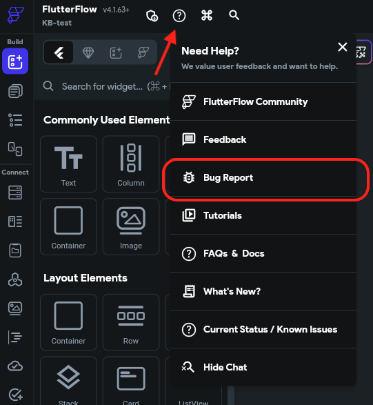

# Submit a Bug Report in FlutterFlow

If you encounter a bug while working in FlutterFlow, you can report it directly from the app. Providing detailed information helps us investigate and resolve issues faster.

:::info[Prerequisites]
You must be logged in to your FlutterFlow account to submit a bug report.
:::

Follow the steps below to submit a bug report:

    1. In your project, click the **Help** icon in the top navigation bar.
    2. Select **Bug Report** from the dropdown.
    3. Fill out the bug report form with as much detail as possible.

    

        Include the following details:

            - **Project link** — Copy the project URL from your browser.
            - **Impacted area** — Specify the page, widget, or feature affected (e.g., custom function name).
            - **Expected behavior** — What you expected to happen.
            - **Observed behavior** — What actually happened instead.

            This information ensures that our engineering team can replicate and resolve the issue quickly.

            Once submitted, your report is reviewed by our team. We prioritize bugs based on severity, impact, and reproducibility.

