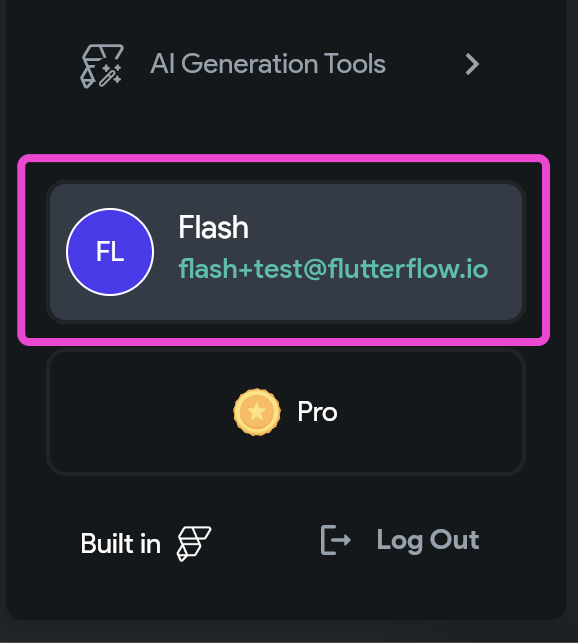
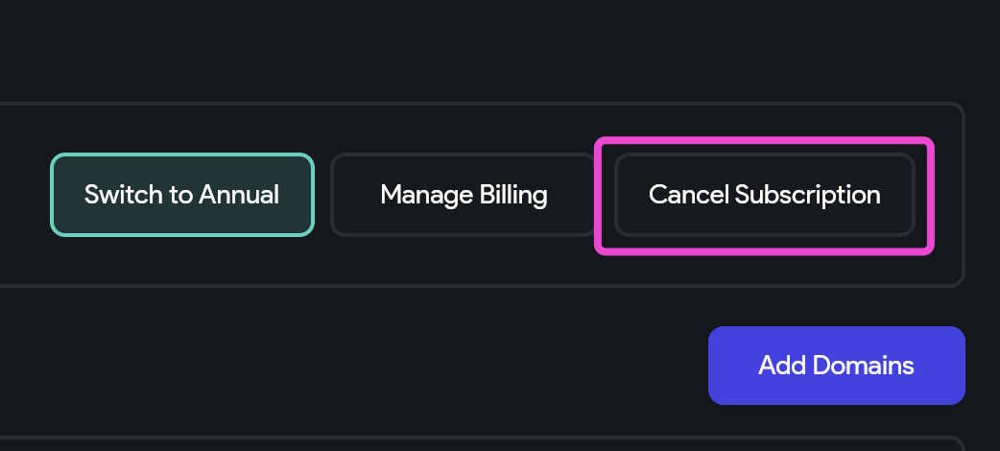

# Downgrading from a Teams plan to a Pro (or other) plan

The best way to downgrade from a Teams plan to a different plan is to let your current subscription expire. You can cancel your account to initiate this process. 

To cancel your account, click on your name in the bottom right-hand corner of the screen on app.flutterflow.io.

From the **My Account **page, click **Cancel **in the **My Plan **section.

You will see the date your subscription expires reflected in the **My Plan **section after confirming your cancelation.

On the date your plan expires, your account will be automatically changes to a free account. From there, you can upgrade your account to a Teams plan by clicking the **Upgrade **button in the bottom right-hand corner.

If you have an urgent need to downgrade from Teams to a Pro plan, please contact us at support@flutterflow.io.