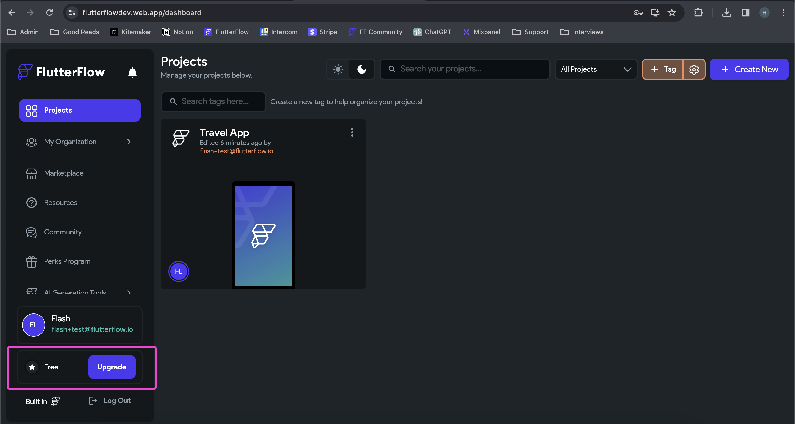
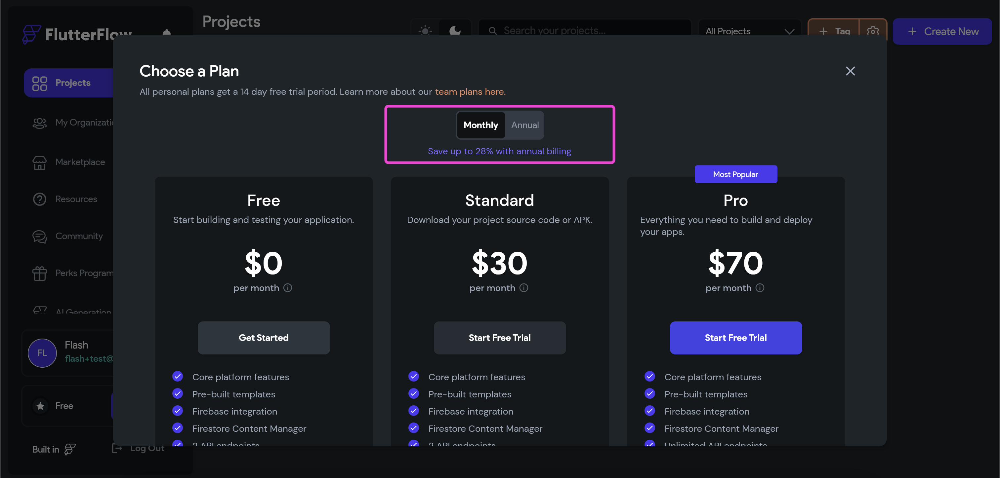
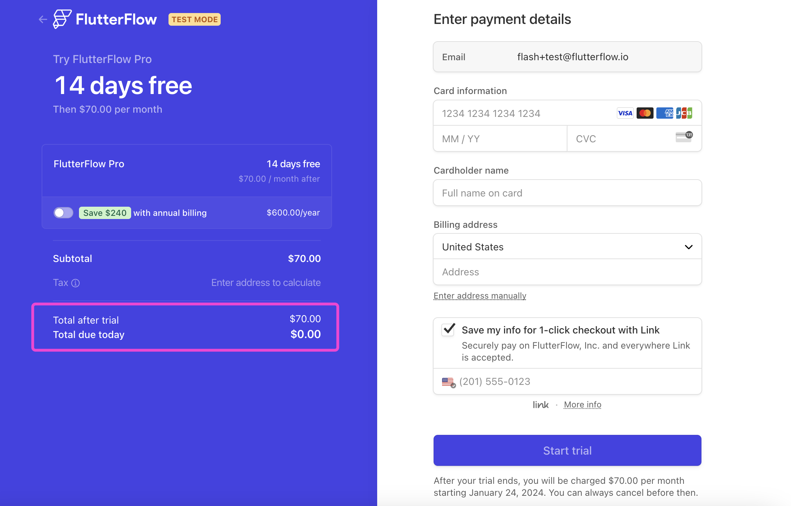

# How do I upgrade to a paid plan?

To change your plan type, please follow these steps:

Login to your account and visit app.flutterflow.io

In the bottom right-hand corner, click **Upgrade:**

In the pop-up that follows, you will be prompted to choose your plan. The benefits of each plan are listed below the upgrade buttons. You have the option to select **Monthly **or **Annual **billing. With an Annual plan you will save up to 28% more:

For new users, you will receive a 14-day free trial on any personal plan. Please note Teams plans are not eligible for free trials at this time.

After selecting a plan, you will be routed to the payments page. Please note our system requires a card on file, but you are free to cancel at anytime from your FlutterFlow account details. For trial users, you will see your **Total due today **is $0.

Once you confirm your selection, you will be routed back to app.flutterflow.io

In the bottom right-hand corner, you will see your new plan type reflected.

