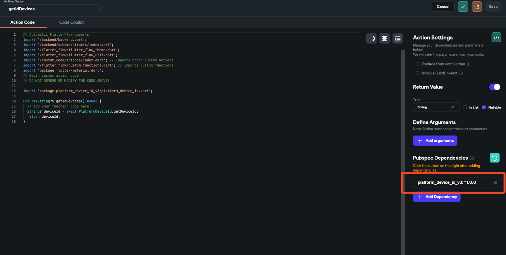
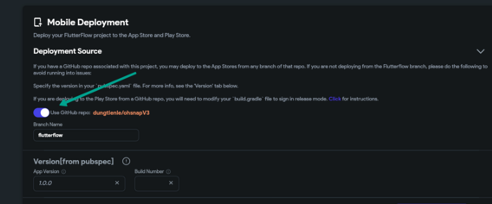

# Codemagic Deployment: Step 6 Script 'Install Pods' Exited with Status Code 1

When Codemagic's deployment fails at the 'Install Pods' step, the root cause is usually related to dependency management in iOS builds. Here’s how to tackle each issue specifically.​

Scenario 1: Custom Code Package Conflicts
**What is the issue?** The deployment process is hindered by a conflict between custom code packages and the existing packages in the project.​
**Why does this happen?** Dependencies in Flutter projects have version constraints that must be compatible with each other. When a new package is introduced, or when versions are updated without checking for compatibility, it may lead to conflicts that prevent pods from installing correctly.​
**How can you fix it?** Adjust the versions of the conflicting packages. This could mean either downgrading to a version that plays well with other dependencies or, in some cases, upgrading to a newer version that has resolved these conflicts.
​**Example &amp; Solution:** In the provided example, **`platform_device_id`** could be causing the issue. A potential fix would be to:​

Check the package's documentation for known compatibility issues.

Modify **`pubspec.yaml`** to use a version that’s known to be compatible.

Run **`flutter pub get`** to update the dependencies accordingly.

Scenario 2: Deployment Directly from an Incompatible GitHub Branch
**What is the issue?** A GitHub branch being used for deployment may contain custom codes or dependency changes that haven't been fully tested for compatibility, leading to deployment failures.
​**Why does this happen?** Branches often have experimental or in-progress work that may not be stable. When these branches are deployed without thorough testing, incompatibilities or errors can arise.
​**How can you fix it?** Ensure that the branch you're deploying from is stable and has been tested. You might need to:

Merge the latest stable changes into your deployment branch.

Remove any experimental or untested code that could be causing the issues.

**Example &amp; Solution:** The second image suggests that the GitHub repo **`dungtienle/folhavpnV3`** might have unstable code. To remedy this, one should:

Check out a stable branch that is known to be working correctly.

Review recent commits on the problematic branch to identify any changes that might affect pod installation.

Revert to a commit before the changes or fix the issues before retrying the deployment.

Scenario 3: Incompatible Pod Versions
**What is the issue?** CocoaPods, the dependency manager for Swift and Objective-C Cocoa projects, cannot find compatible versions for a specific pod, which in this case, is **`app_settings`**.
​**Why does this happen?** This problem typically occurs when the Podfile specifies a version of a pod that isn't compatible with the other pods or with the minimum iOS deployment target.
​**How can you fix it?** You can either downgrade the problematic package to a compatible version or upgrade the iOS minimum deployment target. For the latter, this would require downloading the Flutter project and manually adjusting the deployment target in Xcode.
​**Example &amp; Solution:** The engineering team identified **`app_settings`** as a culprit. To resolve this, follow these steps:

Change the version of **`app_settings`** in **`pubspec.yaml`** to one that’s known to be compatible.

If that doesn’t work, increase the minimum iOS deployment target as suggested by the Amplify Docs on Flutter platform setup.

Key Points to Remember

Always check for the compatibility of new packages or versions with the existing project dependencies.

Deploy from stable, tested branches rather than branches with experimental features.

Consider the minimum deployment target requirements when troubleshooting pod installation issues.

By carefully examining these scenarios and applying the appropriate fixes, you can overcome the 'Install Pods' error and continue with a successful deployment in FlutterFlow using Codemagic.