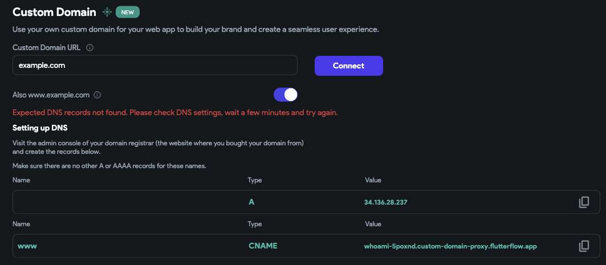
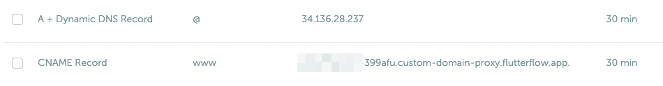
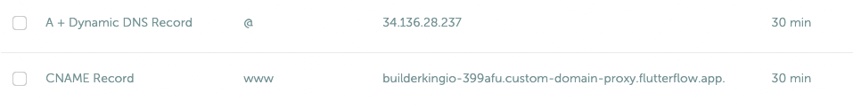

# Can not connect my custom domain.

If you face this error after clicking Connect.Note: Please make sure you did configure the domain DNS records we need before try to connect.

**1- Make sure you create the keys Flutterflow provides to you in your domain DNS configurations.**Note: for the A record, in your DNS configuration if the name was required you can use "@". when you see the value is empty in terms of these kinds of keys it means the value in "@"​

**2- make sure in your DNS configuration there is no unnecessary or extra key that has conflicts with the Flutterflow keys.**Example:  you have another A record, with the same value "@" in your DNS record you need to remove it

Note: Before removing any key make sure you screenshot the keys and save them somewhere in your device.
Here is an example of a configuration in Flutterflow and DNS.​
​