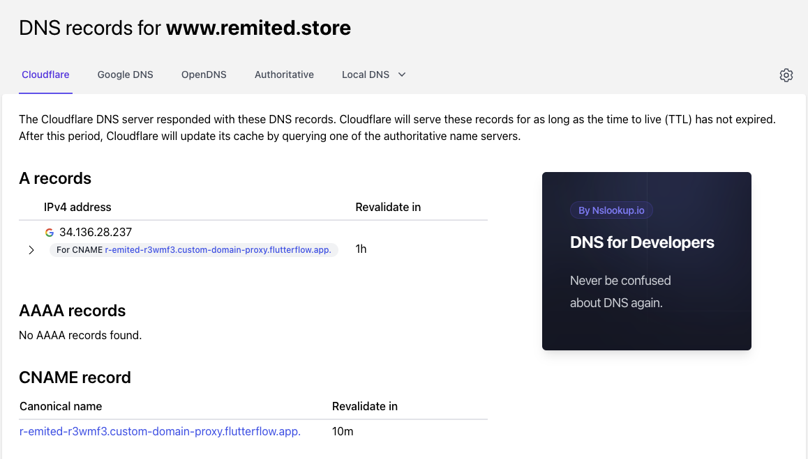

# Publishing Custom Domains in FlutterFlow

Having trouble connecting your custom domain in FlutterFlow? Don't worry – we've got you covered. In this article, we've outlined some common issues users face and step-by-step solutions to get you back on track.

**Issue: Unable to Connect Custom Domain (Error: **Expected DNS records not found)
**Scenario:** You've set up the DNS records for your domain, but the connection still fails.

***Tip: Misconfigured DNS is often the culprit.***

**Background: **FlutterFlow requires specific DNS records for custom domain connection, and you should set them according to your domain. Here's where you'll find them:

Please note that if you uncheck **“Also www...”** you won’t need to create the second, **CNAME** record.​
**Troubleshooting Steps:**

**Verify DNS Records: **Use tools like nslookup.io to check your DNS records against the required configuration.
Ensure the required A and CNAME records exist. No other A, AAAA, or CNAME records should interfere. Here's an example:

**Wait Period: **DNS changes may take up to 24 hours to generate. Please wait at least an hour after making changes before retrying.

**Retry: **If records are correct, retry connecting after some time.​

**Reach out to support:** If all the settings are correct and you are still facing the issue after 48 hours, please communicate with the domain registrar.

**Issue: Difficulty Creating DNS Records**
***Tip: Each registrar may have a different interface, complicating the process.***

**Suggestions:**

When you create a record for a root domain, e.g. example.com, some registrars require the “name” field for the record to be empty, some require “@”, and some - a full domain name (example.com).

When they create a record for a subdomain, e.g. test.example.com, some registrars require the “name” field for the record to be the name of the subdomain (”test”), some - full name (test.example.com).

Please refer to Registrar-specific documentation to learn more about how you can set up the DNS records.

**Issue: Error 404 After Connecting Domain**
**Solution:**

Please try publishing the project after connecting the domain, it should resolve the issue that you are experiencing regarding Error 404.

**DNS Restrictions for SSL Certificates**
**Background: **The DNS might be restricting the SSL certificate authorities, which results in an error while connecting the domain.​​**Solution:**

**Verification:** Use nslookup.io to check for CAA records. you should be able to check that using this link: https://www.nslookup.io/domains/your-site-name/dns-records/caa/. consider replacing "your-site-name" with your site.

**Adjustment:** Add "letsencrypt.org" to allow authorities or remove CAA records.

**Outcome:** FlutterFlow should connect once DNS is adjusted.

By following these steps, you can troubleshoot and resolve common issues encountered when connecting a custom domain in FlutterFlow. If you still face challenges, don't hesitate to reach out to our support team through Live chat or by emailing support@flutterflow.io

**Additional Resources:**

Youtube Tutorial: Web Publishing

