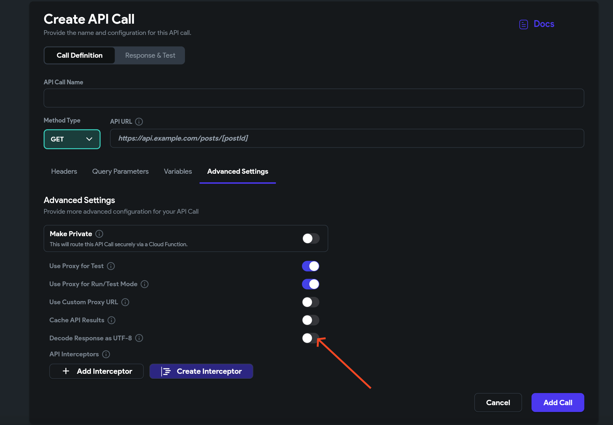

# Fixing Incorrect API Call Outputs Due to Charset and Encoding

Overview
API responses can vary based on factors like charset and encoding, occasionally leading to what may seem like incorrect outputs. This brief guide offers a solution to address and correct such issues.

Solution for Accurate API Responses
Ensure the API header is correctly set up by including the following elements:

`Content-Type: application/json`

`Charset: utf-8`​

You can also set up an API advanced settings whether to force the response to be decoded as UTF-8:​

By verifying these settings, you can get more consistent and accurate outputs from your API calls.

