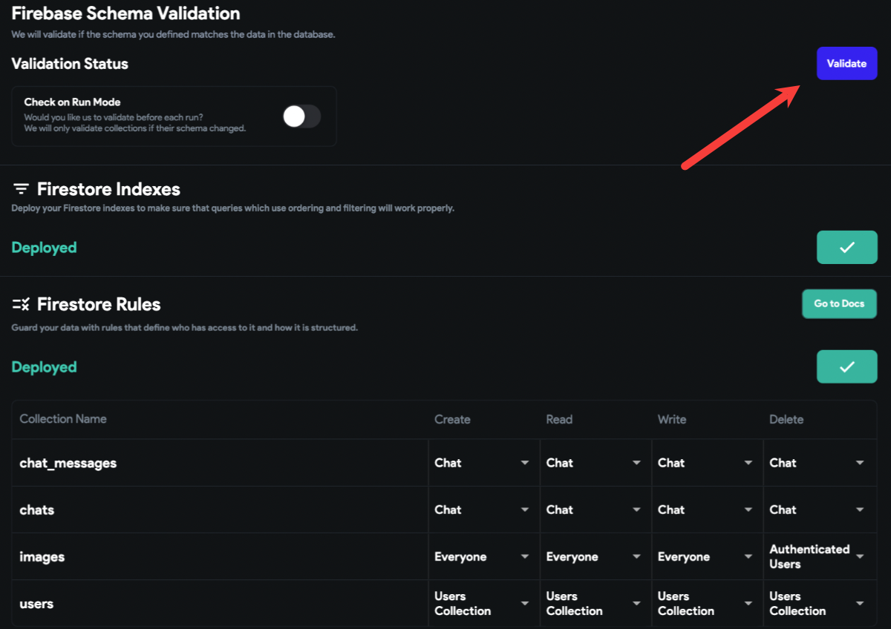

# Backend Issues

These common steps are recommended to perform for any issue faced with the backend.

Ensure you have added the following cloud permissions for firebase@flutterflow.io: 

**Editor** 

**Cloud Functions Admin** 

**Service Account User** (Here are instructions on how to do this)

Update your Firebase rules. Here are instructions on how to do this.

Delete firebase@flutterfow.io from your authenticated users and then deploy the firestore rules again and validate the schema. ​

Make sure all the data field types and field names should match in Firestore and FlutterFlow. Here are instructions on how to do this.

Validate the Firestore schema by clicking on the blue **Validate** button in Firestore -> Settings in FlutterFlow. This ensures that everything is configured correctly and the Firestore collection schema matches with the Collection schema configured in FlutterFlow.

If you have already completed the Firebase setup, remove the existing permissions and complete a new setup from scratch. Here are instructions on how to do this.

Make sure you've added app.flutterflow.io to Authorized Domains under the authentication tab in Firebase.

Ensure you are on the latest version of FlutterFlow by selecting (ctrl/cmd + shift + R). After you have done this, clear your browser cache and log out/in to FlutterFlow.

In order to use Cloud Functions like Push Notifications, Payments, etc. Please make sure your Firebase project is on a Blaze Plan.

