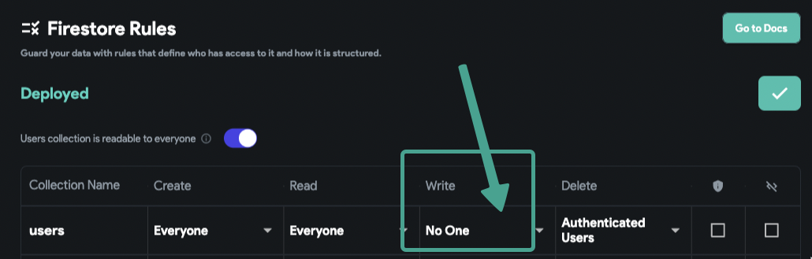
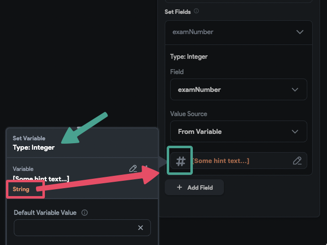

# Backend call: Update Document action is not working!

---

> **Note:** After performing the update action, always check the data in the database. Sometimes, if you don't have a stream on the document you edited, you can't see the updated data in real-time in the app. So, it's important to check the data in CMS or Firebase/Database before moving forward.

---

When you perform the **update action**, the loading indicator will be displayed and shortly after will stop. This means the update **wasn't successful**. If it was, based on my action flow, I should see an alert dialog.

## Why is this happening?

When the upload action fails, the action flow will break and cause the next actions to not be executed.

### Why does the Update action fail?

There could be **two major reasons**:

1. **The user doesn't have permission to write to the document** (Firestore database permission issue)
    - 
    - Based on my user's collection permissions, no one has the right to write (edit) the user documents. So, when I perform the update action, it fails.
    - **Solution:** Make sure you set the write permission correctly. For example, the "Authenticated users" rule is good enough to move forward if you have a logged-in user.

2. **The values you try to set to fields on the document have issues**
    - For example, you try to set a null value to a field or try to set an integer field with a string value.
    - 
    - In this example, I am trying to set a string value from a text field (type: text) to an integer type field.
    - **Solution:** Make sure you are setting the right types. If you are not sure, or your data came from an API call, you can use custom actions to convert the value to the field type you are trying to set.
    - **Note:** If you want to save a text field value as a number, the text field type should be set to Number.

---

> **Note:** You can check the console logs in your browser developer console (F12) to see the error as well. For example, in this picture, you can see the permission issue error:

