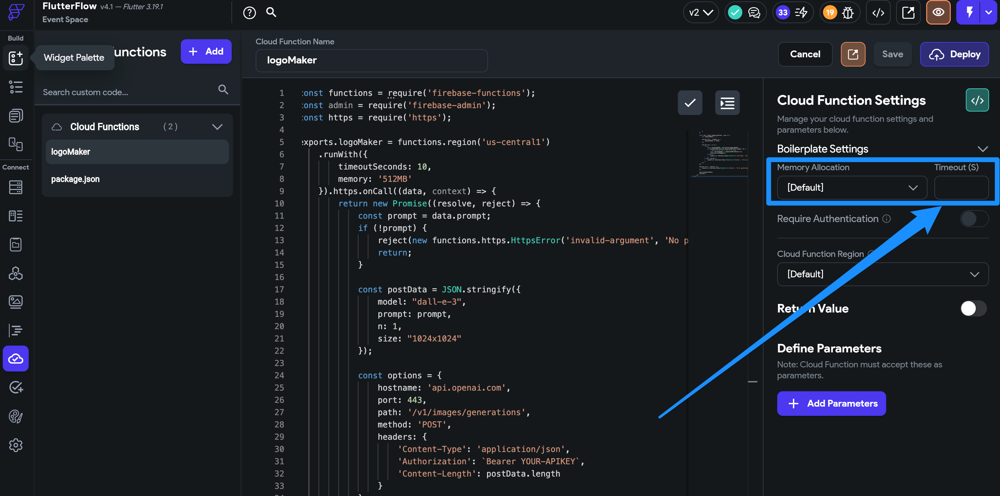

# Cloud Functions Troubleshooting

Introduction
Cloud Functions are a powerful feature in FlutterFlow, allowing developers to execute backend code in response to events triggered by Firebase features and HTTPS requests. This guide provides troubleshooting tips for common issues you might encounter when working with Cloud Functions in FlutterFlow.

**Error** **1: Function Deployment Errors**

**Naming Convention**Please ensure that the name of the functions in the code matches the name of the function in the FlutterFlow editor.

As shown in the attached screenshot, the name of the function is '`data`' which is different from the '`logoMaker`' defined for the function name.​
**Syntax Errors**
Check for Syntax Errors: Ensure your Cloud Functions code does not contain syntax errors. Use linting tools or the Firebase CLI to test your functions locally before deployment.

Ensure Firebase CLI is Updated: Make sure you have the latest version of the Firebase CLI installed. Update it by running `npm install -g firebase-tools` in your terminal.
Validate Firebase Project Configuration: Verify that your FlutterFlow project is linked to the correct Firebase project. Cross-reference the Firebase project ID in FlutterFlow's project settings.

**Error 2: Triggering Issues**
**Event: **Cloud Functions are not triggered by the intended events.​
Solutions:

Review Triggers: Double-check that the event you're using to trigger the Cloud Function is correctly configured. For example, if using a Firestore trigger, ensure the document path is correct.

Permissions and Rules: Ensure your Firebase project's permissions and rules allow the operations your Cloud Function tries to perform. Restricted permissions can prevent functions from executing as expected.

**Error 3: Execution Timeouts**
**Event: **Functions timeout or take too long to execute.

Please ensure to set the timeout time for the functions set in the project to avoid the default timeout duration for the cloud function defined. 

Solutions:
You can add the timeout duration for the function to run in the area shown in the highlighted section of the project. Increase the timeout setting in the Cloud Function configuration if the operation naturally takes longer to complete. Keep in mind that longer timeouts may incur higher costs.

Additionally, you can set up the Cloud Function regions.​

Error 4**. Cold Start Issues**

​**Event:** Functions take longer to respond after periods of inactivity.

Solutions:

Keep Functions Warm: Implement a scheduled function (using Cloud Scheduler) to periodically trigger your Cloud Function, reducing the impact of cold starts.

Optimize Dependencies: Reduce the number of dependencies in your Cloud Function, as loading many or large dependencies can increase cold start times.

Additional Resources 

