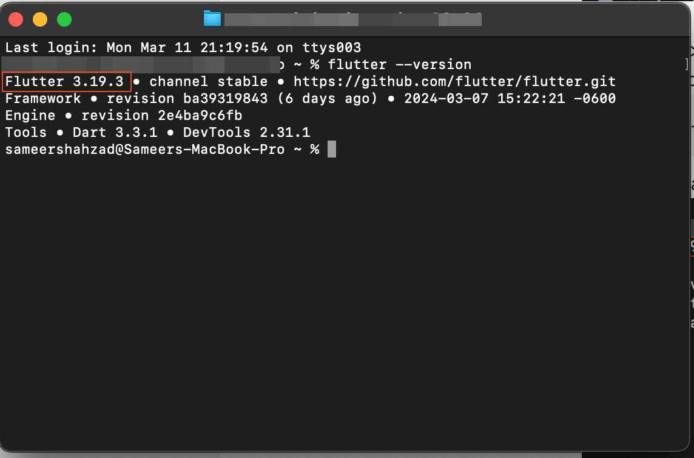

# Resolve Errors in Downloaded Code

Are you facing errors after downloading the code and testing it locally using IDE?No problem, we are here to help! This article covers the solution to fix issues that you experience while running the downloaded code.​
Check the Flutter Version on Your Machine and Ensure It Matches What's Supported by FlutterFlow
**Step 1: Checking FlutterFlow's Supported Version**​First, visit the FlutterFlow website to find out which version of Flutter they currently support. To make this easier, there's a screenshot below that guides you on where to look for this information.​
​**Step 2: Verify the Flutter version on your machine**​Check the version of Flutter that is currently installed on your machine by running the command:
```
 flutter --version
```

Here's an example of how you can do that:

​**Step 3: Upgrading or Downgrading to the correct Flutter version**
If the current version on your machine is different than what is currently supported by FlutterFlow, you can downgrade or upgrade to the supported version. You can learn more about upgrading our Flutter here:​https://docs.flutterflow.io/deploying-your-app/testing-your-app/testing-on-mobile-device#id-2.-verify-correct-flutter-version​By following these steps, you can fix the errors that you face after downloading the code and run locally, If you still face challenges, don't hesitate to reach out to our support team through Live chat or by emailing support@flutterflow.io

Additional Resources

YouTube Tutorial: Download Code


