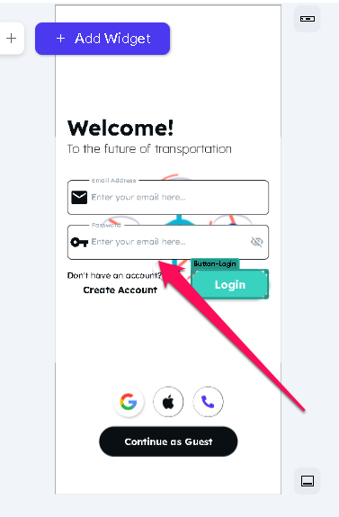
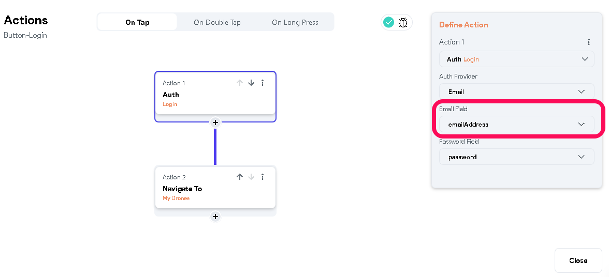

# Error: The email address is badly formatted

Issue Overview
Sometimes, the format of the email address submitted by a user is not recognized or supported by the Firestore database, or the email address TextField Widget is misconfigured in a project.

Basic Troubleshooting Steps
**Step 1: Verify that the correct TextField Widget is selected as an email address TextField Widget on the page**. ​
**Step 2: Check the format of the email address used**. 
For instance, a valid email address format is bartholomew@flutterflow.io or xxxxx.xxx@gmail.com or any other format from a service provider. 

