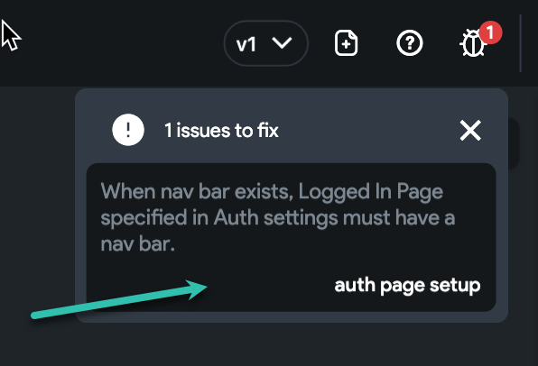
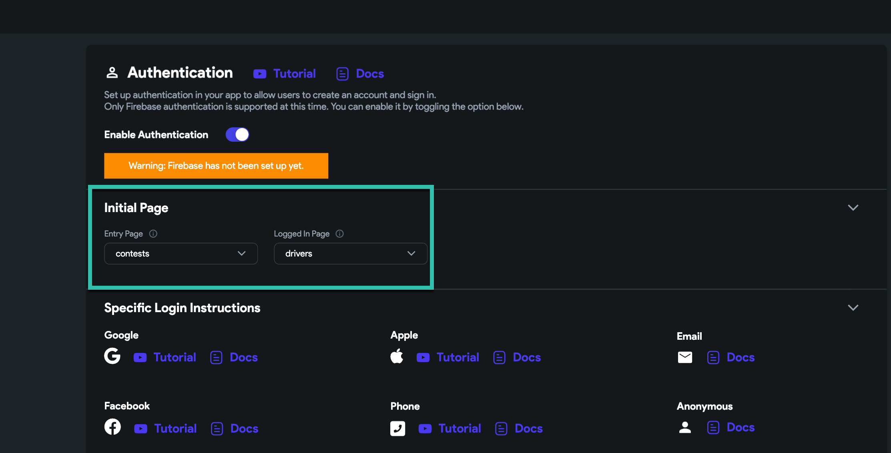
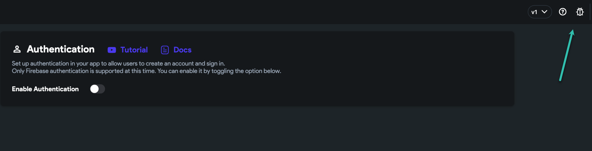

# Error: When nav bar exists, Logged In Page specified in Auth settings must have a nav bar

**If your project has this issue, here are the steps to fix it**

**Why does this happen?** This issue can happen when you turn ON/OFF authentication and the editor does not properly save whether you are using authentication.

**What is the solution?** We need to reset the process so the editor understands that you are not using authentication.

You can use these steps to fix this issue: 

**1: We need to enable authentication temporary:**
Please go to setting/Authentication and enable authentication

**2: Set entry page and logged in page:** No matter whether you have firebase connected or not, here we just want to reset this setting.
you need to just select 2 pages that have a nav bar on them.

**3: Now you need to turn OFF the enable authentication.**

This way we backward the process and now the editor knows that we turn the authentication OFF.

