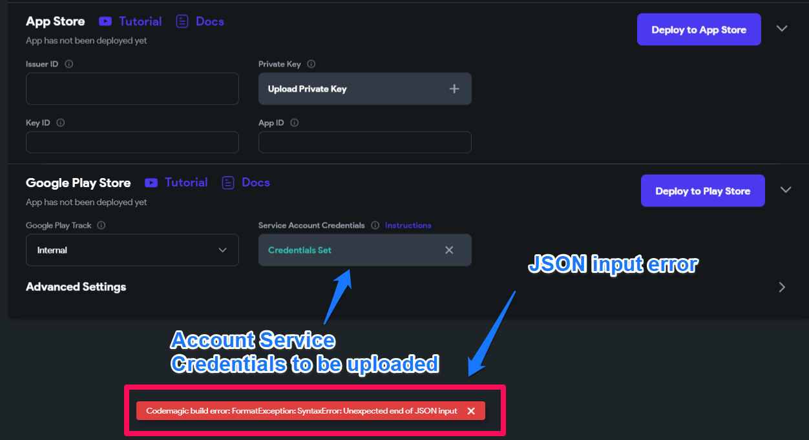

# FormatException: SyntaxError: Unexpected end of JSON input

**Full error message**
```
Codemagic build error: FormatException: SyntaxError: Unexpected end of JSON input
```

**What does this error mean?**
The error 'unexpected end of Json input' indicates that the uploaded **Service Account Credential** is not correctly formatted. The expected format for uploaded **Service Account Credentials** is `.JSON`.​

**How to resolve this issue?**
How Do I Reupload my Service Account Credentials?
To ensure smooth integration with FlutterFlow, you may need to reupload your Service Account Credentials. Depending on the existing state of your app, you may require a fresh API Key to grant FlutterFlow access to secure and confidential information.

To add an API Key for use with FlutterFlow, you may use the following steps:

Need an in-depth guide? Please refer to our Play Store deployment documentation for further details and illustrations.

**The issue was not resolved.**
If this does not resolve the issue, contact FlutterFlow Support at support@flutterflow.io.
We'll be happy to help!