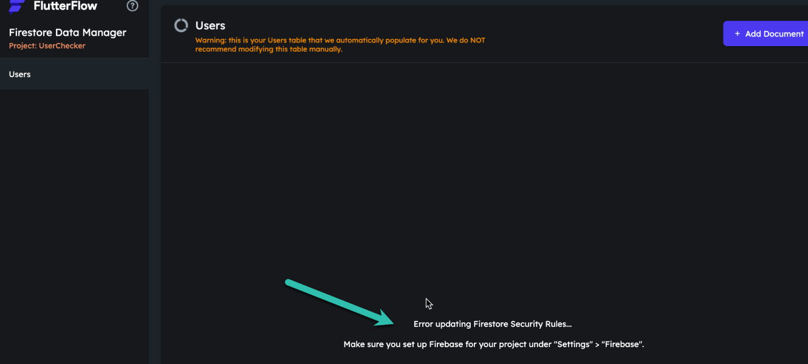
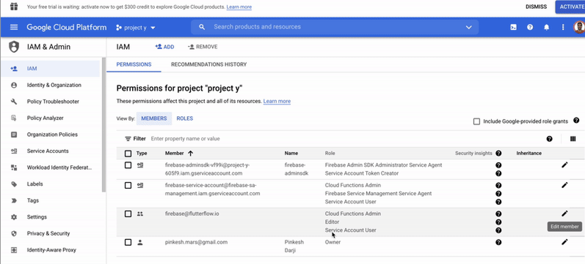

# Content Manager Error: Error Updating Firestore Security Rules

Issue
I see this issue when I try to use the FlutterFlow Content Manager (CMS)

```
Error updating Firestore Security Rules... Make sure you set up Firebase for your project under "Settings" &gt; "Firebase".
```


Why You Are Seeing This Error
You are seeing this error because your Firebase permission have not been set up correctly. No worries, this is easy to fix!

**Ensure Email Sign-In Is Enabled**

Open the Firebase console, and click on **Authentication** (in the left side menu).

Click on the **Get started** button.

Select the **Sign-in method** tab.

Check to see if you see Email/Password with that is turned on with a green check **Enabled**:


**If you don't see this, you will need to use these instructions to turn on email sign-in.**

**Ensure you have added the required cloud permissions**
For push notifications to work, you will need to add the following cloud permissions for firebase@flutterflow.io: Editor, Cloud Functions Admin, and Service Account.

Head to the Firebase Console and open the project dashboard for your project (click the project tile). Select Project Settings &gt; Users &amp; Permissions.

If you don't have Cloud Functions Admin, Editor, and Service Account listed next to firebase@flutterflow.io, you have not completed this step.

Here are the instructions on how to add the required cloud permissions to your project.
**Update Your Firebase Rules**
From within your FlutterFlow project, select Firestore &gt; Settings &gt; Scroll down to Firestore Rules &gt; select Deploy/Redploy.

**Ensure Firebase Schema Is Defined**
Ensure you have defined the fields in your Firebase schema. Only fields defined in your Firebase schema are shown in the Firebase Content Manager.

**Ensure you are using the latest version of FlutterFlow**
To upgrade to the latest version of FlutterFlow select Ctrl + R on Windows or Cmd + R on Mac.

After you have done this, clear your browser cache and log out/in to FlutterFlow.If the above wasn't helpful full please make sure you check this Link as well.

**Create Permissions From Scratch**
If you have already completed the above steps, the final troubleshooting method is to remove the existing permissions and complete a new setup from scratch. Here are instructions on how to do this.