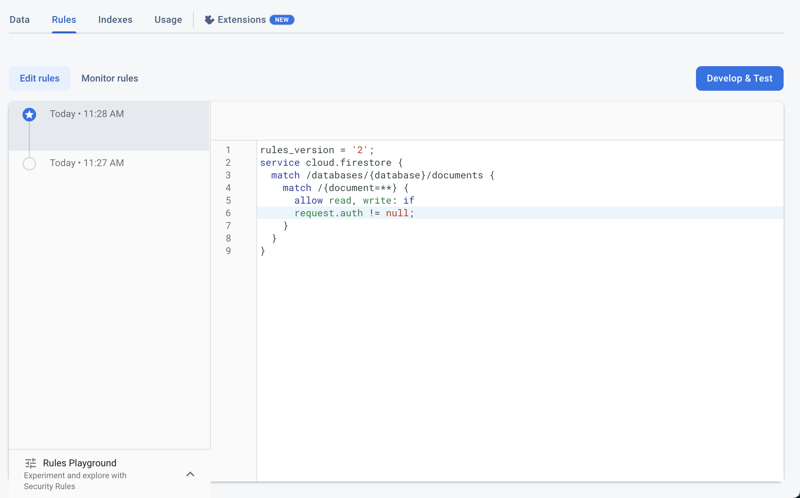

# Email: Client access to your Cloud Firestore database expired

**Background**
You've received an email from the Firebase that "Client access to your Cloud Firestore database expired"​
Why Am I Seeing This Message?
When the user enables the cloud firestore, there are two rules to select in order to get started. 
1. Test Mode (Time bounded)
2. Production Mode (Not Time bounded but secured at the start)Usually, the user selects the Test Mode and the Firestore works fine. but after the time has been completed the client access get expired. To keep using Firestore user must update the rules.​
**Solution 1: Manage the Firestore Rules directly from FlutterFlow**Head over to this article to see step by steps instructions about how to Manage the Firestore Rules directly from FlutterFlow.
**Solution 2: Manually update the Firestore Rules from Firebase**In order to keep using Firestore, User should head over to the** Firebase Firestore** section and select** Rules**.Here we can see our previously defined rules, We have **two options** here, any of these options will solve the problem.

Update the timestamp date to a future date if you still want to keep it in test mode.​

Update the rules with some conditions in your database to make it secure.

After applying this solution, your problem should be resolved, it the problem still persists, feel free to contact us at support@flutterflow.io​