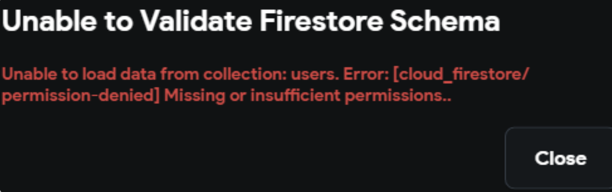
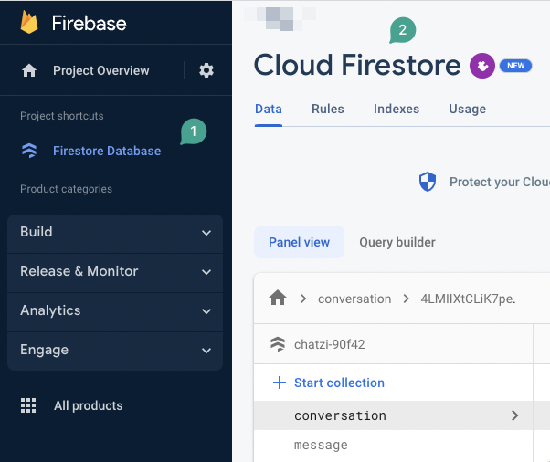
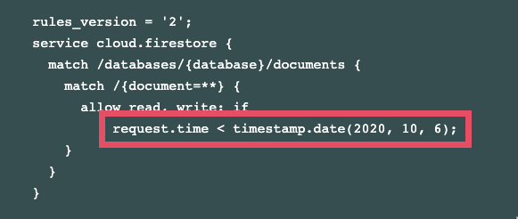
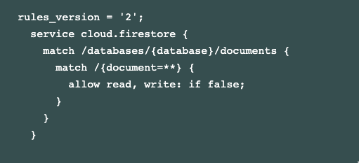
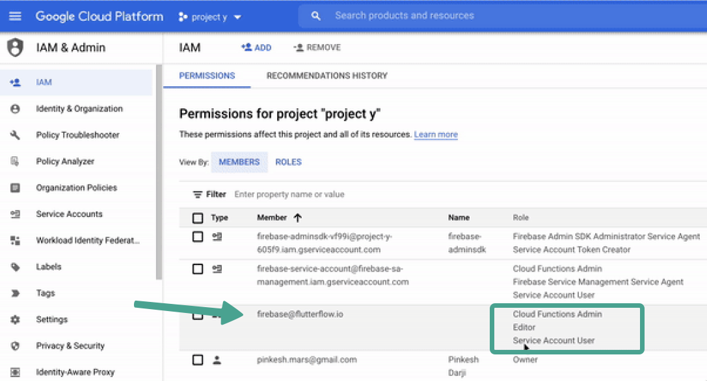
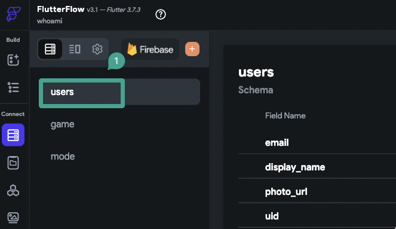
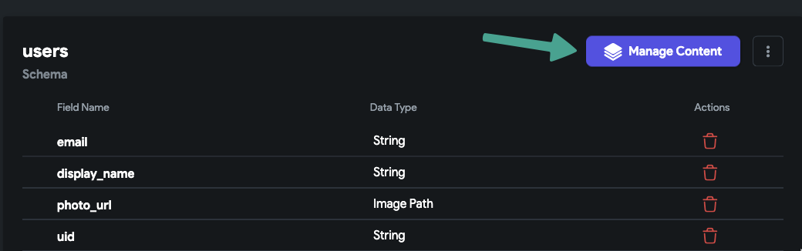
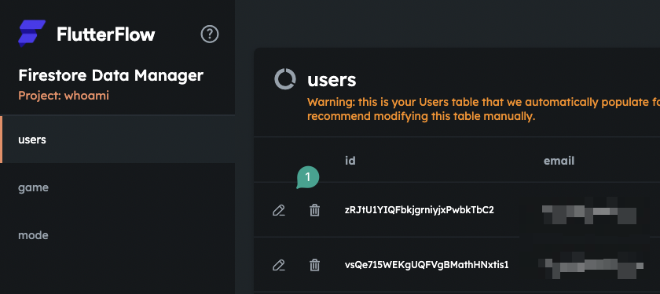
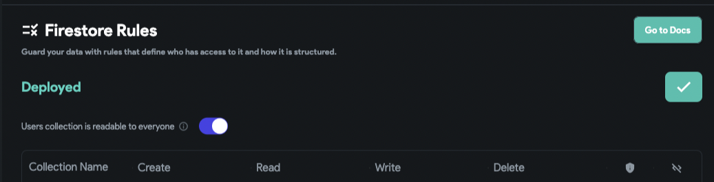

# Unable to validate Firestore Schema: Unable to load data from collection. Missing or insufficient permissions

Issue: You see an error like this when trying to validate your Firestore Schema:

Unable to load data from collection. Error: [cloud_firestore/permission-denied] Missing or insufficient permissions.​
Troubleshooting Steps:

**1. Make sure you already created a database in firebase**

**2. Make sure your database is not on TEST MODE. **

**Important: A Database in Test Mode may not work properly***Note: after creating the database on test mode there is no visual way to set it on production mode, instead, you need to change the firebase rules. and if you deploy your rules from Flutterflow it will be done. and no need to do this manually and you can skip this part.*1) Go to your firebase project.
2) Select Cloud Firestore.
3) Select Rules.

You will see something like below.​
Change it as follows, Note: mind the rules_version and ensure you are reflecting the correct rules_version.

4) Publish.
That's it, you are now switched to Production mode.  Thanks.
Tags: Firebase Cloud Firestore project
**3. Make sure you give the necessary permissions to firebase@flutterflow.io editor account in your firebase project**

**You will need to add the following cloud permissions for firebase@flutterflow.io: Editor, Cloud Functions Admin, and Service Account.**

Head to the Firebase Console and open the project dashboard for your project (click the project tile). Select Project Settings &gt; Users &amp; Permissions.

If you don't have Cloud Functions Admin, Editor, and Service Account listed next to firebase@flutterflow.io, you have not completed this step.

Here are the instructions on how to add the required cloud permissions to your project.

**4. Make sure you at least one collection created in FlutterFlow**
Select the Firestore tab from the left menu. If you have no collections listed, you will need to create one.

This article will walk you through step-by-step on how to create a collection.​

**5. Make sure that at least one of your collections has at least one document. **

You can use the CMS in FlutterFlow to confirm that you have at least one document. Select Manage Content and view your collections.

If you don't see any data listed, you will need to add this data.

This article will walk you through step-by-step on how to use the FlutterFlow CMS to add data to your collection.​

**6. Make sure you deployed your database rules with the proper permissions**

From within your FlutterFlow project, select Firestore &gt; Settings &gt; Scroll down to Firestore Rules &gt; select Deploy/Redploy.

