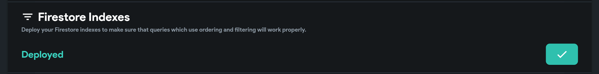
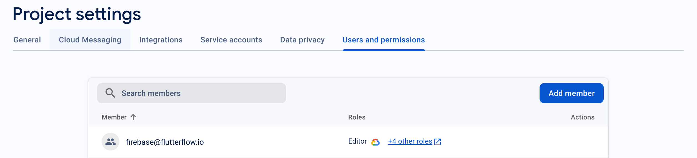
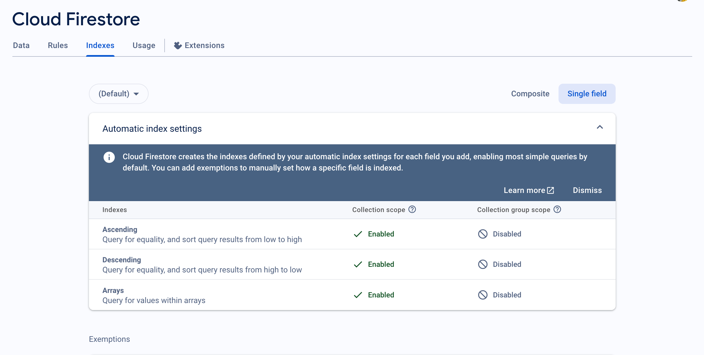

# What To Do If Firestore Indexes Are Not Deployed

Properly deployed Firestore indexes are essential for your app's performance and functionality. If your Firebase indexes are not being deployed, follow this clear, step-by-step troubleshooting guide.

---

## 1. Problem Overview

> **Issue:** Firestore indexes are not being deployed as expected.
>
> **Expected Outcome:** Indexes should be successfully deployed to Firebase for optimal app performance.

---

## 2. Troubleshooting Steps

### 🔹 **Step 1: Enable Email Sign-In**
- Go to your Firebase project's **Authentication** section.
- Ensure the **Email/Password** sign-in method is enabled.
- **Reference:** [FlutterFlow Email Sign-In Docs](https://docs.flutterflow.io/data-and-backend/firebase/authentication/email-sign-in)

---

### 🔹 **Step 2: Grant Proper Permissions**
- Add **firebase@flutterflow.io** as a member of your Firebase project.
- Assign the necessary permissions to manage and deploy Firestore indexes.
- **Reference:** [Firestore Rules & Permissions Guide](https://docs.flutterflow.io/data-and-backend/firebase/firestore-database-cloud-firestore/firestore-rules)

---

### 🔹 **Step 3: Update Firebase Rules**
- Review and update your Firestore security rules in both the Firebase console and FlutterFlow.
- Make sure the rules are correctly set up for your app's needs.
- **Reference:** [Firestore Rules Documentation](https://docs.flutterflow.io/data-and-backend/firebase/firestore-database-cloud-firestore/firestore-rules)

---

### 🔹 **Step 4: Verify Index Deployment**
- In the Firebase console, check the **Indexes** section to confirm deployment.
- **Note:** Deployment may take a few minutes. Refresh the console if needed.

---

## 3. Additional Tips

- Double-check that all steps above are completed before retrying deployment.
- If issues persist, consult the [official FlutterFlow support article](https://intercom.help/flutterflow/en/articles/9127351-what-to-do-if-firestore-indexes-are-not-deployed).
- For advanced troubleshooting, review Firebase logs and permissions in the Google Cloud Console.

---

> **Summary:**
> - Enable Email Sign-In
> - Grant permissions to firebase@flutterflow.io
> - Update Firestore rules
> - Verify index deployment in the Firebase console

Following these steps should resolve most issues with Firestore index deployment in FlutterFlow.

