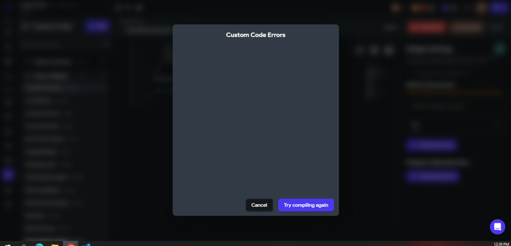
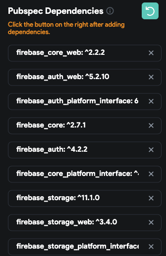
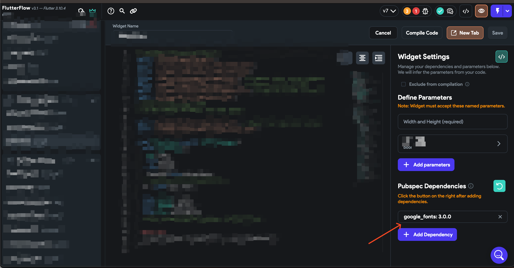
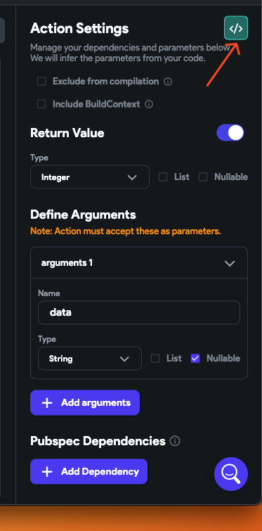
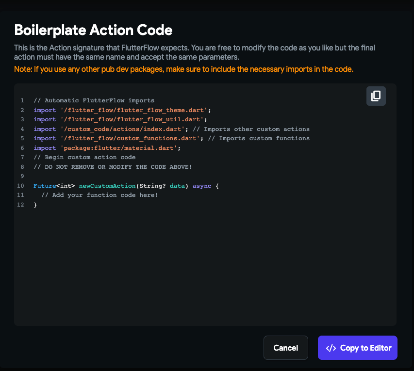

# Compilation Fails Despite the Compiler Not Showing Any Errors

Sometimes, your code may fail to compile even though the compiler does not display any errors. This guide outlines common causes and solutions for this confusing situation.

---

## 1. Issue Overview

> **Problem:** Code fails to compile, but no errors are shown in the compiler output.

---

## 2. Common Scenarios & Solutions

### 🔹 **Scenario 1: Conflicting Package Versions**
- You may have packages in your `pubspec.yaml` with versions that conflict with other dependencies.
- 
- 
- **Solution:**
    - Remove or update conflicting dependencies in your `pubspec.yaml`.
    - Run `flutter pub get` to refresh your packages.

---

### 🔹 **Scenario 2: Inconsistent Custom Code**
- Custom code in your project may differ from what is expected (e.g., parameter names, null safety, return types).
- 
- 
- **Solution:**
    - Ensure your custom code matches the expected structure and types.
    - Compare your code with the generated boilerplate to spot differences.

---

### 🔹 **Scenario 3: Unsaved Changes**
- Sometimes, you may forget to save your changes before compiling.
- **Solution:**
    - Always click the **Save** button after editing code and before compiling.

---

## 3. Additional Tips

- Double-check for typos or subtle mismatches in your code and configuration files.
- If the problem persists, try cleaning your build (`flutter clean`) and rebuilding the project.
- Consult the [official support article](https://intercom.help/flutterflow/en/articles/8076318-compilation-fails-despite-the-compiler-not-showing-any-errors) for more troubleshooting steps.

---

> **Summary:**
> - Check for package version conflicts
> - Ensure custom code matches expected structure
> - Save all changes before compiling

By following these steps, you can resolve most cases where compilation fails without visible errors.

