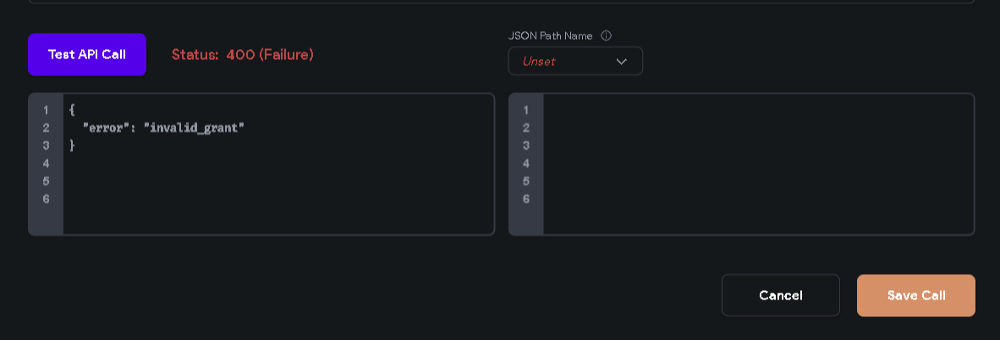
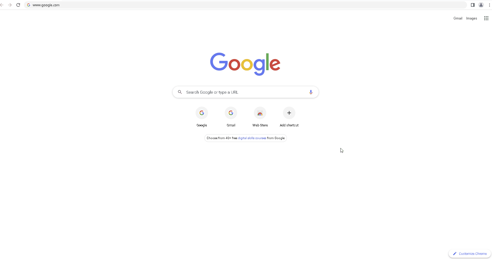
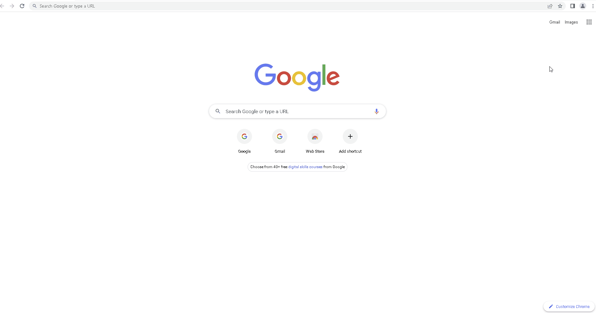

# How To: Resolve 400 API Call Errors

Standard API status codes are returned when unsuccessful API  calls are made in FlutterFlow. Outlined below are some of the common responses for 400 HTTP API calls and how to solve them. 

**400 (Bad Request) **
The server could not understand the request due to malformed syntax. The API endpoint should be modified before attempting an API call again. Some of the likely causes are:1. For POST API calls, the uploaded file might be too large.2. The accessed URL is invalid3. Expired or invalid cookies in the browser. 
An example of the returned API call is shown in the attached image below.
**Troubleshooting Steps:**1. Clear the browser **cache**. The browser cache can be cleared by going to **More tools** -&gt; **Clear Browsing Data**

2. Clear the browser **cookies**.

3. Check the requested URL or endpoint. (Domain names are case-sensitive). 

4. Upload smaller files 

