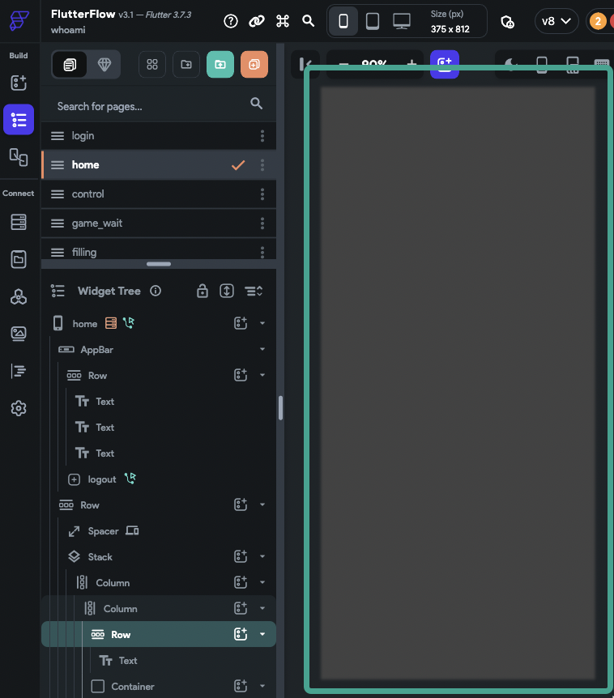

# My project freezes after opening, how do I fix this?

Issue
When I try to open my project it freezes. I'm unable to access my project or make changes. How do I fix this?
Background
The most frequent cause of a project freezing is a rendering issue in one of your pages
How To Use Safe Mode To Identify And Resolve The Issue
The best practice to fix a project that is freezing is to open the project in safe mode, go to the place you were working before the crash happened, and undo the changes (e.g. update properties, delete the widget, etc.)

Add ?SAFE_MODE to the URL
Simply add `?SAFE_MODE` to the end of the URL (e.g. https://app.flutterflow.io/project/sample-app-social-app-tx2kqp?SAFE_MODE) which will open it without rendering the UI Builder.

Tip: Don't forget to add the ?​
Example project when the UI is not rendered in the Builder:

Undo The Changes You Made Before The Crash Happened
Enter the  project in Safe Mode and go to the place you were working last time before the crash happens.​
Undo the changes you made (e.g. delete the widget, change the height back to 50px, etc.)​
After doing the first edit, the editor will exit from the SAFE_MODE. If your project successfully renders, you can return to building. 

Otherwise continue to enter make safe mode and make changes until you find what was breaking your project. 
If you are unable to identify the widget causing the issue, please reach out to support at support@flutterflow.io or via chat.

