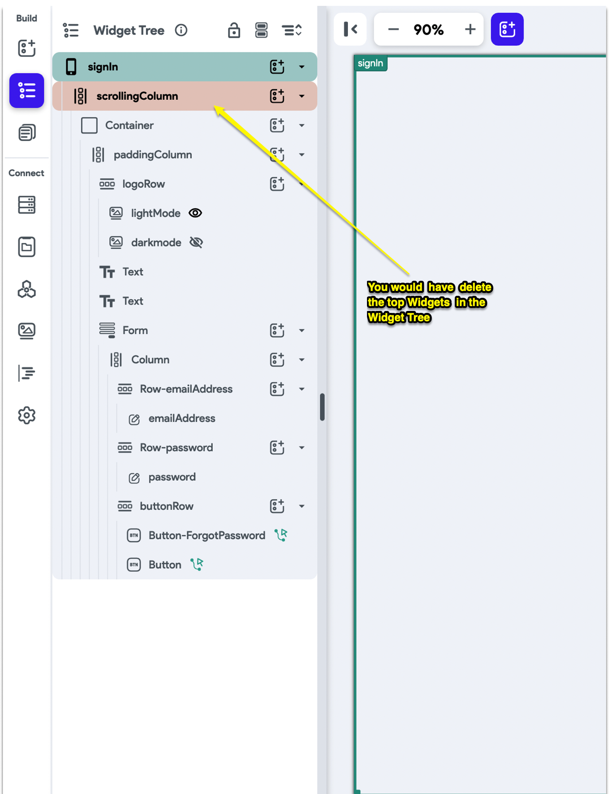

# Project Does Not Open in FlutterFlow

If your project won't open in the FlutterFlow editor, follow these steps to diagnose and resolve the issue.

---

## 1. Issue Overview

> **Problem:** Project does not open or load in FlutterFlow.
> 
> **Goal:** Regain access to your project for editing and development.

---

## 2. Basic Troubleshooting Steps

### 🔹 **Step 1: Open the Project in Safe Mode**
- Append `?SAFE_MODE` to the end of your project URL.
    - Example: `https://app.flutterflow.io/project/xxxxxx?SAFE_MODE`
- This can help you bypass problematic widgets or pages.
- 

### 🔹 **Step 2: Identify and Remove Problem Widgets**
- Safe Mode should open the page with the widget causing the issue.
- Delete the topmost widget in the Widget tree to identify the culprit.
- 
- **Note:** Any changes may cause the project to not load again until the problematic widget is removed.

---

## 3. Other Troubleshooting Steps

### 🔹 **Step 1: Check Your Internet Connection**
- Ensure you have a strong, reliable internet connection.
- Connection drops or weak signals can prevent FlutterFlow from loading.

### 🔹 **Step 2: Clear Your Cache and Cookies**
- Browsers store cached data and cookies that may interfere with loading.
- Clear your browser's cache and cookies (refer to your browser's help files for instructions).

---

## 4. Additional Tips

- Try a different browser or device to rule out local issues.
- Disable browser extensions that might interfere with FlutterFlow.
- If the problem persists, contact [FlutterFlow Support](https://intercom.help/flutterflow/en/articles/7032666-project-does-not-open-in-flutterflow) for further assistance.

---

> **Summary:**
> - Use Safe Mode to diagnose widget issues
> - Check your internet connection
> - Clear browser cache and cookies
> - Try another browser or device if needed

Following these steps should help you regain access to your FlutterFlow project.

