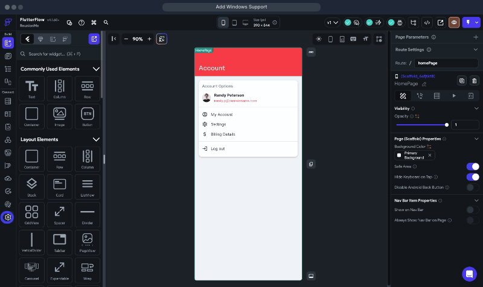

# Enable FlutterFlow support for Windows

Overview
The source code generated from FlutterFlow can support different platforms: Android, iOS, Windows, and Linux, among others. You can toggle support for these platforms on and off in the Platforms section of your App Settings.
This article will walk you through enabling support for Windows in FlutterFlow.

Instructions

Within your FlutterFlow Project, navigate to **Settings and Integrations **on the left-hand Navigation Menu.

Under **Project Setup**, click **Platforms.**

Click on the **toggle** next to "Windows (alpha)".

That is it! The project now supports Windows platform in FlutterFlow. Please note Windows support is still in alpha mode and may not function as expected for older versions of Windows.

