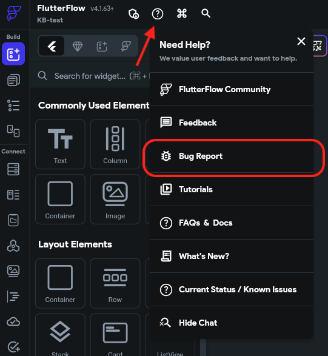

# How Do I Submit A Bug Report?

We know that bugs can be frustrating and we work to fix these on an ongoing basis. If you think you've found a bug, please submit an in-app bug report. Please include the following in every bug report:

A link to your project

The page, component, or area of the project impacted (e.g. custom function name)

The expected behavior

The behavior you are experiencing

To get started, click the **Help** icon along the top bar, then click **Bug Report**. 

Click here to learn more about how we review and prioritize bugs.