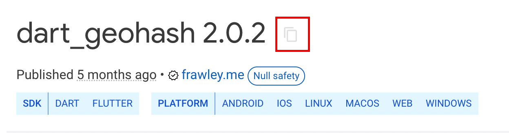

# How do I import a flutter package?

To get started with Custom Code in FlutterFlow, please watch this tutorial. The steps for creating a custom widget or an action are somewhere similar. But, here are some links to our documentation that provide some step-by-step instructions on how to create them.

Custom Widget Documentation

Custom Action Documentation

**Here are the instructions on how to get a dependency in FlutterFlow.**
Dependency is a package (library) hosted on pub.dev. While creating the Custom Action, you may need the dependency name and its version so that FlutterFlow can download that dependency for your project.

To get the package/dependency name and its latest version:

Open the package/dependency page on pub.dev.

Click on the Copy icon on the right side of the package name.

Paste the copied dependency inside the FlutterFlow.

**The next important step is getting the package import statement.**
Package Import Statement is usually a path where the code (you are using to create Custom Widget/Action) resides. While creating Custom Widget/Action, you need the package import statement to be written at the top in the code editor.
To get the package/dependency import statement:

Open the package/dependency page on pub.dev.

Select the **installing** tab.

Under the **Import it** section, copy the import statement by clicking on the Copy icon. Paste it inside the Custom code editor.

Here are some additional important points to note while working with custom actions/widgets

Make sure your pub.dev widget has WEB support. This is required to use the widget in Run/Test mode within FlutterFlow.

Inside the **Required Pubspec Dependencies** enter the **package name with its latest version. **It should be something like `packagename: ^version`. If you don't use a version it imports the last version specified on pub.dev for the package.

Every time when you add a new parameter, make sure you compile the Custom Widget.

You won't be able to delete a Custom Widget/Action if it is being used in the app. To successfully delete a Custom Widget/Action, make sure you are not using it anywhere.

