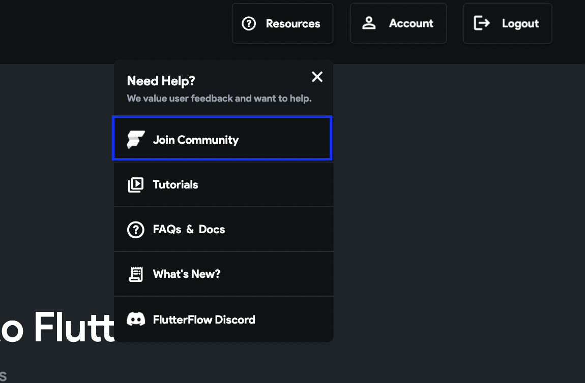

# How do I join the FlutterFlow community? It says my account is not created and my password is wrong.

The FlutterFlow community is a separate website and requires you to create a separate login from your FlutterFlow login.

You can join the FlutterFlow community by following these steps:

On the dashboard screen, click on the Resources button.

Here you'll find an option to "Join Community".

Check your inbox for an invitation email from no-reply@circle.so.

Select **Accept the invitation **in the email and complete the account setup.

***Make sure you use the same email address that's registered with FlutterFlow. If you aren't sure which email address you used, you can check the Account page.***