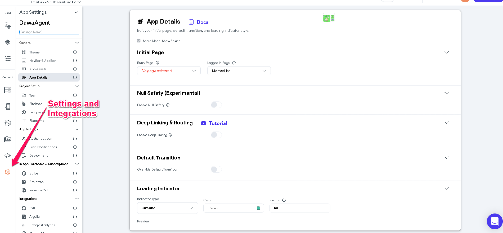
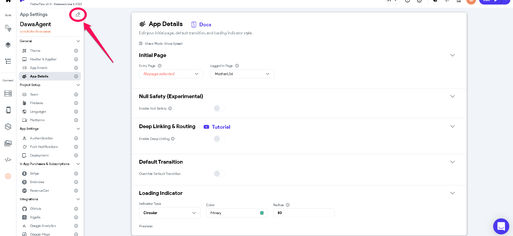
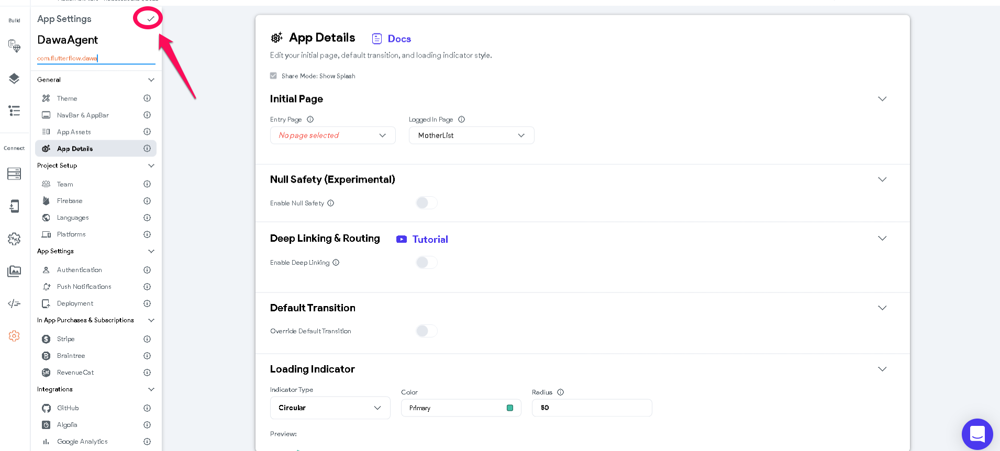

# How to change the package name of an application in FlutterFlow

When changing the package name of an app in Firebase, you will also need to change the package name from FlutterFlow as well for your app to be synchronized with the database. Outlined below at the steps on how to do so.1. Head over to the **Settings and Integrations **page** **in FlutterFlow** **​

2. Click on the icon shown in the button to make the app and package name editable. ​
3. After changing the package or app name, click the tick icon to save the changes.​
