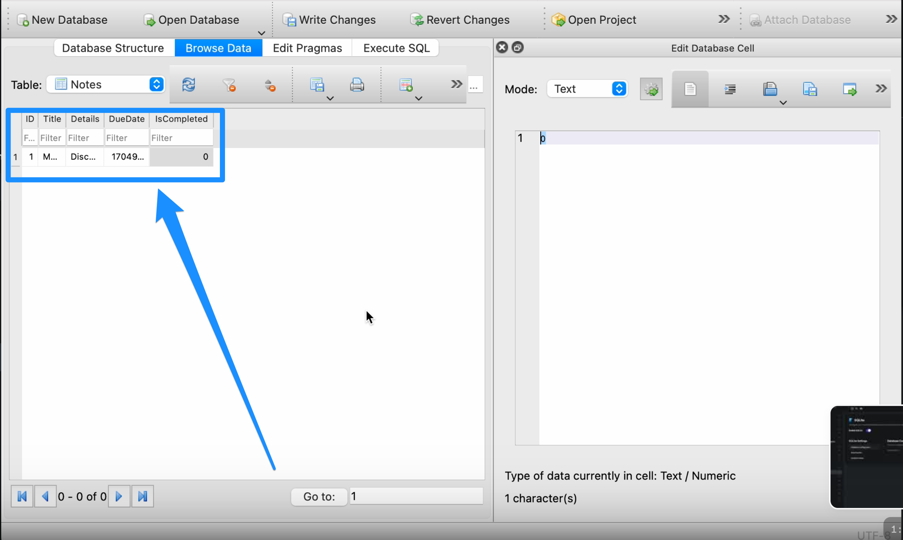

# Troubleshooting SQLite in FlutterFlow

Introduction
One of the key features of FlutterFlow is its seamless integration with SQLite, a lightweight and efficient database engine. SQLite allows developers to store and retrieve data locally on the device, enabling offline functionality and improved performance.

However, working with SQLite in FlutterFlow can sometimes present challenges, especially for those new to the platform or unfamiliar with database management. From common error messages to performance issues, troubleshooting SQLite in FlutterFlow requires a solid understanding of best practices and effective strategies.

In this comprehensive guide, we will dive deep into the world of SQLite troubleshooting in FlutterFlow. We'll explore common issues encountered by developers, provide step-by-step solutions, and share valuable insights to help you overcome obstacles and build robust, data-driven applications.


**Error 1: Database Configuration File**
Please ensure that the first letter of each word in the database configuration file is capitalized. Not capitalizing the initial letters may result in configuration or setup issues.

Next, please ensure that the variables in the database of the tables have set values.​


**Error 2: Late Initialization Error**
**Error Message**
`Late InitializationError: Field ‘xxx’ has not been initialized.`

**Reason**: SQLite is not supported on the web

**Resolution: **To test this the application would have to be downloaded and run on the local device for detailed testing.

**Error 3: Syntax Errors** 
When setting up read and update queries, syntax errors may arise. Here are some best practices to avoid facing syntax errors when using READ queries for SQLite.


Best Practices for READ Queries:
**1. Use SELECT statement**
Start your READ query with the SELECT keyword followed by the column names you want to retrieve.
If you want to retrieve all columns, you can use the asterisk (*) wildcard.

Example:
```
SELECT   column1,   column2,   ...FROM   table_name;
```

2. **Specify the table name**
After the SELECT statement, use the FROM keyword followed by the name of the table you want to query.

Example: 
```
SELECT   * FROM   employees;
```

3. **Use WHERE clause for filtering**
If you want to filter the results based on certain conditions, use the WHERE clause.
The WHERE clause comes after the FROM clause and is followed by the condition(s) you want to apply.

Example: 
```
SELECT   * FROM   employees WHERE   department = 'Sales';
```

4. **Use logical operators for complex conditions**:
If you have multiple conditions in the WHERE clause, use logical operators like AND, OR, and NOT to combine them.

Example: 
```
SELECT   * FROM   employees WHERE   department = 'Sales'   AND salary &gt; 50000;
```

5. **Use ORDER BY clause for sorting**:
If you want to sort the result set based on one or more columns, use the ORDER BY clause.
The ORDER BY clause comes after the WHERE clause (if present) and is followed by the column name(s) you want to sort by.
You can specify ASC for ascending order (default) or DESC for descending order.

Example: 
```
SELECT   * FROM   employees ORDER BY   last_name ASC;
```

6. **Use the LIMIT clause for limiting the result set**:
If you want to retrieve only a specific number of rows from the result set, use the LIMIT clause.
The LIMIT clause comes at the end of the query and is followed by the maximum number of rows you want to retrieve.

Example: 
```
SELECT   * FROM   employees LIMIT   10;
```

7. **Use aliases for column names**:
If you want to assign a different name to a column in the result set, use the AS keyword followed by the desired alias name.

Example: 
```
SELECT   first_name AS "First Name",   last_name AS "Last Name" FROM   employees;
```

8. **Use JOIN for combining data from multiple tables**:
If you need to retrieve data from multiple tables based on a related column, use the appropriate JOIN clause (INNER JOIN, LEFT JOIN, RIGHT JOIN, or FULL OUTER JOIN).
Specify the join condition using the ON keyword followed by the related column(s) from both tables.
Example: 
```
SELECT   e.first_name,   d.department_name FROM   employees e   INNER JOIN departments d ON e.department_id = d.department_id;
```

9. **Use parameterized queries to prevent SQL injection**:
When building dynamic queries with user input, use parameterized queries to avoid SQL injection vulnerabilities.
Use placeholders (e.g., ?) in your query and provide the actual values separately.

Example: 
```
SELECT   * FROM   employees WHERE   department = ?;
```

10. **Follow naming conventions**:
Use meaningful and descriptive names for tables and columns.
Follow a consistent naming convention, such as using lowercase letters and underscores for separating words (e.g., employee_id).

Best practices for **UPDATE** queries:
Like the one shown below: 


1. Use the UPDATE keyword followed by the table name:
```
UPDATE   table_name
```
2. Specify the columns to be updated and their new values using the SET clause:
```
UPDATE   table_name SET   column1 = value1,   column2 = value2,   ...
```

3. Use the WHERE clause to specify the condition that determines which rows should be updated:
```
UPDATE   table_name SET   column1 = value1,   column2 = value2,   ...WHERE   condition
```

4. If updating multiple columns, separate each column-value pair with a comma:
```
UPDATE   table_name SET   column1 = value1,   column2 = value2,   column3 = value3,   ...WHERE   condition
```

5. Use parameter placeholders (e.g., ?, :name) instead of directly inserting user input into the query to prevent SQL injection vulnerabilities:
```
UPDATE   table_name SET   column1 = ?,   column2 = ?,   ...WHERE   condition
```

6. If updating a column with a value from another column, you can use the column name directly:
```
UPDATE   table_name SET   column1 = column2 + 1 WHERE   condition
```

7. If updating a column with a value based on a condition, you can use a CASE statement:​
```
UPDATE   table_name SET   column1 = CASE WHEN condition1 THEN value1 WHEN condition2 THEN value2 ELSE value3 END WHERE   condition
```
8. If you want to update all rows in a table, you can omit the WHERE clause:
```
UPDATE   table_name SET   column1 = value1,   column2 = value2,   ...
```

9. Always double-check your UPDATE statement before executing it, especially if it doesn't have a WHERE clause, to avoid unintentionally updating all rows.

10. Consider using transactions (BEGIN, COMMIT, ROLLBACK) when performing multiple related updates to ensure data consistency

Here's an example that demonstrates some of these best practices:

```
-- Update the price of a product with a specific IDUPDATE   products SET   price = 19.99 WHERE   id = 1;-- Update multiple columns of a customer based on a conditionUPDATE   customers SET   email = ?,   phone = ? WHERE   id = ?;-- Update a column using a CASE statementUPDATE   orders SET   status = CASE WHEN payment_received = 1 THEN 'Paid' ELSE 'Pending' END WHERE   order_date &lt; '2023-01-01';
```
Remember to always test your UPDATE statements on a small subset of your data or on a backup copy of your database before applying them to your production data.

You can also verify your SQLite queries using SQLite Online

Additional Resources

SQLite documentation

SQLite Query

