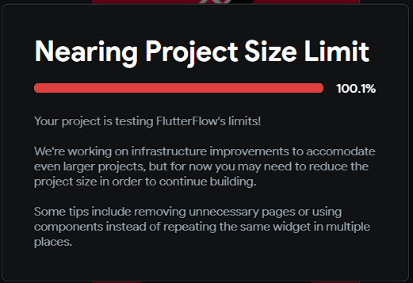
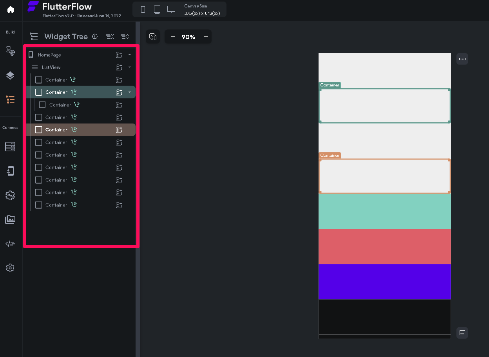

# What to do if your project reaches the project size limit?

While building complex applications, it might be that the project size limit could be exceeded. This article outlines some best practices/tips for minimizing resource usage while building complex applications. ​
Some of the best practices include: 1. Removing unnecessary pages in your project. 2. Using network path for audio/video files instead of importing the assets in FlutterFlow. 3. Avoid repeating actions, as shown in the attached image below. ​
