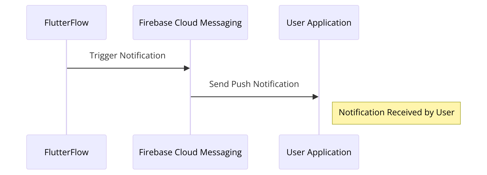
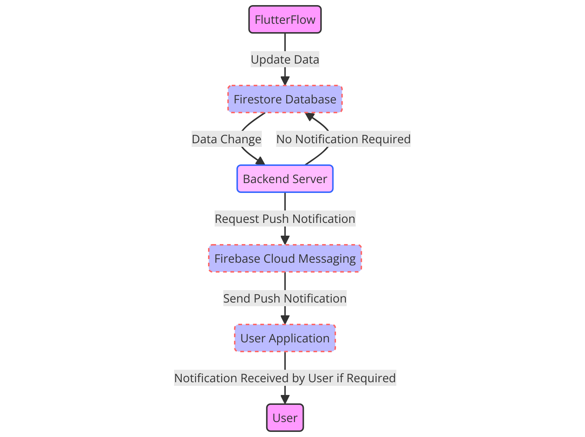
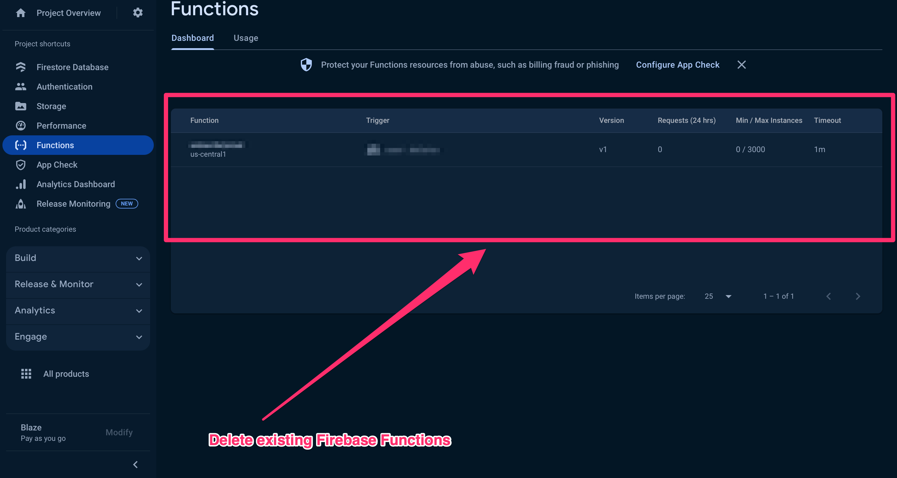
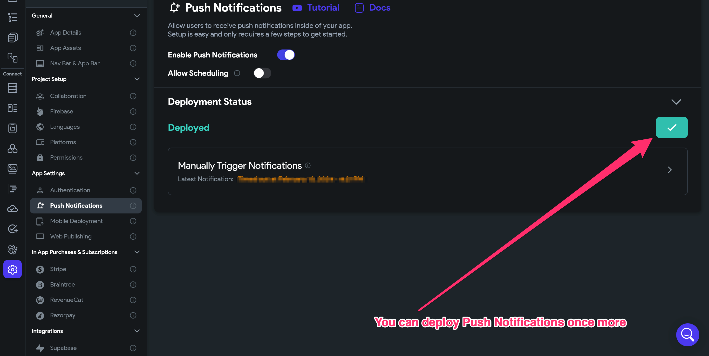
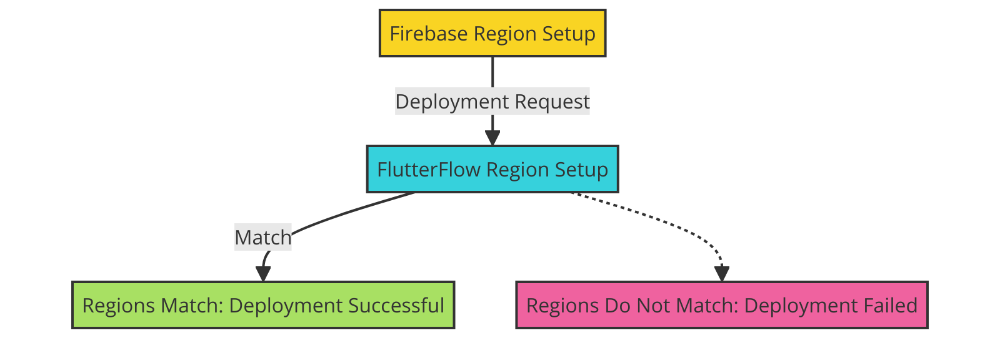
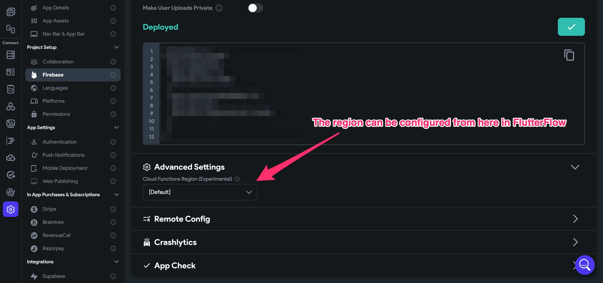
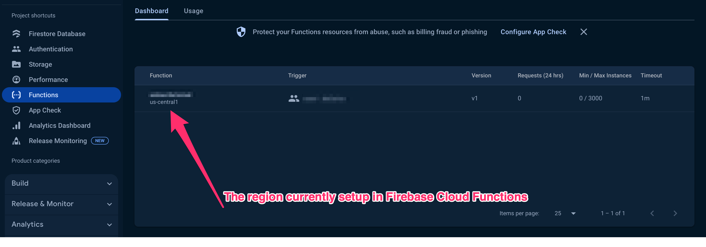
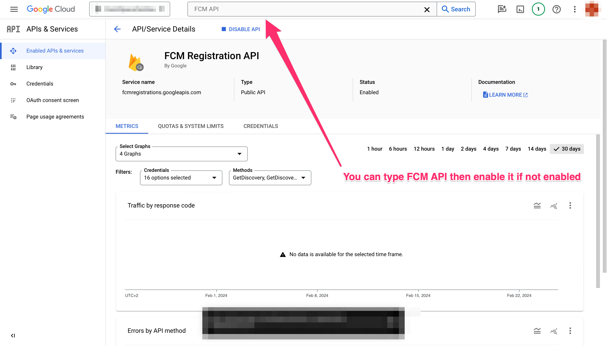
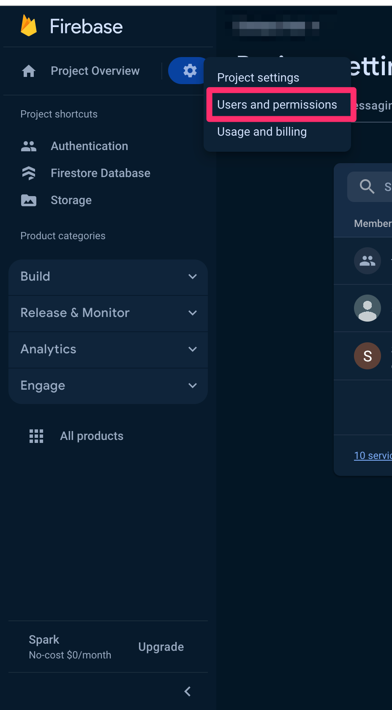

# Push Notification Sent to 0 (Zero) Devices

Introduction
Push notifications serve as a vital bridge between your FlutterFlow app and users, offering a direct channel for engagement, alerts, and updates. Despite their benefits, setting up and managing push notifications can sometimes feel like navigating a complex maze, especially when they don't work as expected. Whether you're a seasoned developer or new to FlutterFlow, encountering issues with push notifications is almost a rite of passage​When Push Notifications are triggered here is a flow of how the notifications ultimately reach the user.​

​
Pre-Requisites

Please ensure that Firebase Functions are enabled in Firebase​


Ensure you are on the Blaze plan in Firebase

What the Error Message Looks Like

```
Push Notification sent to 0 devices
```
​
​What Does This Error Mean?
The "Push Notification sent to 0 devices" message in FlutterFlow refers to a situation where a push notification was attempted to be sent, but it reached 0 recipient devices. Some potential reasons for this include:

There are no registered devices to receive push notifications for that FlutterFlow app yet. No FCM tokens have been generated.

All target recipient devices were offline and unable to receive the push notification at the send time.

A configuration issue or problem is connecting to the push notification service to deliver notifications to devices.

Permissions, system settings, or other restrictions are blocking recipient devices from receiving push notifications for that app among other reasons.​
***Essentially, "sent to 0 devices" most likely means no eligible, reachable, or listening devices received that push notification - even though the system tried to send it. It could be an issue on the sender configuration side or the recipient device side. Through the instructions below, we will follow step-by-step guidelines on how to resolve this.***

How Do I Resolve This Issue?

1. Delete the Firebase Cloud Function Manually in Firebase
After successfully deploying Push Notifications or other functionalities that require Cloud Functions, the functions will be recreated.

Then, deploy Push Notifications in FlutterFlow once more:



2. Verify the Server Region
The other important aspect is to check the server location. If you've chosen a server in the USA (e.g., "*`us-central1`*"), ensure that FlutterFlow is configured with the same server location. Inconsistencies in server location can cause unexpected issues.
Here is how to set up the region in FlutterFlow. ​Navigate to ***Settings -&gt; Firebase -&gt; Advanced Settings*** to modify these settings. ​
From the FlutterFlow, the region can be changed from [Default] to '***`us-central1`***'​In Firebase Cloud Functions, the region is shown here. ​


3. Check FCM API Settings in Google Cloud Console
The third step involves checking the settings of the Firebase Cloud Messaging (FCM) API in the Google Cloud Console. It's essential to ensure that the FCM API is enabled and has a secret key displayed in the Firebase Console. If the key is not shown, you must create a new one in the Google Cloud Console.​In the Google Cloud console, you would have to type '***FCM API***' and then enable it if not already.


4. Ensure You Have Added The Required Cloud Permissions
To ensure that push notifications function correctly in your FlutterFlow app, you need to grant the necessary cloud permissions to the firebase@flutterflow.io service account. This article will guide you through the process of adding the required permissions in the Firebase Console.

Step 1: Open the Firebase Console
Go to the Firebase Console (https://console.firebase.google.com/).
Click on the project tile to open the project dashboard for your FlutterFlow app.​
Step 2: Navigate to Users &amp; Permissions
In the project dashboard, locate and click on the gear icon (⚙️) in the top-left corner to open the project settings.
From the left sidebar, select "Users &amp; Permissions" under the "Project" section.

Step 3: Verify firebase@flutterflow.io Permissions
In the "Users" tab, look for the "firebase@flutterflow.io" service account.
Check if the following permissions are listed next to the service account:​
***Editor***
***Cloud Functions Admin***
***Service Account***

If any of these permissions are missing, proceed to the next step to add them.

**Step 4: Add Missing Permissions (if necessary)**
Click on the "Add Member" button in the top-right corner of the "Users" tab.
In the "Add members" dialog, enter "firebase@flutterflow.io" in the "Members" field.
Click on the "Select a role" dropdown and choose the missing permission(s) from the list:

***Editor***
***Cloud Functions Admin***
***Service Account***


Click the "Add" button to grant the selected permissions to the firebase@flutterflow.io service account.​
**Step 5: Verify the Added Permissions**

After adding the missing permissions, verify that "Editor," "Cloud Functions Admin," and "Service Account" are now listed next to the firebase@flutterflow.io service account in the "Users" tab.

Additional Resources


