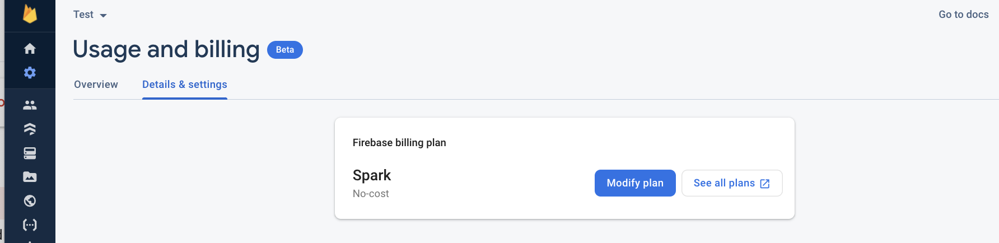
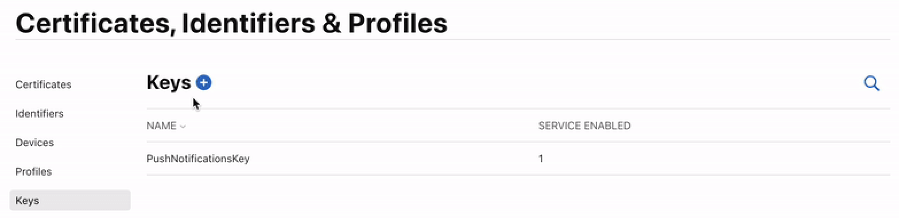
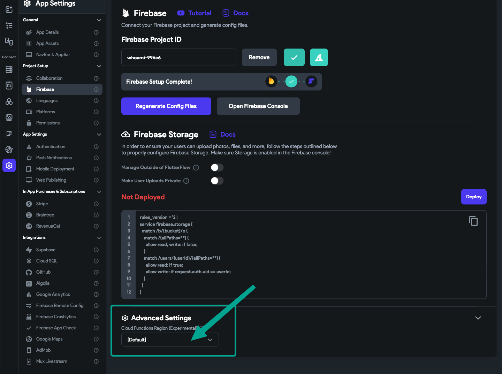
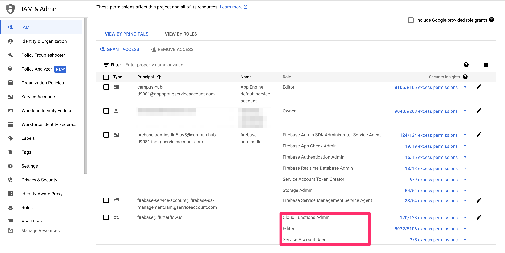

# Troubleshooting Push Notification Issues in FlutterFlow

Push notifications are a crucial feature in mobile applications, allowing you to engage with your users and keep them informed about important updates. However, sometimes push notifications may not send as expected, leaving you and your users frustrated. In this article, we'll guide you through the most common issues that can cause push notification failures in FlutterFlow and provide you with step-by-step solutions to resolve them.

Please note the following situations where push notifications do not work by design:

Push notifications will not work on an iOS simulator. To test you will need to use a real device. Here are instructions on how to do this.

Push notifications will not work if the user is not logged in to your app.

Push notifications will not work if you have the app open on your device.

With Codemagic Deployment
Ensure your Blaze Plan is active for Firebase.
Even if you've previously subscribed, it's always good to double-check this and make sure your subscription status hasn't changed.

Head to the Firebase Console and select Project Settings &gt; Usage &amp; Billing &gt; Details &amp; Settings. 

If you see **Spark** listed, you will need to select **Modify Plan** and upgrade to a Blaze Plan. 

Click here for more information on Firebase pricing plans.

Ensure you have created a push notification key for Apple.
Apple requires developers to create a key for the push notifications inside the Apple Developer Console to verify the push notification's sender.

Head to your Apple Developer account and select Certificates, Identifiers &amp; Profiles &gt; Keys.

If you haven't added a push notification key, you will need to add this.

Here are instructions on how to add a push notification key.​

**Ensure you have added the APN key to Firebase.**
Head to the Firebase Console and open the project dashboard for your project (click the project tile). Select Project Settings &gt; Project Settings &gt; Cloud Messaging.

Scroll down to the iOS section. If you have no files listed under APNs Authentication Key (like the photo below), you need to upload the APN Key.

Here are the instructions on how to upload the APN key to Firebase.​
**Ensure you have added a push notification identifier for Apple.**
You must add an Identifier to be able to send the push notifications to the iOS devices after you deploy your app to the app store.

Head to your Apple Developer account and select Certificates, Identifiers &amp; Profiles.

If you haven't created a push notification identifier, you will need to add this.

Here are instructions on how to create your push notification identifier.

Ensure you have added the required cloud permissions
For push notifications to work, you will need to add the following cloud permissions for firebase@flutterflow.io: Editor, Cloud Functions Admin, and Service Account.

Head to the Firebase Console and open the project dashboard for your project (click the project tile). Select Project Settings &gt; Users &amp; Permissions. 

If you don't have Cloud Functions Admin, Editor, and Service Account listed next to fireabse@flutterflow.io, you have not completed this step.

Here are the instructions on how to add the required cloud permissions to your project.

Ensure your cloud function region is the same in FlutterFlow and Firebase 
We have an option in setting/firebase/advance you can change your data center region. In case you change this, it may be the cause of the notification deployment issue you are facing​Check your GCP location in your firebase project/setting.​

Make sure in FlutterFlow project / Setting / Firebase / Advance the cloud functions region is set to default, or the same region you have in your setting.In my case, it is set by default and it is good.​

**Ensure you are using the latest version of FlutterFlow**
To have access to the latest features, bug fixes, and performance improvements, it's important to keep your FlutterFlow version up to date. In this article, we'll guide you through the process of upgrading to the latest version of FlutterFlow.

Step 1: Refresh FlutterFlow
The first step in upgrading to the latest version of FlutterFlow is to refresh the application. To do this, follow these steps:

If you're using Windows, press the "Ctrl" and "R" keys simultaneously (Ctrl + R).
If you're using a Mac, press the "Command" and "R" keys simultaneously (Cmd + R).
This action will trigger FlutterFlow to check for any available updates and download the latest version.

Step 2: Clear Your Browser Cache
After refreshing FlutterFlow, it's crucial to clear your browser cache. This ensures that any outdated files or data are removed, allowing the latest version of FlutterFlow to run smoothly. The process of clearing your browser cache may vary depending on the browser you're using

FlutterFlow has insufficient permissions for Push Notifications
If you encounter an error in FlutterFlow related to insufficient permissions for the firebase@flutterflow.io account, follow these steps to resolve the issue:

**Step 1: Open Firebase Console**

Go to the Firebase Console 
Click on the project tile to open the project dashboard for your FlutterFlow project.​
**Step 2: Navigate to Users &amp; Permissions**

In the project dashboard, click on the gear icon (⚙️) in the top-left corner to open the project settings.
From the left sidebar, select "***Users &amp; Permissions***" under the "Project" section.

**Step 3: Locate the firebase@flutterflow.io Account**

In the "Users" tab, look for the firebase@flutterflow.io account in the list of users.
If the account is not present, you may need to add it by clicking on the "Add User" button and entering firebase@flutterflow.io as the email address.

**Step 4: Assign Necessary Permissions**

Click on the firebase@flutterflow.io account to open the user details page.
In the "Permissions" section, ensure that the following permissions are assigned to the account:

**Editor**

**Cloud Functions Admin**

**Service Account User**

If any of these permissions are missing, click on the "Add Permissions" button and select the required permissions from the dropdown menu.

**Step 5: Save the Changes**

After adding the necessary permissions, click on the "Save" button to apply the changes.
Double-check that all the permissions have been successfully added and saved.

**Step 6: Retry the Operation in FlutterFlow**

Go back to your FlutterFlow project and retry the operation that previously caused the permission error.

The error should now be resolved, and FlutterFlow should be able to access the required Firebase resources.
I
f you continue to face issues after following these steps, please reach out to the FlutterFlow support team for further assistance.

Note: Ensuring that the firebase@flutterflow.io account has the necessary permissions is crucial for FlutterFlow to interact with your Firebase project correctly

Ensure that all these permissions have been added and saved. 

Additional Resources

