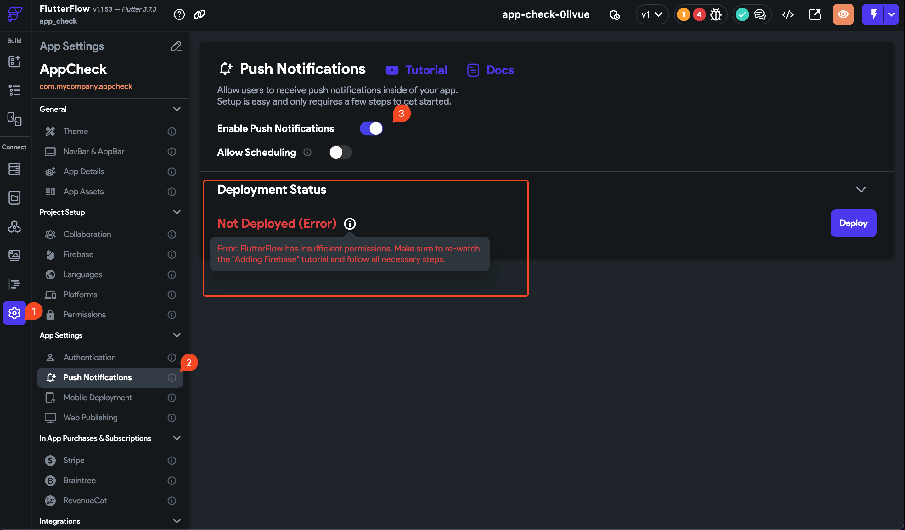

# What To Do When FlutterFlow has Insufficient Permissions for Push Notifications

Background
When deploying push notifications to Firebase using FlutterFlow, you may encounter an error message indicating that FlutterFlow has insufficient permissions. This error occurs when FlutterFlow doesn't have the necessary access rights to deploy the push notification settings to your Firebase project. In this article, we'll explore the cause of this error and provide a step-by-step solution to resolve it.

How To Resolve 
If you encounter an error in FlutterFlow related to insufficient permissions for the firebase@flutterflow.io account, follow these steps to resolve the issue:

**Step 1: Open Firebase Console**

Go to the Firebase Console 
Click on the project tile to open the project dashboard for your FlutterFlow project.​
**Step 2: Navigate to Users &amp; Permissions**

In the project dashboard, click on the gear icon (⚙️) in the top-left corner to open the project settings.
From the left sidebar, select "***Users &amp; Permissions***" under the "Project" section.

**Step 3: Locate the firebase@flutterflow.io Account**

In the "Users" tab, look for the firebase@flutterflow.io account in the list of users.
If the account is not present, you may need to add it by clicking on the "Add User" button and entering firebase@flutterflow.io as the email address.

**Step 4: Assign Necessary Permissions**

Click on the firebase@flutterflow.io account to open the user details page.
In the "Permissions" section, ensure that the following permissions are assigned to the account:

**Editor**

**Cloud Functions Admin**

**Service Account User**

If any of these permissions are missing, click on the "Add Permissions" button and select the required permissions from the dropdown menu.
Step 5: Save the Changes

After adding the necessary permissions, click on the "Save" button to apply the changes.
Double-check that all the permissions have been successfully added and saved.

**Step 6: Retry the Operation in FlutterFlow**

Go back to your FlutterFlow project and retry the operation that previously caused the permission error.
The error should now be resolved, and FlutterFlow should be able to access the required Firebase resources.
If you continue to face issues after following these steps, please reach out to the FlutterFlow support team for further assistance.

Note: Ensuring that the firebase@flutterflow.io account has the necessary permissions is crucial for FlutterFlow to interact with your Firebase project correctly

Ensure that all these permissions have been added and saved. 

**Additional Resources **

