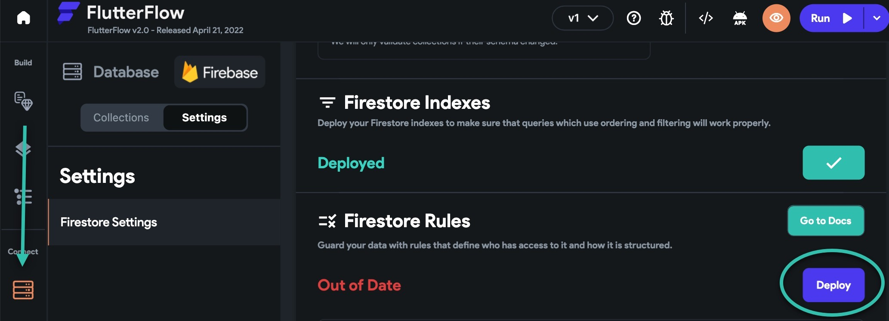
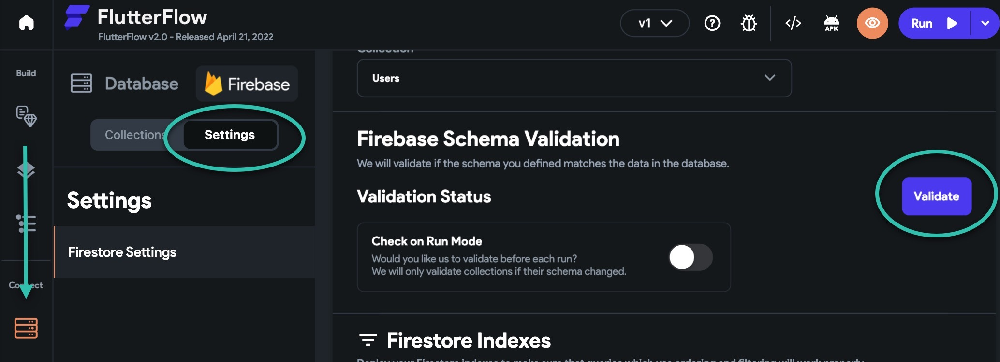

# I get a gray (grey) screen in Run Mode

If you see a gray screen in the UI Builder or while using Test/Run Mode (shown below), this indicates there is likely a configuration issue within your project.

In this article, we review the most common issues and how to resolve them.​
**Verify you have given firebase@flutterflow.io the correct access **
Run Mode and other features within FlutterFlow require that you add the have added the following cloud permissions for firebase@flutterflow.io: **Editor**, **Cloud Functions Admin**, and **Service Account User**.

To check if you have added the correct permissions, head to the Firebase Console &gt; Select Your Project &gt; Project Overview &gt; Users and permissions &gt; Advanced permission settings.

Next to firebase@flutterflow.io you should see Cloud Functions Admin, Editor, and Service Account User.

If you don't see these permissions, select the pencil icon and follow these instructions to add these permissions.

**Regenerate the Firebase configuration files ** 
Open your FlutterFlow project and select Settings &amp; Integrations &gt; Firebase &gt; Regenerate Config Files. A popup will appear, select Generate Files​
A popup will appear, select Generate Files. After this step is complete, you will be taken back to the main Firebase page.

**Tip: this step is required any time you change the name of your FlutterFlow or Firebase project.**
**Update your Firebase rules**
FlutterFlow has a built-in feature for updating your Firebase rules.

Open your FlutterFlow project and select Firestore &gt; Settings &gt; Scroll down to find Firestore Rules. Select **Deploy.**

A popup will appear. Select **Deploy Now**.

An orange loading icon will appear while the schema is being validated. Once deployment is complete, you will see **a **green checkmark.

**Validate your Firebase Schema**
Open your FlutterFlow project and select Firestore &gt; Settings &gt; Scroll down to find Firebase Schema Validation. Select **Validate.**

An orange loading icon will appear while the schema is being validated. Once validation is complete, you will see **Successful **next to Validation Status.

Check to see if any issues were identified. If the validation found any issues, you need to troubleshoot and resolve these.

**Make sure your Firebase collections have data in them**
A query for a collection with no data in it will result in a gray screen.

To double-check that head to the Firebase Console and select Firestore Database. Here you can see your collections and the data within them.

**If you are using a custom widget, ensure that the package has Web support**
Packages with web support are required for your custom widget to render properly in Run Mode.

To check if your package has web support, search for the package and check if **WEB **is listed under platform. 

If you don't see WEB listed, you will need to select a different package for it to work properly in Run Mode.

**Ensure you are on the latest version of FlutterFlow**
To upgrade to the latest version of FlutterFlow select Ctrl + R on Windows or Cmd + R on Mac.

After you have done this, clear your browser cache and log out/in to FlutterFlow.

**Tip: Clearing the cache and restarting the browser can help if you notice FlutterFlow is running slower than usual.**
**Retest your project**
After you have completed these steps, create a new Run Mode version of your project and see if the gray screen has been resolved.

**Test your project locally**
If the issue still persists, we recommend downloading the code and testing it locally on your machine. This will allow you to identify the exact source of your error. Here are the instructions on how to test your app locally on your machine.