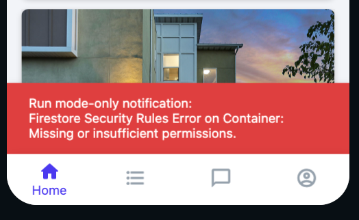

# Run mode-only notification: Firestore Security Rules: Missing or insufficient permissions

If you are seeing this error in Run Mode, there is a mismatch between your Firestore Rules and the permissions required for your query.

**Tip: **the error will indicate which item has the issue. For example, in this project there is a permissions issue with Container on this page. Giving your widgets descriptive names will make it easier to identify the source of the permissions issue.​
Here a couple of examples that would cause you to see this error:

If Firestore rules are set to “No one can read from this database” then you would see this notification on every query. 

If your Firestore rules are set to “only logged in users” and you put a query collection on the sign-in page (before a user signs in), that query would fail and you would see this error message.

