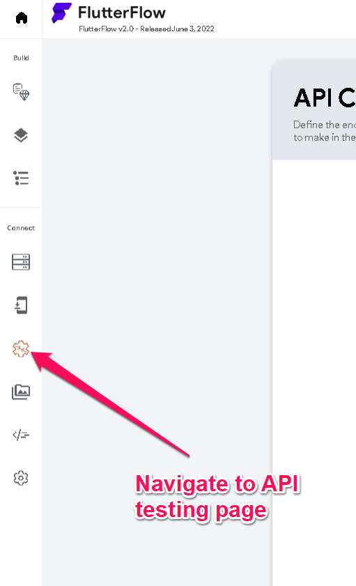
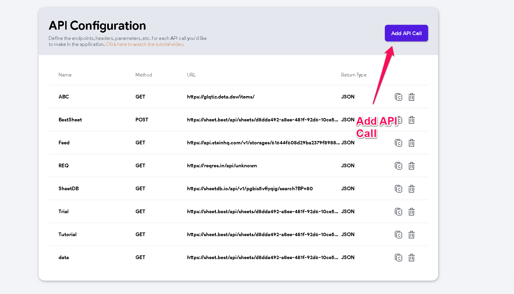
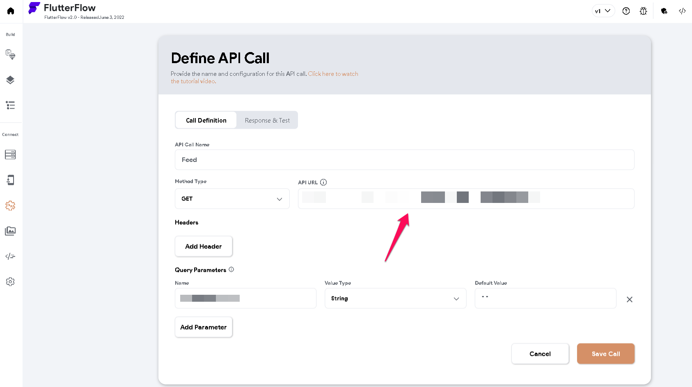
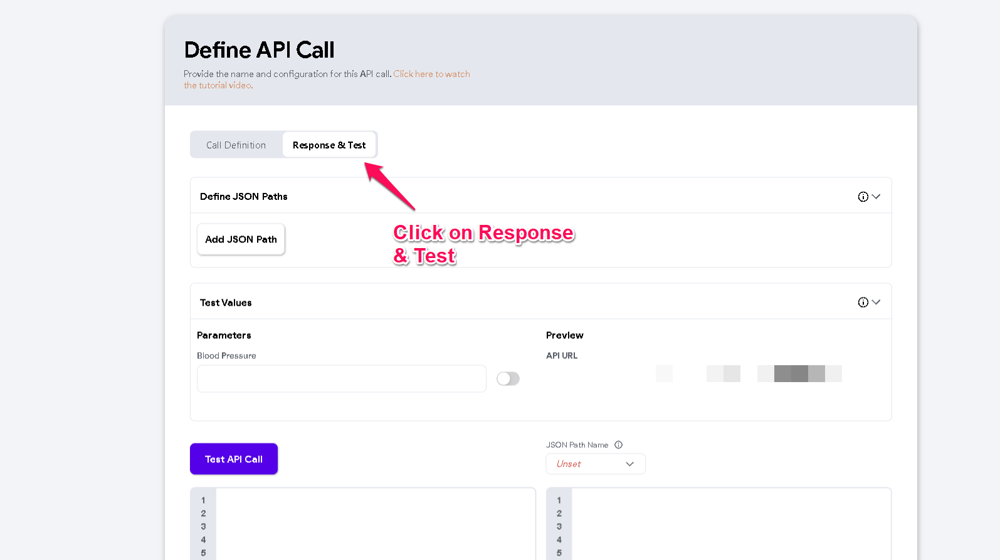
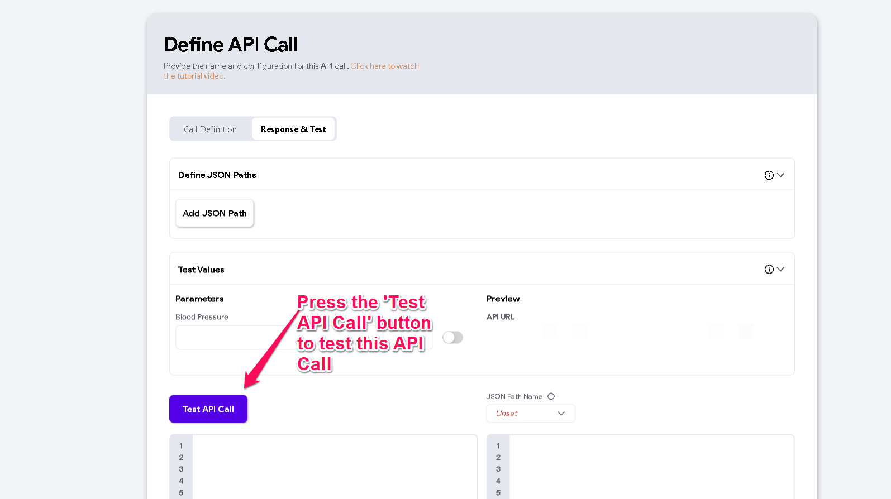
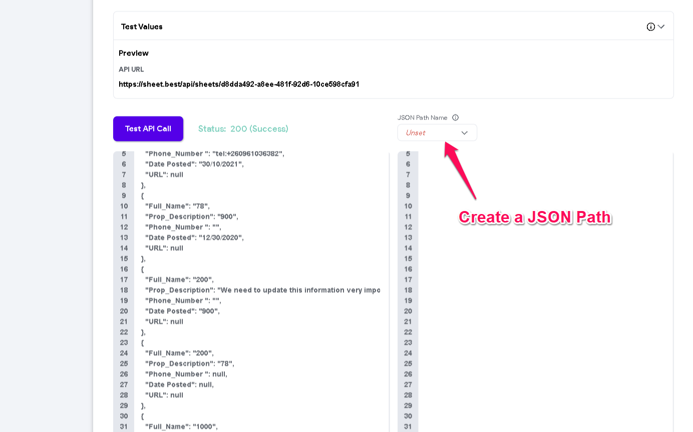

# How to test APIs in FlutterFlow.

Whether it is a SOAP or REST API, verifying if an API works before using it in your application is crucial. This article will guide on how to test APIs in FlutterFlow. 1. Navigate to the API Calls page ​
2. Click on API call in your project. ​
3. Add an API call, including the endpoint. ​
4. Next, click on 'Response &amp; Test.' ​
5. Lastly, click the 'Test API Call' button to verify if the output is as expected. ​
A valid API Call will have an output that takes the form as shown in the attached image below. ​
JSON paths can be tested from (https://jsonpath.com/)​