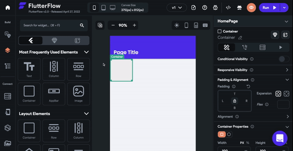

# Having issues scrolling inside of FlutterFlow

Most areas of FlutterFlow do not have scroll bars. Instead, you just need to hover over the section and scroll as they would normally.

If you are unable to scroll in FlutterFlow, please try these troubleshooting steps:

**Use a mouse when building in FlutterFlow**
If you are building using a trackpad, try using a mouse. There are some known issues with Flutter and trackpads on Windows computers.
**Check Your Scrolling Settings**
Your ability to scroll in FlutterFlow can be impacted by your device settings. For example, Windows may require two fingers to scroll.

For more info on updating Windows touchpad and mouse settings, please see this article.

For more info on updating Windows touchpad and mouse settings, please see this article.
**Switch To Google Chrome**
FlutterFlow works best in Google Chrome. If you are using another browser (e.g. Safari, Firefox), you may encounter performance issues and feature limitations.

If you are using a different browser, switch to Google Chrome and see if you still face this issue.
If the issue persists, please reach out to us at support@flutterflow.io.