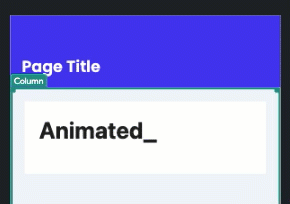
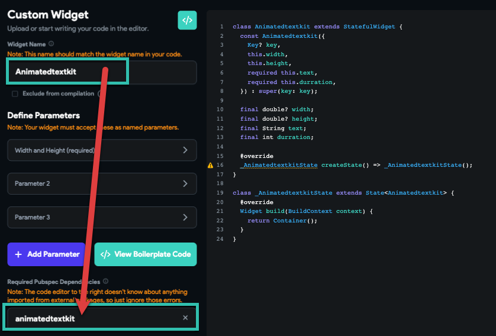
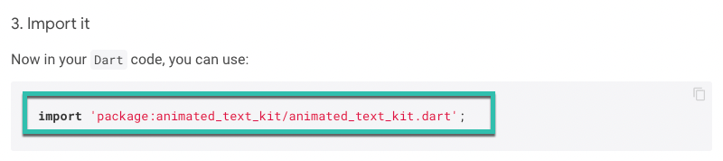
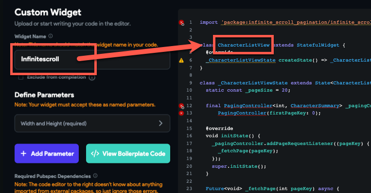
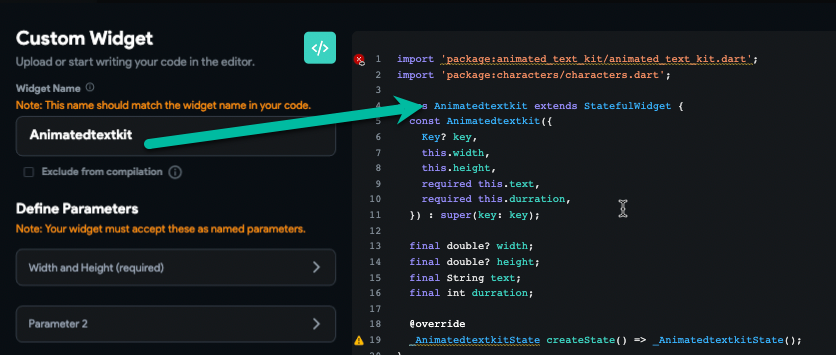

# Custom Widget Troubleshooting

We want to make a custom widget and reproduce some common errors and issues and explain how we can fix them.What do we want to make during this article?

**Animated Text Widget**
**Project URL: https://app.flutterflow.io/project/animated-kit-widget-fyqw6j**
**Run mode URL:  https://app.flutterflow.io/run/QP62FwanUTRs7O3HJzdo**

Tips:

1: always set the left panel sideWidget name [ make sure to use a unique name ]2: Use the boilerplate code and copy it, then start to edit, and add the code

**Errors could happen:**​
**1: The widget name is the same name as the package you used as a dependency**

Make sure the widget name you pick is not the same as the package names you import as a dependency, also don't use unique names like "main" or "widget"Try to use unique names.2: **Forget the package import inside the code**​
You use an external package for your custom widget and you add it in dependency, but you forget to put the import line in the code
"The method X isn't defined ..."

Fix: Open the package URL on pub.dev, you can find the import line in the details
in our example, this is the import line​

**3: Packages you are using also need another external package, and you need to import that as well.**Each time you want to use a package, make sure that specific packages have other needs as dependency or not.​
In this picture, you can see our package needs another dependency name "silver_tools"When we are making the custom widget we need to do this import as well.​
**Notice:** Always check the widget name in the code, if you forget to use the boilerplate code, then maybe the name of the widget and name in the code maybe be different, and it could cause compile failure.​
as you can see in this picture name of the widget is not the same as in the code. and this widget will fail to compile.
it should be like the picture below.

