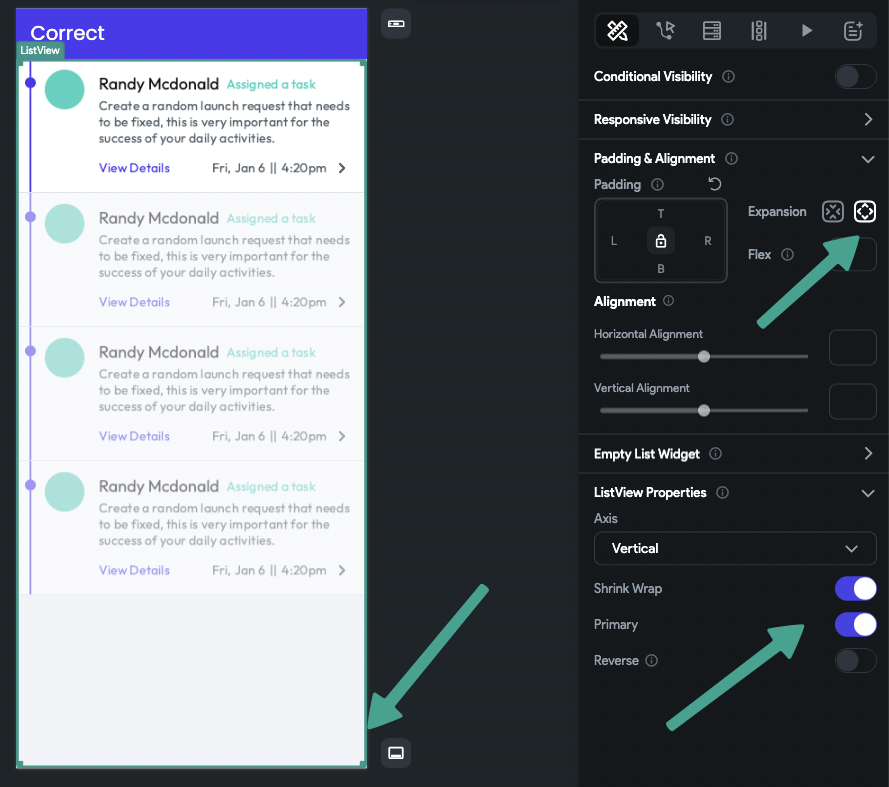
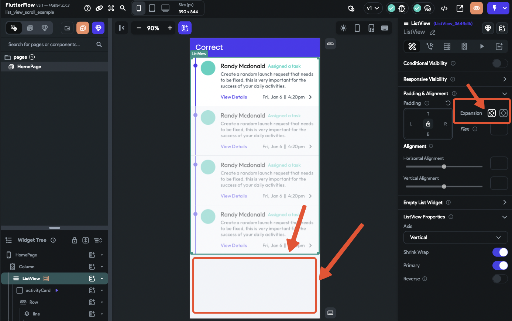

# ListView with Infinite Scroll Enabled is Not Working and Loading All Items

If your ListView with infinite scroll enabled is loading all items at once instead of paginating, follow this guide to understand the cause and apply best practices for a smooth user experience.

---

## 1. Issue Overview

> **Problem:**
> - Infinite scroll is enabled, but ListView loads all items instead of a limited number per page.
> - This can lead to performance issues and unexpected behavior.

---

## 2. Why Does This Happen?

- The ListView expands indefinitely when there is no height constraint.
- Without a defined height, the query loads all items because it cannot determine the visible area.

---

## 3. Solution & Best Practices

### 🛠️ Make ListView "Aware" of Available Space
- The ListView must know its available height to calculate how many items to load per page.
- **Example:** If the ListView has 800px of space and each item is 100px tall, it should load 10 items (8 visible, 2 just out of view). As the user scrolls, the next set of items loads.

---

## 4. Implementation in FlutterFlow

**This project includes examples of the implementations below.**

### ✅ Best Practice Implementations

- **Let ListView Handle Scrolling:**
    - Turn off scrolling on the parent column.
    - Enable the primary option and use expanded options on the ListView.
    - This allows ListView to know the page height and adjust items accordingly.
    - 

- **ListView Inside a Scrollable Widget:**
    - If you need ListView inside another scrollable widget, wrap it in a container with a fixed or max height.
    - **Example:** Main scrollable is a column, ListView is inside a container with a fixed height (e.g., 500px). The ListView scrolls until the end, then the page scrolls.

---

## 5. Configurations That Can Cause Issues

- If the ListView is not expanded or lacks a height constraint, it cannot determine how many items to load.
- If the parent column is scrollable, ListView cannot calculate its height, leading to all items being loaded at once.
- 

---

## 6. Conclusion

Implementing infinite scroll in ListView can greatly improve user experience, but only if configured correctly:

- Calculate the number of items to load based on available space.
- Wrap ListView in a container with a fixed or max height if needed.
- Let ListView handle scrolling when possible.

**See the [project example](https://app.flutterflow.io/project/list-view-scroll-example-wdv076) to view these best practices in action.**