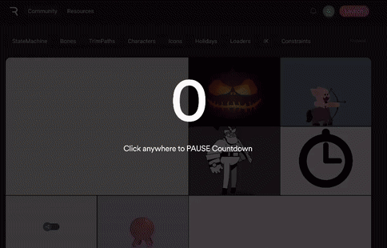

# My Rive animation is not loading

The most common reason Rive animations do not work in FlutterFlow is an incorrect URL format.  

Double-check that your URL has the correct format, including the file extension `.riv`. It should look like this:
```
https://public.rive.app/community/runtime-files/1199-2317-jack-olantern.riv
```

To get the network URL for a community animation:
**Right-click the download button** and select **Copy Link Address.**



