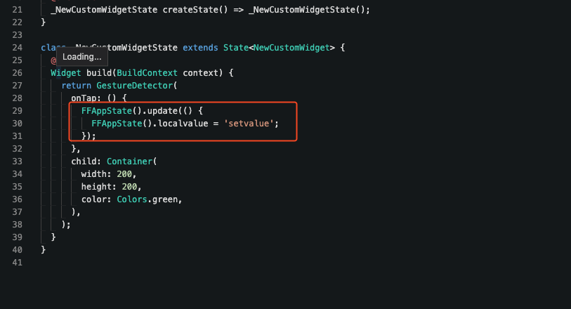

# Tutorial: Getting output from Custom Widgets

**Use Case**
There might be scenarios when you might need to get some output from the custom widgets, but because it is no direct way to do that in FlutterFlow, I will be sharing an alternative way to do that.​

Tutorial:
In order to get the value out of the custom widgets, we'll be using app state variables to do that. The strategy would be to store the value from the custom widget inside the app state variables and then use them outside the custom widget on the screen.Step 1: Create a new app state variable.​
Step 2: Update the app state variable inside the code using FFAppState() as shown in the image​
Here is the code to update:`FFAppState().update(() {`
`FFAppState().localvalue = 'setvalue';`
`});`**Still facing any problems?**
If you still face any problems after following the outlined steps, please reach out to support via Chat or Email at support@flutterflow.io.​