# API Call Error Handling.

**Why do we need error handling?**​
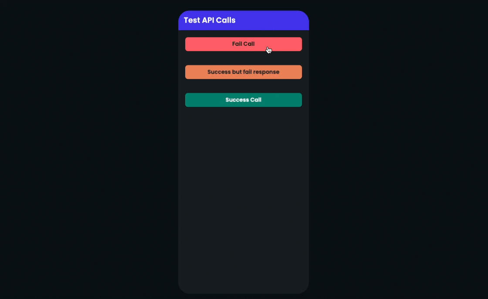**1: We need to know whether the API call was successful or not**
**2: If the API call was successful, is the response valid or not**

**3: if the API call fails, what is the error code [ for troubleshooting ]**We need the error code, in case the **API call** fails, so we can find out where is the issue.**Let's set up an API call throw the actions [ the principles for the API calls in the UI are the same ]**1: Add an API call action. 
**Notice:** *when you make an API call action make sure you write a name for the action output variable, this way we can access the result of the API call throw the action output.*​
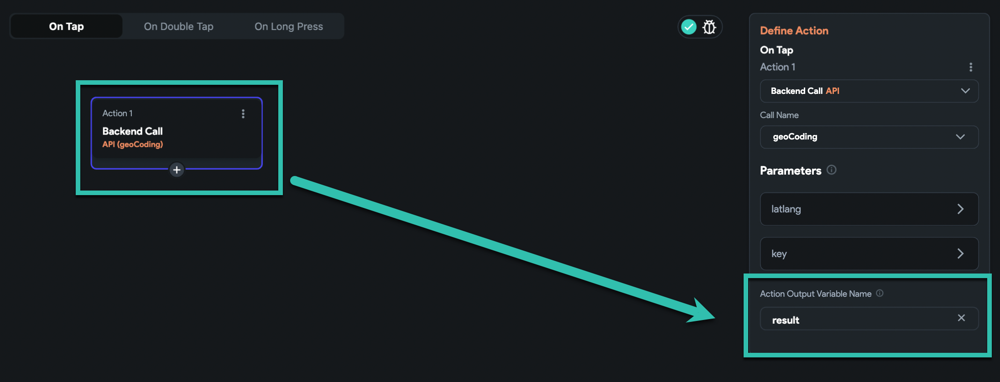In general, if you want to be a silly developer, you can leave this here, and just use the result.But the point is, this works only when API calls success and there is some data to use.**But what if the API call fails?** yes, this is the exact time we need to handle the errors and check the API call situation before using the response.
​

2: Add a conditional action
We need to check the API call status if it is a success or not.

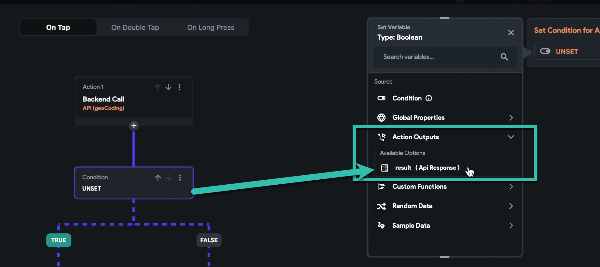After we select the result [ **the output variable of the call** ] we have access to a boolean type variable name Succeeded. this variable is true if the API was successful.this is the easiest way to find out whether our call was successful or not

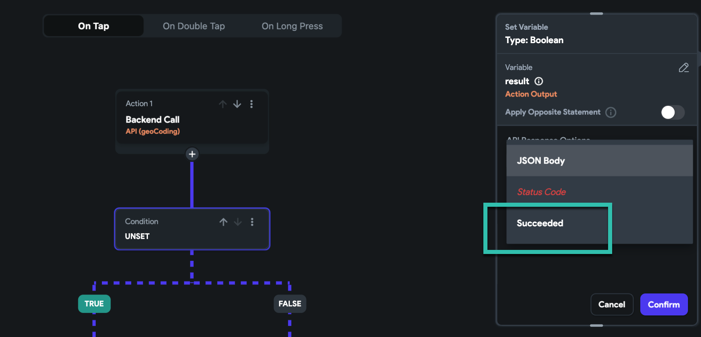***Notice: ****if after an API call you want to search for a specific error code, then you can choose the condition and then select the status code.*for example, if I want to check the status code of the API is 400 or not, I can do this:*** sometimes we want to do something specific when a status code was there**

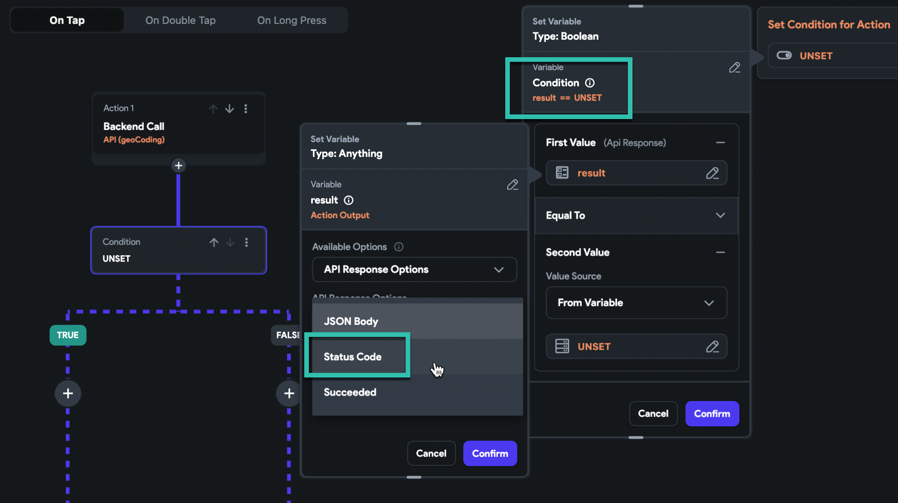
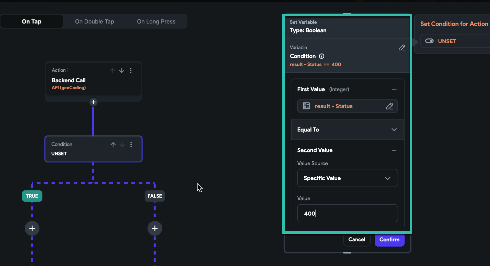
in this article, we check the boolean field Succeeded, and based on this we continue​

3: add the action for when the call fails.

now we show a snack bar and the message we want to show is the error code, simply now if the API call fails, we can see the error code.

**you can use combine text and show more data or some static texts, or you can show alert dialogs or even navigate to another page, the action after success or failure is up to you and your logic.**

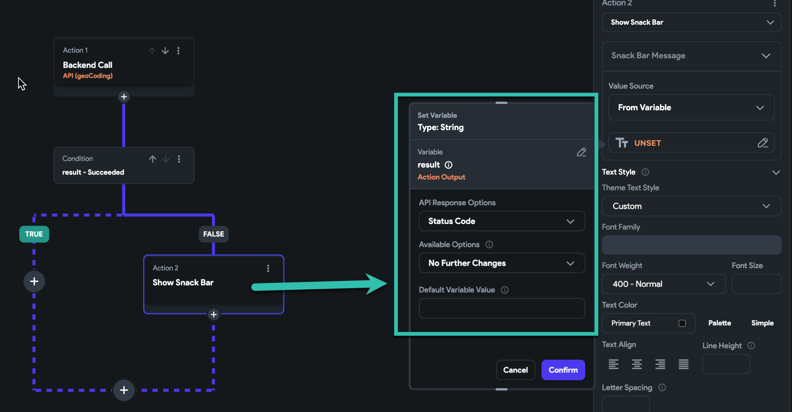Ok, Do you think we are done?? NO. why?some times even when our call was successful, the response body is not what we expected.for example here. I try to retrieve my full address from geoCoding google API.when I give it the wrong KEY, the API call is a success but the response is not a valid response, it is a failure response.so in my case, a success call is like this picture:

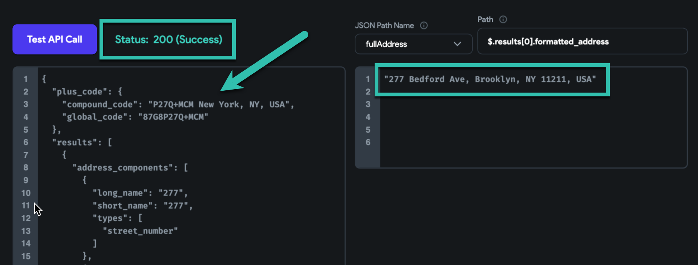But now, a success call with no valid data is like this:

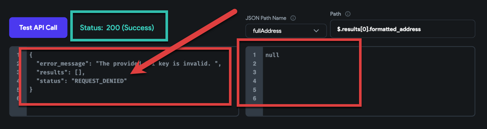As you can see, the status is** code 200**, and it is a **success**, but we don't have a valid response here, and if I use the custom path I have, it will show **NULL** in my app, and I wonder why?

So for better logic, it is better we check the response body data before using it.

****Notice: this depends on the API servers you are calling them, so maybe you don't need to do this, but in most cases, it helps you save time and reduce the debug sessions.***​

4: Check whether the response is valid data or not
this part is a bit tricky and can be done base on the response data you will get from each API call, but most of the time we can check one of our custom oaths.
for example here, I will check whether my custom path is null or notin my API call, I have a **custom path** for the **full address**, and I want to check this path, after the success call, if this field is not null, then means the call has a valid response​
**Notice: based on your API call and your response you can check all the responses, or check the response in a custom function and search for specific data.*​
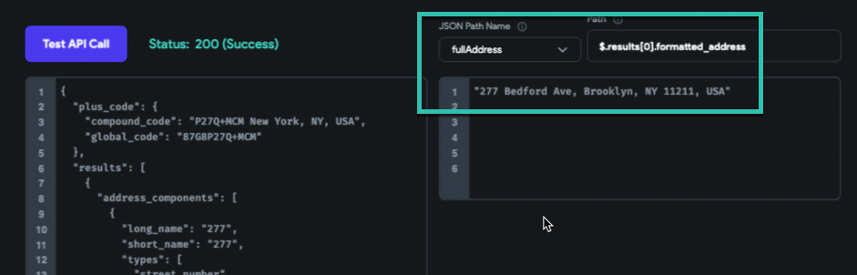
And this is the conditional action​
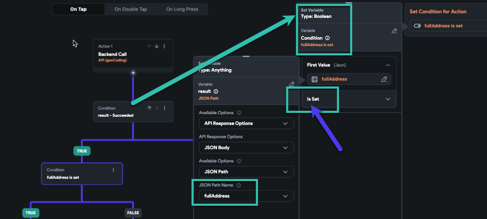I chose the custom path I have, here is the full address, and then use the powerful set or not set in Flutterflow.I say, if this **JSON path** *is set*, then do: here I show my full address in a snack bar.

On the other hand, when is not set, I show the whole response body in a snack bar, so I can see the response.​
**Notice most of the time in this situation, we can see the error code and error message in the response, so printing the error message can help us to know what is happening.*​
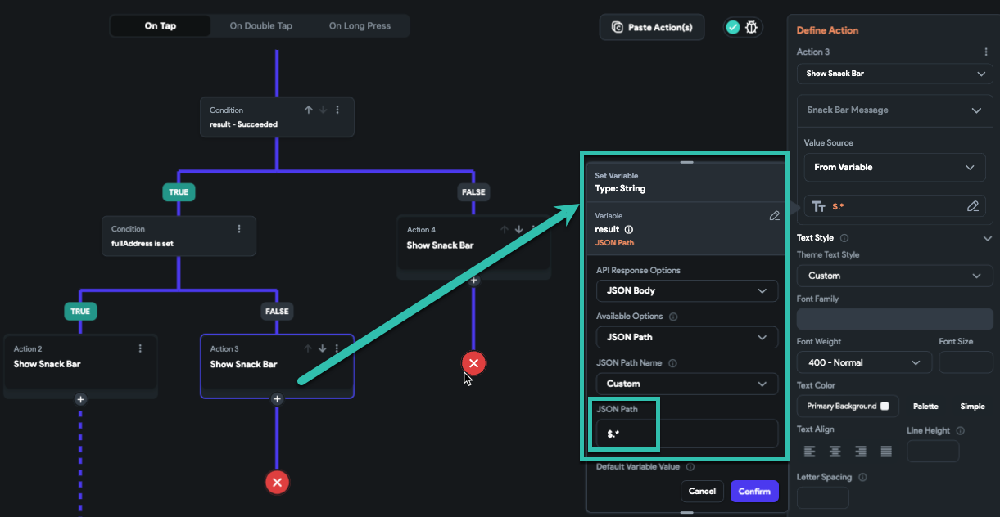FINAL:
now let's see our action flow.​
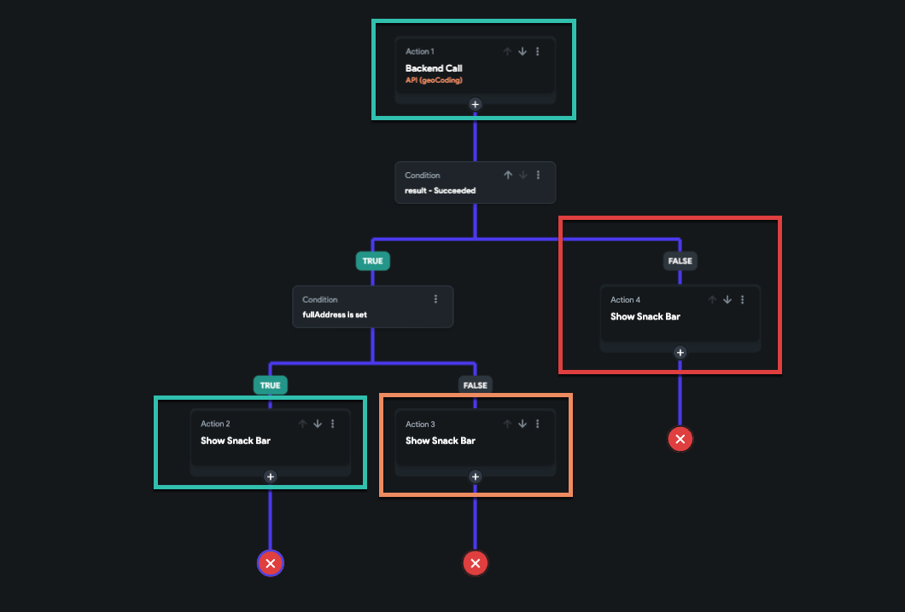
This is a simple flow, but the point is, with this, nothing can happen that we don't expect it.and now we are sure in any condition, we know how to deal with the data and situation, so we can properly show the best possible UI to the user.Here I made an example. 
we have 3 separate API calls
1: Fail call
2: success call, but not a valid response
3: Success call with a valid response

Run Link for this example

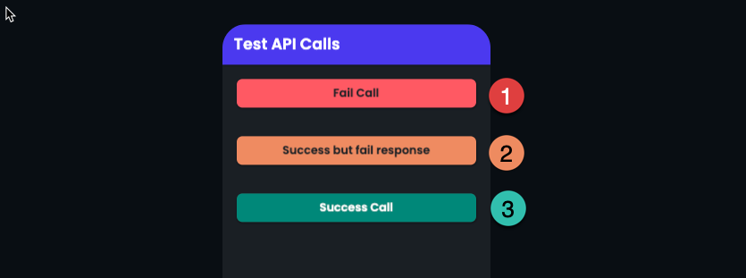
Here is what happens in each call

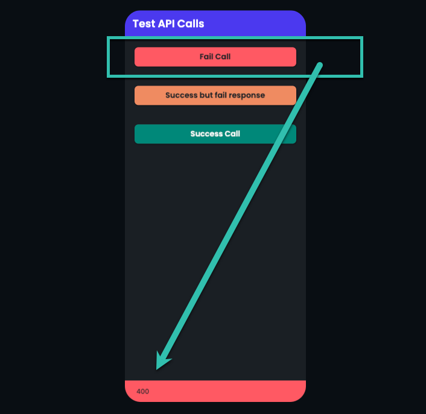Now we know that API fails and our error code is 400
Now you can do research on error codes and find the cause.Here is our article about error codes ​
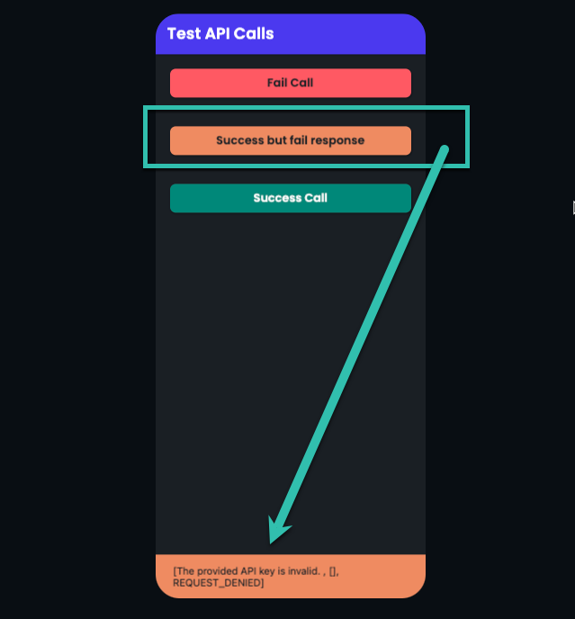
Now the second situation: call is a success but the custom path [ full address ] is not set means it is empty.i print the response now I can see it and the message is "REQUEST_DENIED"Now I can search for the request denied error message to find out where I fail.And the last one is my successful call

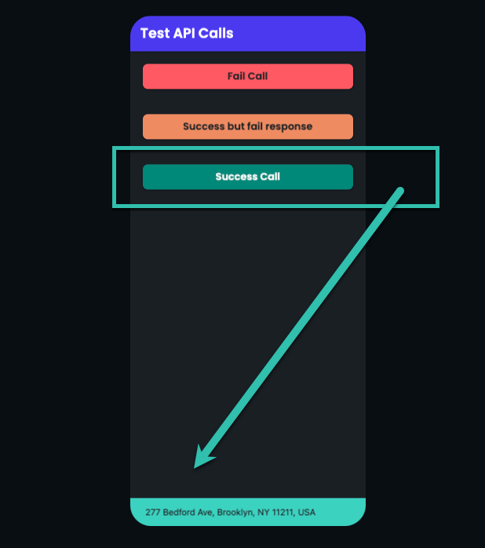Now my call is successful and my custom path is not null, so with peace of mind I can use my custom path and show my full address.**This is a safe way to deal with an API call. with peace of mind. Enjoy!**

