# Custom routing when a user logs in

**Why do we need a mission control page?**
In this article we'll show you how to use a Mission Control page to:

Show a page to a user for the first time they log in and then route the user to the home page.

If a user is an admin, route them to the admin dashboard instead of the home page.

You don't have to both of these together (e.g. you could just build the admin routing). However, many users have asked to include these together - so we thought it would be helpful to show them together.

**Prerequisites:**
In order to get started, you will need:

A FlutterFlow project with Firebase set up (instructions)

Authentication setup in your FlutterFlow project (instructions)

**The Pages You Will Need In Your App**
We will need five pages in our app to accomplish this:

**Login page:** this is our initial page and the page that let users log in to the app

**Onboarding page:** we want to show this page one time, to new users only

**Admin home page: **we want to route admins to this page after login

**User home page:** we want to route users (non-admins) to this page after login

**Checkup page:** this is our **mission control** page. we route all logged users to this page and after checking conditions again route them to other pages.

We've create a cloneable project so that you can see what the final project should look like.

Note: we've added a 1 second delay to improve user experience. 

**Create a Local State variable:**
Local State allows you to store values that you can use on different pages of your app. **Tip:** You can learn more about Local State here.

Create a Local State Variable called firstTime
This Local State variable will check to see if this is the first time a user has logged in.

Complete these steps to create this variable:

Select **Local State** from the left navigation menu and then select **+ Add State Variable.**

Create a State Variable called firstTime. Select Boolean from the dropdown and turn Persist on. 

**Tip:** Persist means this will remain on the device until the user uninstalls the application.

**Important Tip: **The Persist option works only on device. If you are testing on the web, each time you refresh the page the local state value will be set to true again [ back to default ]. 

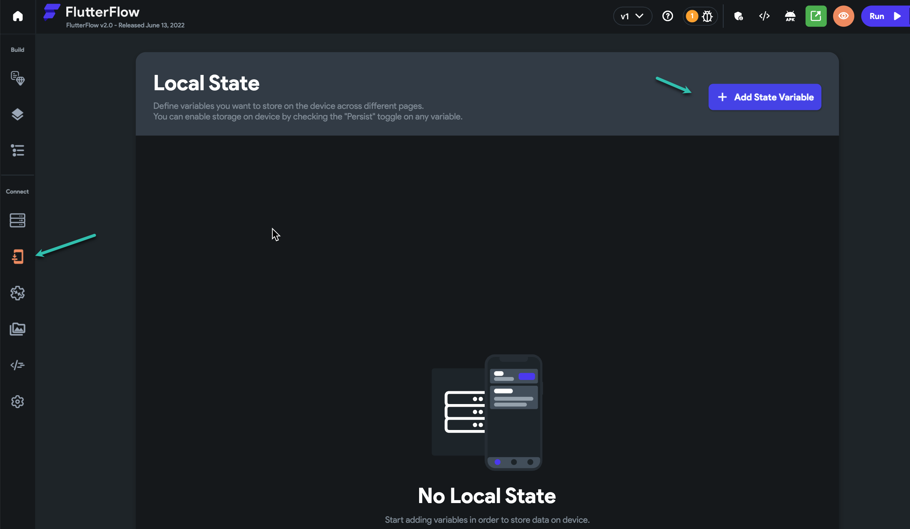
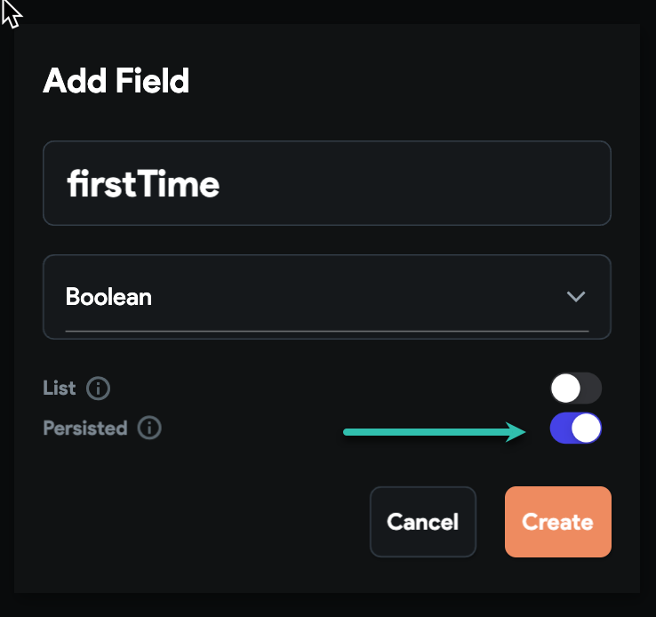
**Create a User Field called isAdmin **
Next, we'll need to add a field to the users table called isAdmin. This will allow us to route an Admin to a different page than other users:

Select **Firebase** from the left navigation menu and then select **+ Add Field.**

Create a State Variable called isAdmin. Select Boolean from the dropdown.

If a user is an an admin, you should set this value to True for this user. 

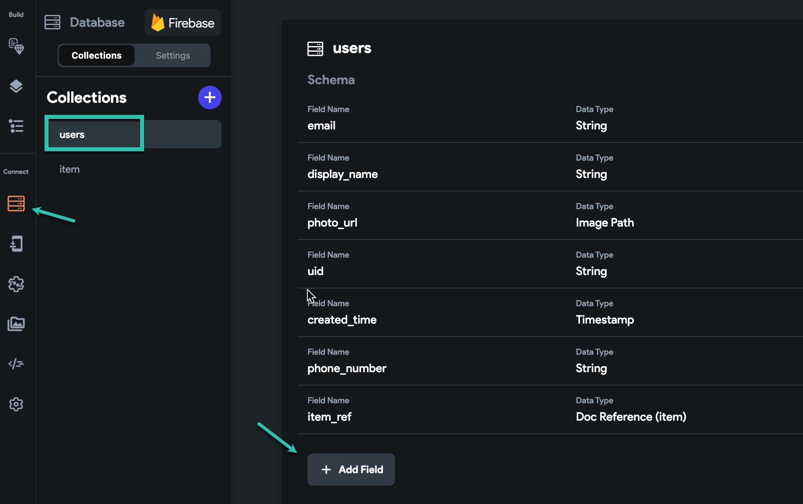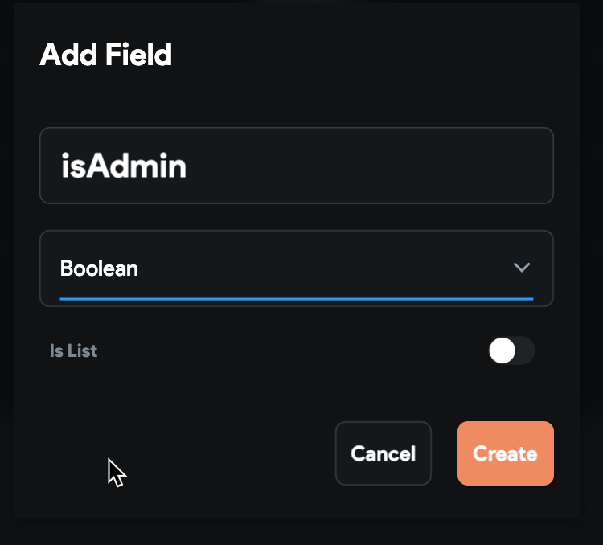Define the Initial Pages
Next you need to define your initial pages. Head to Settings &amp; Integrations &gt; App Details &gt; Initial Page and define:

the **login** page as our** entry page **

the **checkup page** [ mission control ] as our **logged in page**

Tip: **Entry Page** is the page will be shown if the user is not logged in. **Logged In Page** is the page will be loaded if the user is already logged in to your app. 

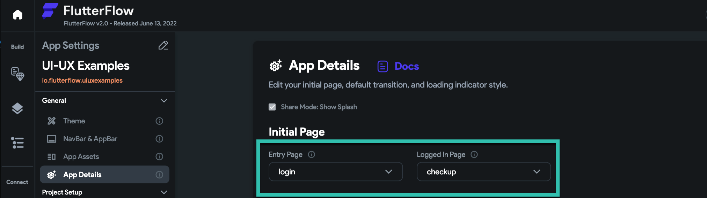Define Actions On The Check-Up Page
Next, we'll need to define a series of actions that will help us identify user role, whether a user has seen the onboarding, etc.

**Tip: **If you're new to actions, you may want to read our Actions Introduction.

On your mission control page, select **Open** in the **Action Flow Editor**

Make sure **On Page Load** is selected at the top and then select **+ Add Conditional Action** from the bottom of the screen

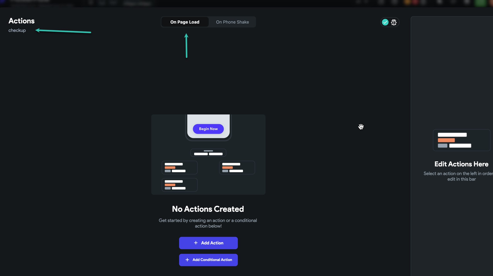
**Add a [ conditional ] Action To Check If User Is Logged In** 
This action will check if a user is logged in. If they aren't it will route the user to the Login page.

Complete these steps to define this action:

Under **Source **select **Global Properties.**

Under **Available Options** select **Is User Logged In**

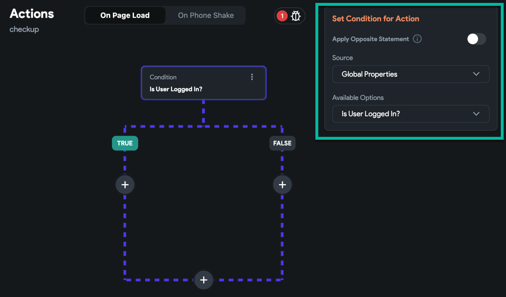
In the **FALSE** branch, select the + icon and then select **Add Action**. 
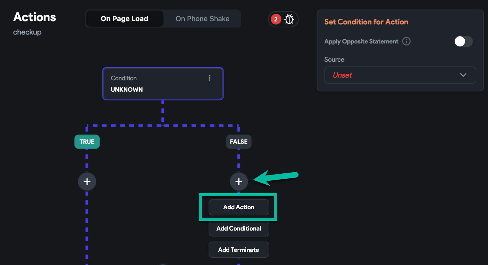

Define the action as **Navigate To** &gt; **Login**.

Change the **Allow Back Navigation** Toggle to** Off.**

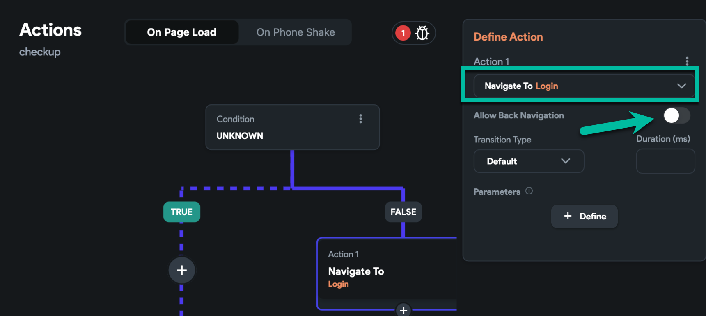
Now select the small + icon on this action and select** Add Terminate.**
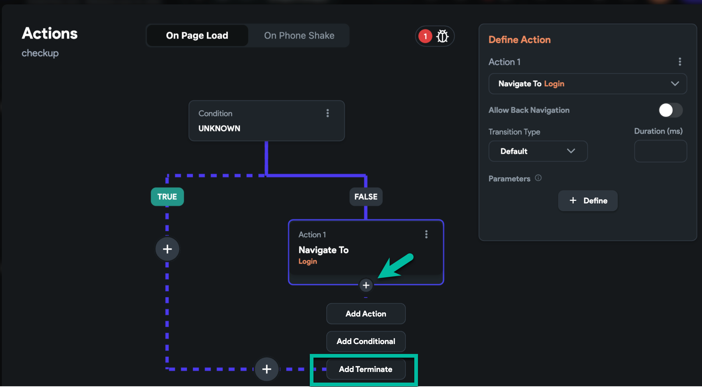Your action flow should now look like this:​
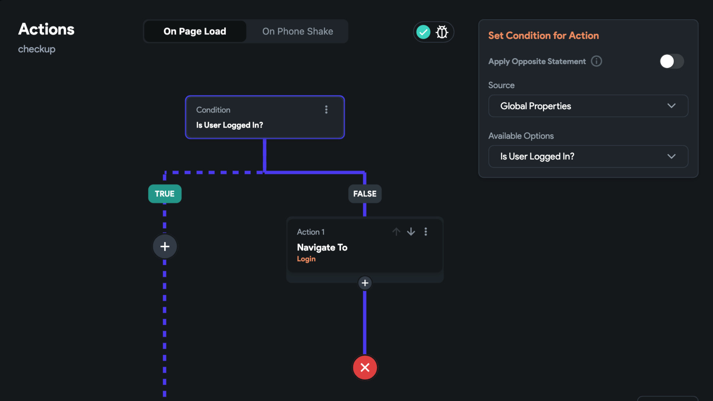**Add a [ conditional ] Action To Check If User Has Seen The Onboarding Page Already**
This action will check to see if this is the first time a user has logged in. If TRUE they will be shown the onboarding page.

Complete these steps to define this action:

In the **TRUE **branch, select the + icon and then select **Add Conditional**. 

In the **Set Condition For Action** (right side of screen) select Source &gt; **Local State** and Available Options &gt; **firstTime**.

Under the TRUE branch of the firstTime conditional, select the + icon and then select **Add Action**. 

Define the action as **Navigate To** &gt; **Onboarding**. Change the **Allow Back Navigation** Toggle to** Off.**

Now select the small + icon on this action and select** Add Terminate.**

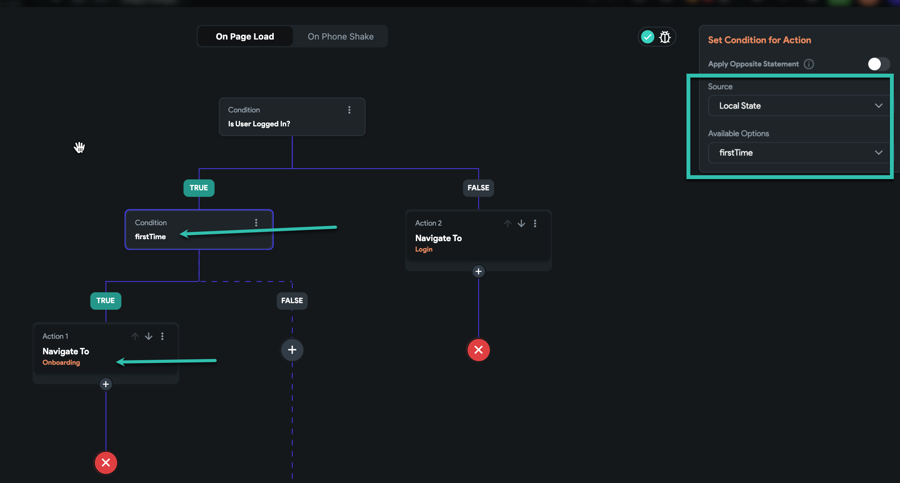
on the onboarding page, we need to turn the firstTime local state variable to False. it means the user checks this page one time.

**Add a [ conditional ] Action To Check If User Is An Admin** 
This action will check if a user is an Admin. If they are, they will be sent to an Admin page. All other users will be sent to a different page.

Complete these steps to define this action:

In the **FALSE **branch of the firstTime Condition, select the + icon and then select **Add Conditional**. 

In the **Set Condition For Action** (right side of screen) select Source &gt; **Authenticated User** and Available Options &gt; **isAdmin**.

Under the **TRUE **branch of the firstTime conditional, select the + icon and then select **Add Action**. 

Define the action as **Navigate To** &gt; **AdminPage**. Change the **Allow Back Navigation** Toggle to** Off.**

Now select the small + icon on this action and select** Add Terminate.**

Under the **FALSE** branch of the firstTime conditional, select the + icon and then select **Add Action**. 

Define the action as **Navigate To** &gt; **UserPage**. Change the **Allow Back Navigation** Toggle to** Off.**

Now select the small + icon on this action and select** Add Terminate.** 

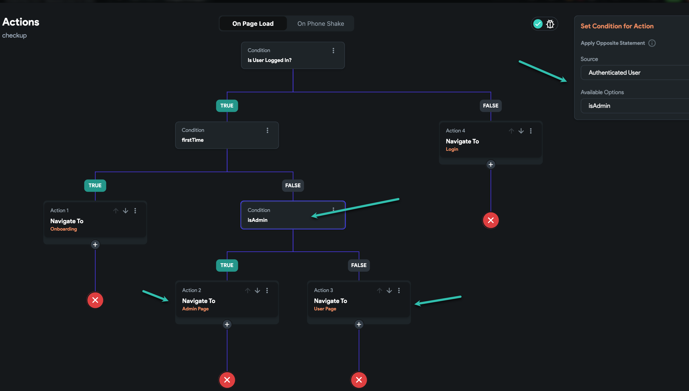**Set firstTime to FALSE after user sees the Onboarding Screen **​
To prevent users from seeing the onboarding screens multiple times, we'll set the firstTime variable to FALSE after they have viewed the onboarding screen.

Go to the Onboarding Page, select the **Start Button **and then open the Action Flow** Editor.**

Complete these steps to define this action:

Select On Tap &gt; Add Action &gt; Update Local State (under Database/Backend).

Select Select field to Update &gt; **firstTime** and Select Update Type &gt; **set value**.

Set Value Source to **Specific Value** and Value to **False**.

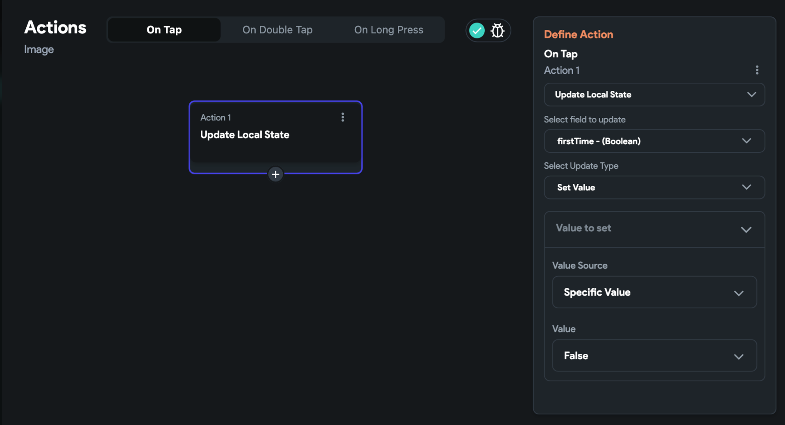

Under the **Update Local State Action**, select the + icon and then select **Add Action**. 

Define the action as **Navigate To** &gt; **Checkup**. Change the **Allow Back Navigation** Toggle to** Off.** 

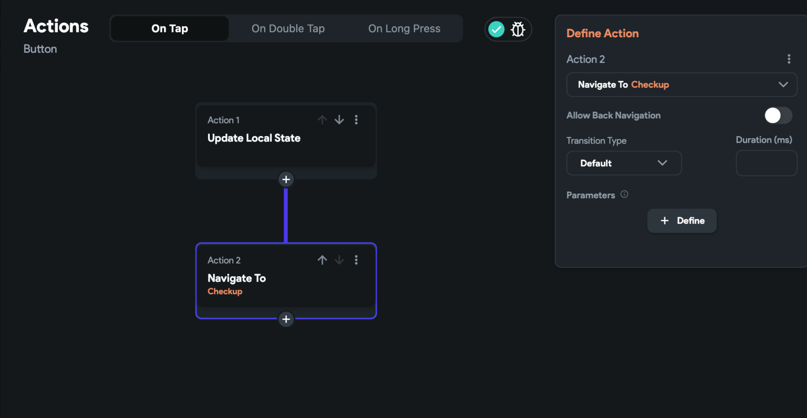Congrats! You've completed these steps.

**Bonus Tips:**
You can reuse this "Mission Control" page for other advanced routing options.For example, if you want the user to complete their profile. You can route the user to the checkup page and have another conditional if profileIsCompleted==false then go to the complete profile page.

What if I don't want to show onboarding page to admins as well? You can accomplish this using this logic:

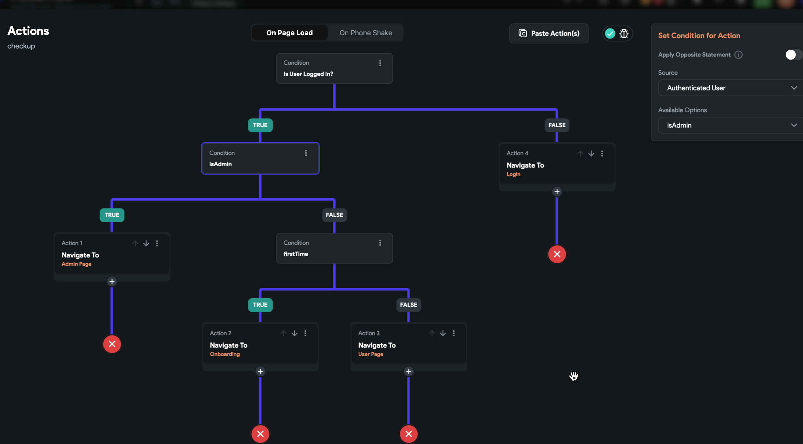

​
