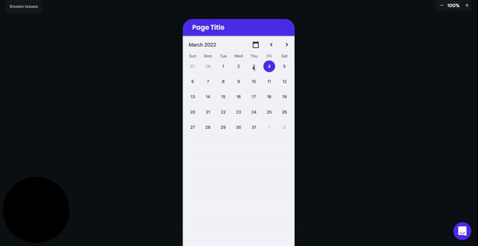
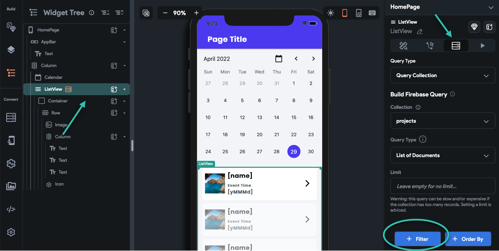
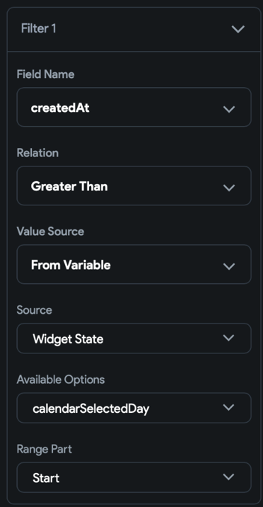
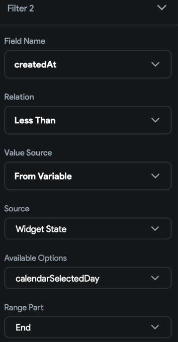
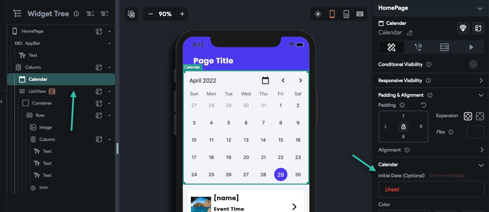
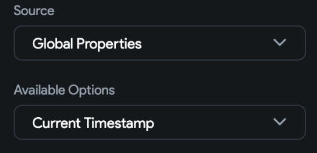

# Filter a query based on a selected date in a calendar

This article describes how you can filter your ListView data based on the date your user selects on a calendar.

Prerequisites
Before you get started with the rest of this article, you will need to:

Complete Firebase setup

Create a Firebase collection

Add data to your Firebase collection

Have a ListView with data from Firebase

Have a Calendar Widget in your project

**Create Filters For Your ListView**
In order to filter your ListView items by the date selected on the calendar, you will need to create two filters for your listview. We'll create one filter for Start Date and one filter for End Date. The result will be the date selected!

Select your ListView from the **Widget Tree &gt; Backend Query &gt; + Filter**

**Create Filter To Filter For Start Date**
A list of dropdowns will appear. Select the following values:

Under Field Name select the field you want to filter your data by (e.g. eventDate).

Under **Relation** select **Greater Than**

Under **Value Source** select **From Variable**

Under **Source** select **Widget State**

Under **Available Options** select **calendarSelectedDay**

Under **Range Part** select **Start**

**Create Filter To Filter For End Date**
A list of dropdowns will appear. Select the following values:

Under Field Name select the field you want to filter your data by (e.g. eventDate).

Under **Relation** select **Greater Than**

Under **Value Source** select **From Variable**

Under **Source** select **Widget State**

Under **Available Options** select **calendarSelectedDay**

Under **Range Part** select **Start**

**Set the initial date for your calendar**
The initial date is the option that will be highlighted by default. **If you don't set an initial date for your calendar, you will get a gray screen in Run Mode.**

Select your Calendar Widget and navigate to the right Properties Panel. Locate the Initial Date section and click the dropdown. A list of options will appear. 

In order to set the Date by current day, select:

Source: Global Properties

Available Options: Current Timestamp

🎉 Congrats your new feature is complete! To test your new feature, select **Run** and wait for your new changes to compile!

