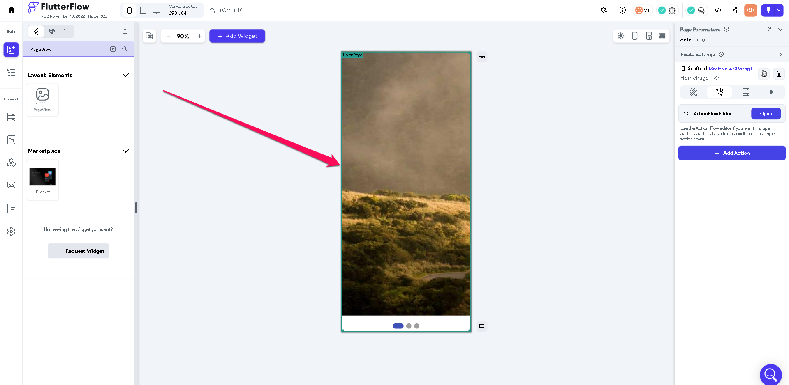
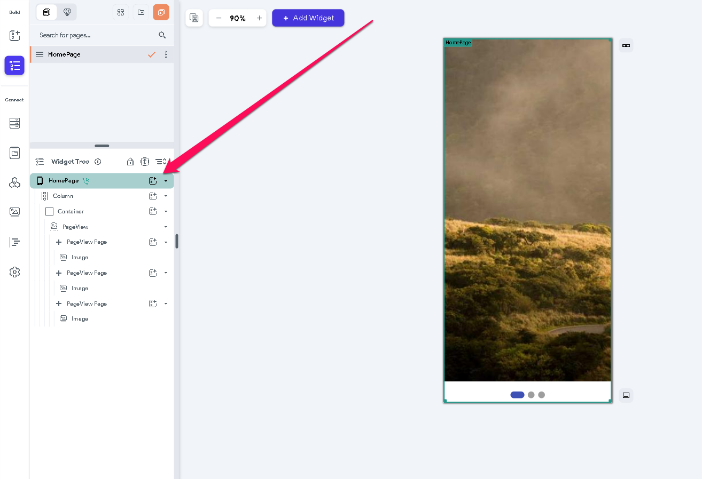
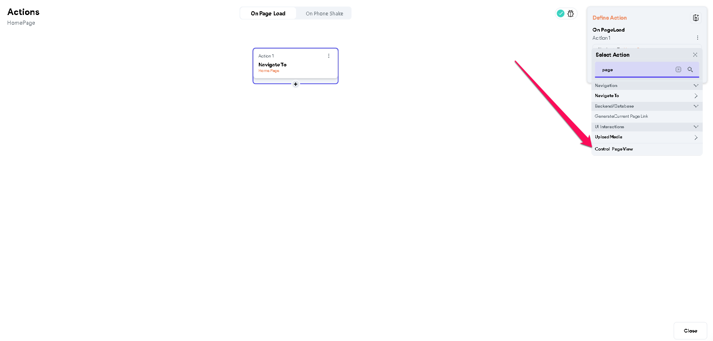
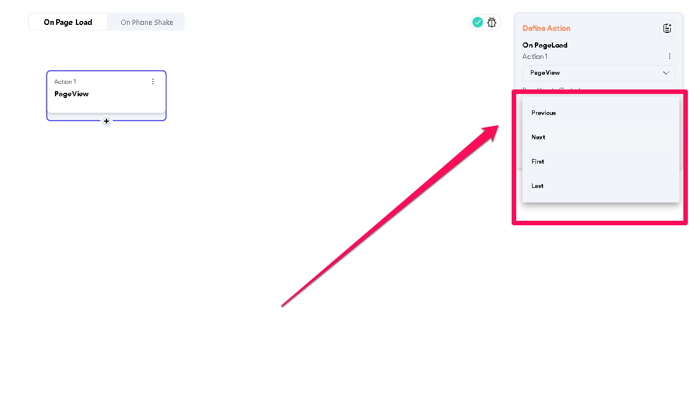
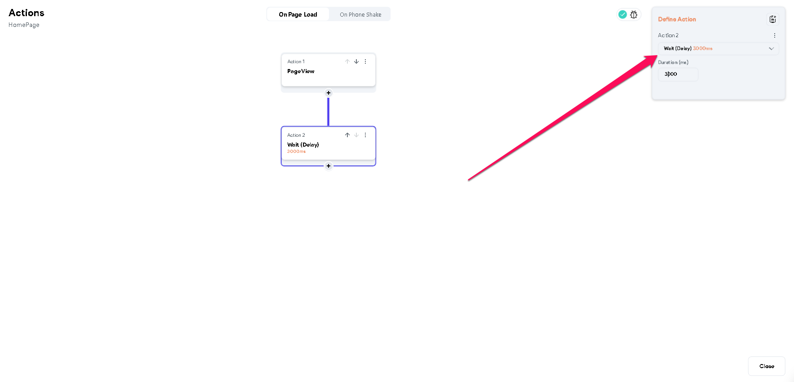
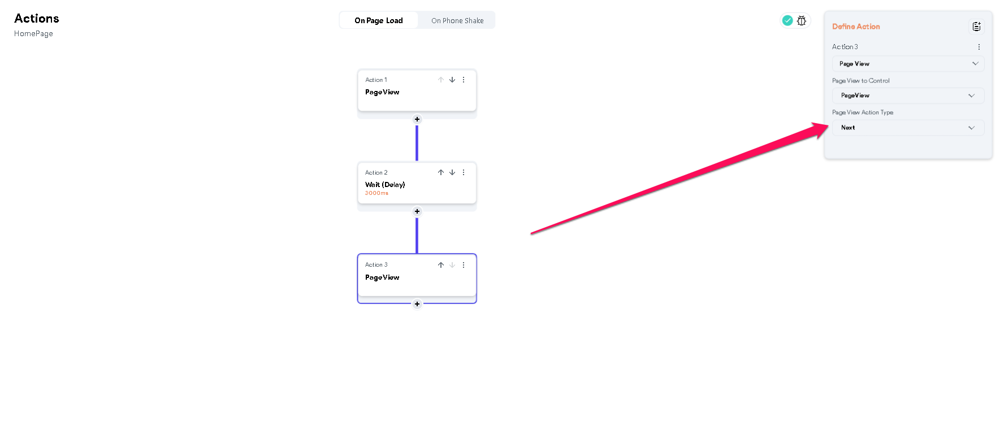
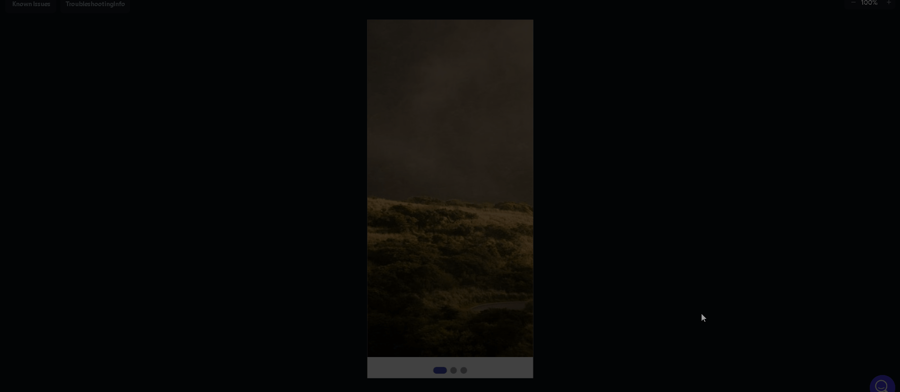

# How To Create An Image Carousel In FlutterFlow

The following are the widgets and actions that will be required to build an image carousel in FlutterFlow:

 ***Widgets ***

Page View Widget
***Action (User Interaction)***

Control Page View
Step 1: ​
Add a **Page View Widget** to the canvas or displayed screen.Step 2: Add an action to the scaffold, on '**page load**'
Step 3: Under, '**define actions**', select '**control page view**' This makes it possible to set up which page view should be displayed, at the first, last, or next
Step 4: Select the page view control type among the options shown in the attached image. 
1. **Previous**: Scroll to the previous page in the pageview.
2. **Next**: Scroll to the next page in the pageview.
3. **First**: Scroll to the first page in the pageview.
4. **Last**: Scroll to the last page in the pageview.​
Step 5: For purposes of demonstration, the initial page view control was set to '**first**'. This action should be followed by a wait action that sets the transition interval between the current page view and the next. ​
Step 6: The page view action type should be set to '**next**'  for displaying the subsequent page view. If a user has more page views to display, the actions setup should be extended 
Demonstration 
