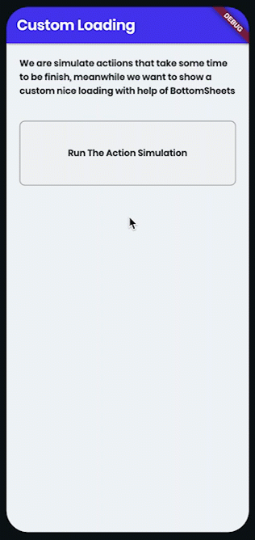
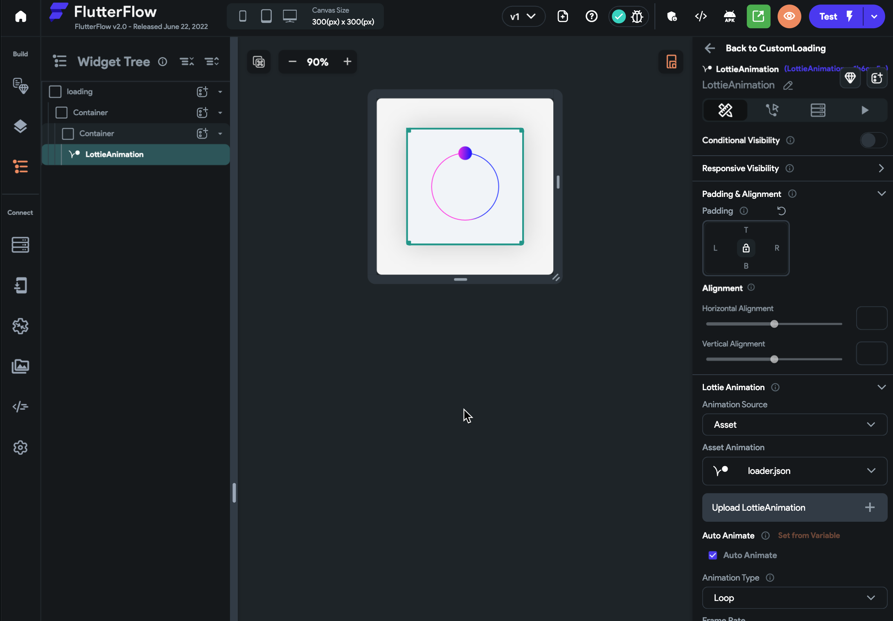
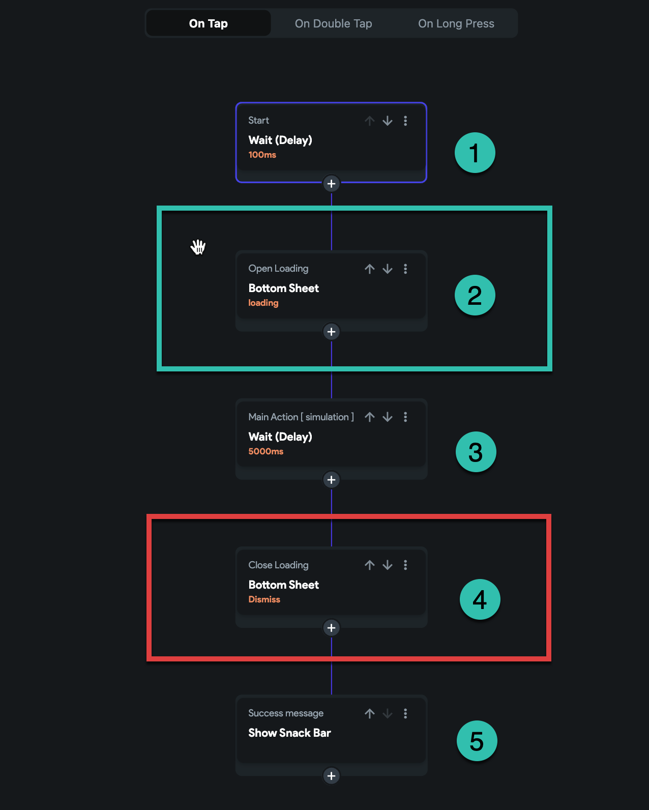
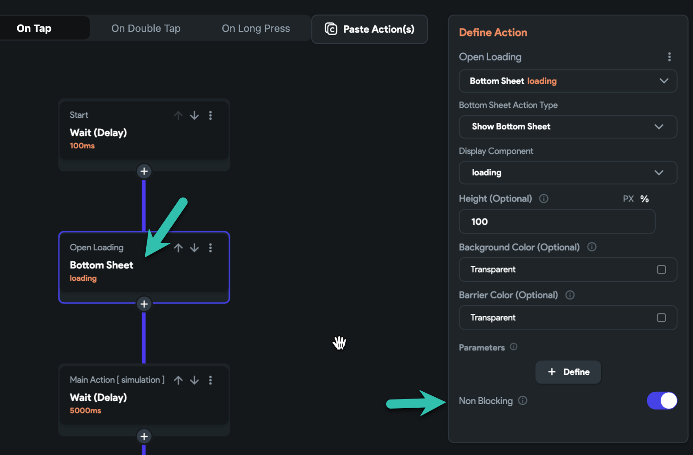
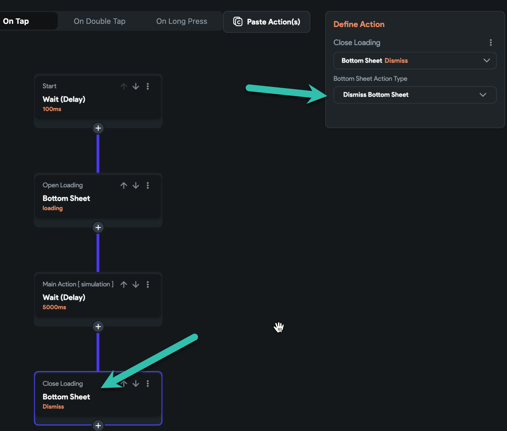

# How To: Make a custom Loading Indicator Animation With Bottom sheet

Why do we need this? Sometimes we have actions that need time to finish, like calling an API and waiting for the response.Now we want to show a nice custom loading animation with help of bottom sheets.1: Create the loading modal

Make a  new component, the bottom sheet, we putLottiee animation inside the modal.
You can simply make any kind of UI for this bottom sheet, show film, Gif images or animations, text etc.

2: Create our chain of actions:

1- a fake delay action, can be the API call or a simple action, even you can ignore this one.

2- show the loading animation, and open a bottom sheet. here we start to show the loading.

**IMPORTANT: in the open bottom sheet action, you can see the option "Non Blocking"**
**We need to turn this option on.it means: open the bottom sheet and do not block the next actions. any action after the open bottom sheet action will be executed immediately.**

3- our main actions, I just put a delay for 5 seconds here to simulate some actions that need time to be finished. this could be a chain of actions. anything you need to do and meanwhile you are showing the loading.

4- Close the loading, Here all our actions are finished and we just need to dismiss the bottom sheet.

5- Show a finished message, this is a snack bar we show, a message that says the actions are done! if you need to give a message to the user after all.

Project URL [ Public ]​
page name "CustomLoading"
when you run the project, just hit login on the login page [login with our test user] in the home page click on the item "Custom Loading"
Run Mode Link

