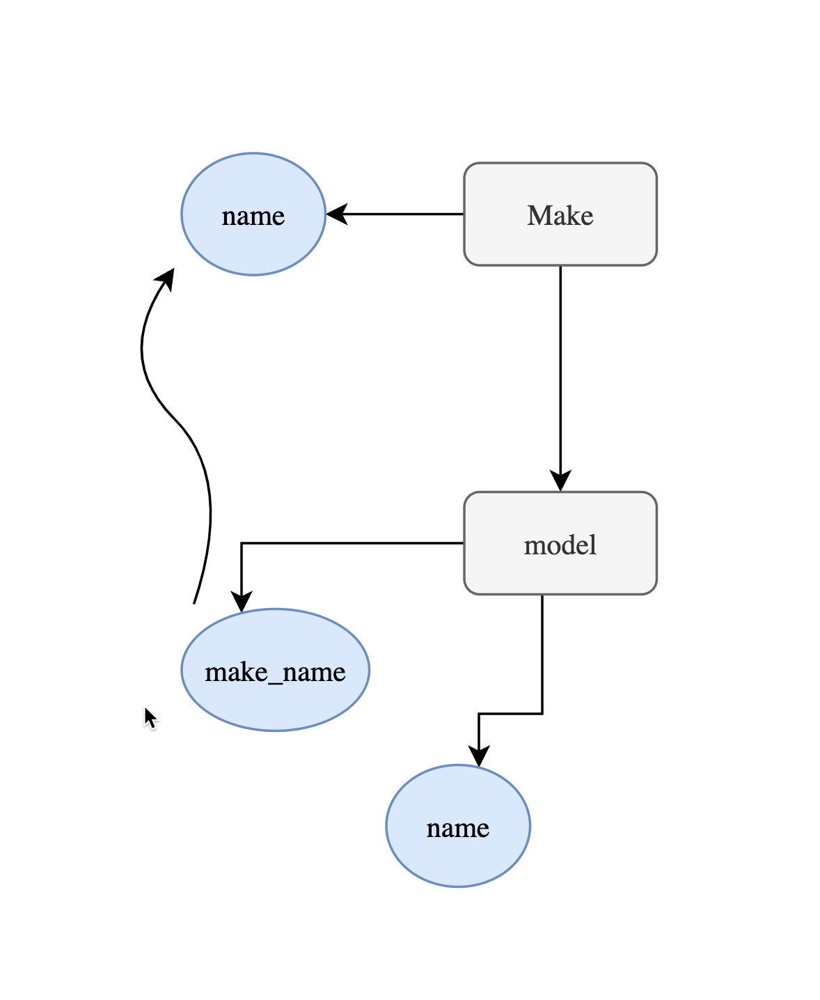
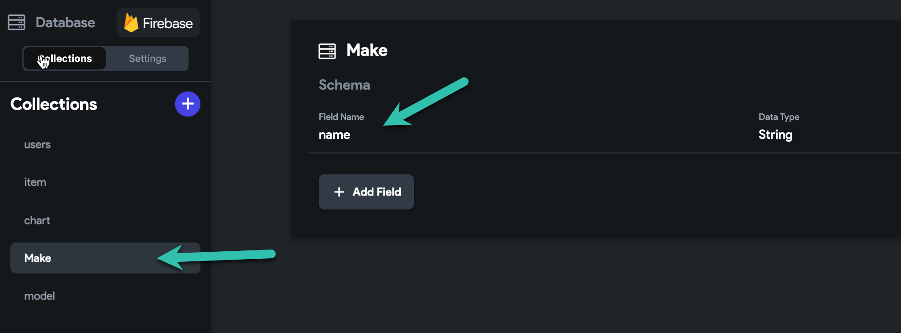
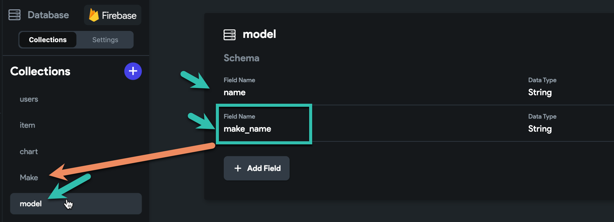
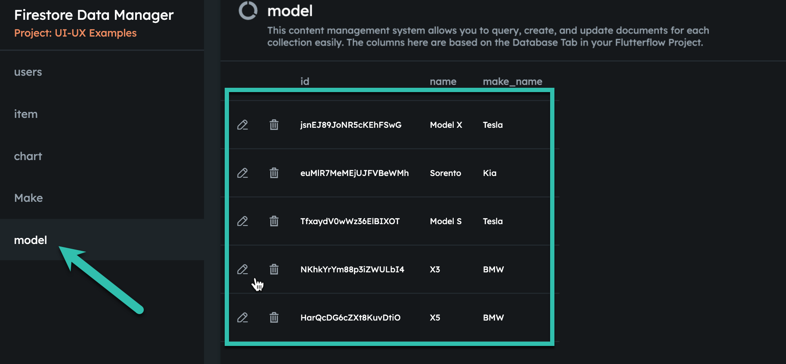
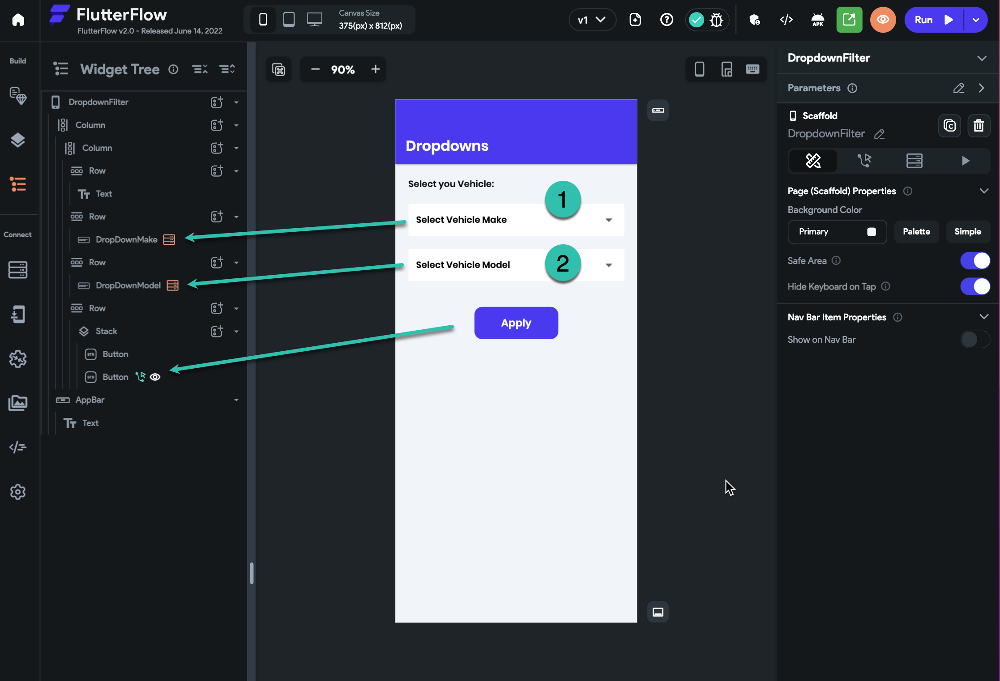
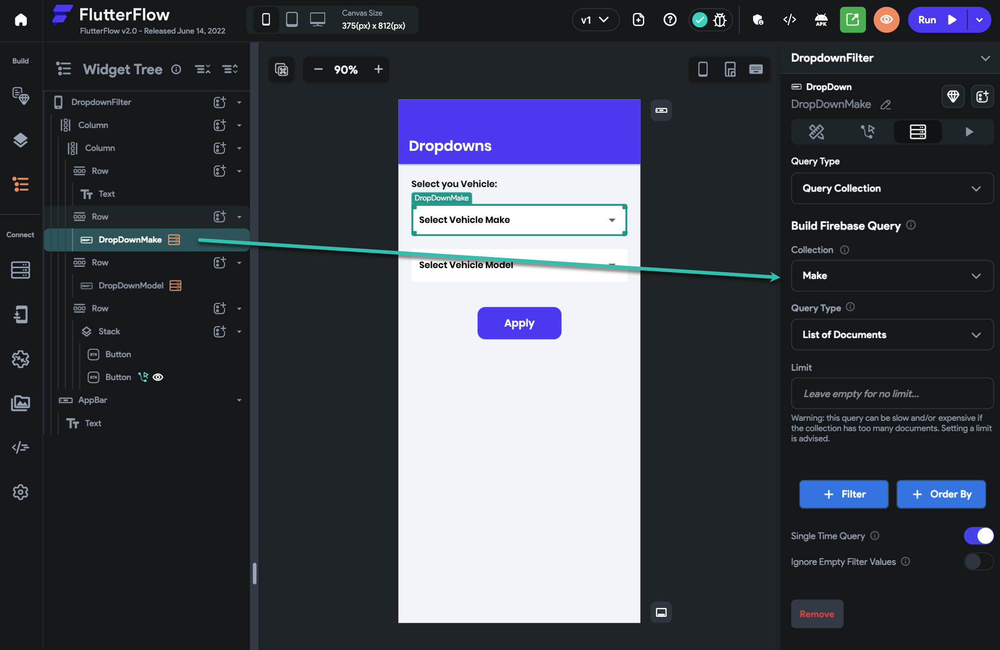
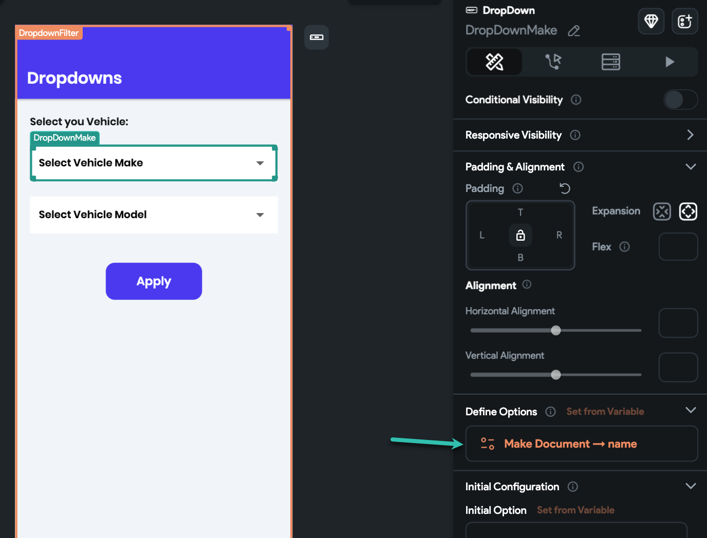
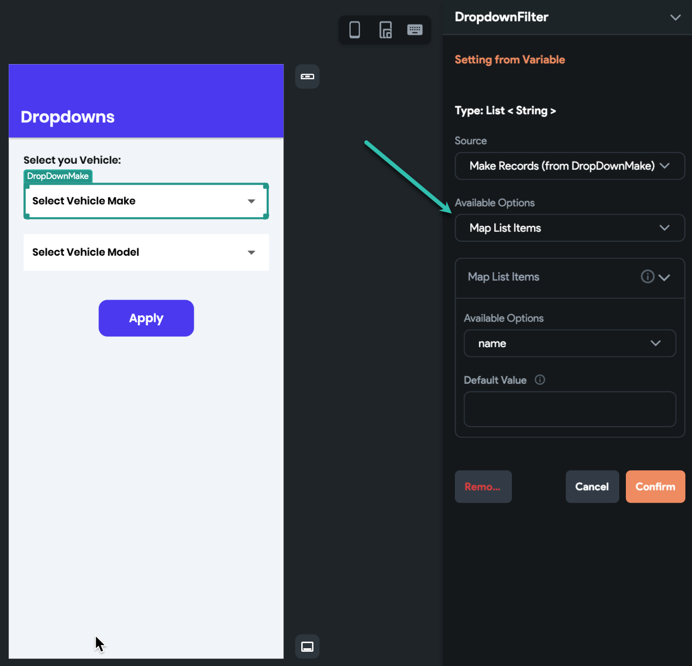
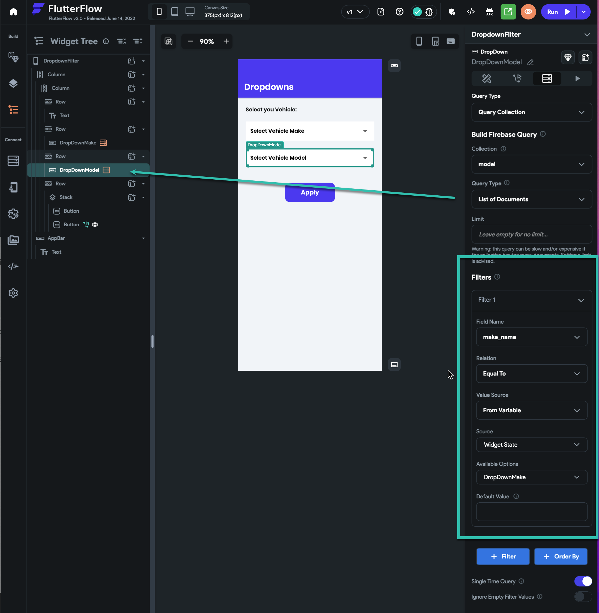

# How to: Filter dropdown based on another dropdown selected value

**What we are doing?**

We want to filter a Dropdown widget value, based on another Dropdown Selected value.
**In our example, we ask the user to select his vehicle make and model. and we show the user the available vehicle makes, and based on the vehicle make selected we filter the vehicle models.**
so if the user selects the BMW we just show the BMW models in the next Dropdown.

Public Project
Run Mode

**Database**:We need separate collections for each vehicle **make** and vehicle **model**.

**Collection "make"**, With one single field **"name"** from type **String**, we want to save the name of each vehicle **make** there. so for each vehicle make we need to make a collection.

Here we have Three vehicle makes.

Collection **"model"**, With a field **"name"** from type **String**
a field **"make_name"** from type **String** [ we need to put the same exact name of the make collections for each model ]

As you can see for example in model collections, for each BMW model I have a make_name field that is the same as the make collections name fields.​

**Next: User Interface**

On this page, we have **two dropdowns** and a button to just show the selected values.
**Notice: You can grow this principle for as many dropdowns you need**

** We need to query items on each dropdown.**

1: Our query on the collection **"make"** on the **first dropdown**

In the first dropdown, we are retrieving all make items. then we need to set the result for dropdown options.

Now we have all vehicle makes loaded into the first dropdown.

2: We want to do the same with the second dropdown, the only difference here is that we do a query on **"model"** collection, and we add a filter to the query, on the field name **"make_name"**.
the field is referring to the collection **make** names.

Again after the query, we set the result to the dropdown options.

Now both dropdowns are set, and we can use the values.

This way each time the first dropdown value is changing, our second query will be executed again with the new value [ value we used in the query filter ]

You can check the public project and see this is real action.

