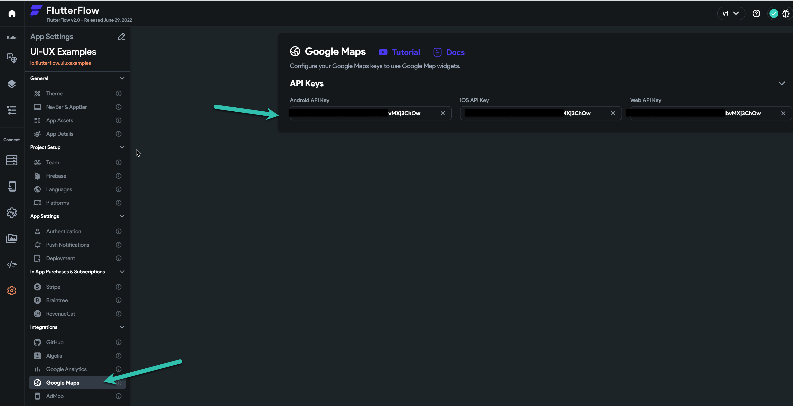

# How to: Retrieve the full address from your current location or a latlang value.

In Flutterflow we have access to the **current device location** from **Global properties**. the retrieved data is in the **Latlang** data type.we can use that data to set the location on a map, but what if we want to show a marker there?**First:** if you just simply want to show a marker on the map and no need to retrieve the full address, you can save the latlang value on a document, and set that document as a single marker of the map.But if: you want to have the full address and full data about the location. like country, city, state, street, etcthen follow the instructions.

Project Link
Run Link**What do we need?**1- **Google map API key** [based on the device you need different API keys ] if you already use Google Maps in your project and set your **google map API keys**, you can use the same key here.​
If you do not know how to get your keys, follow the video or documentation in the Flutterflow/Settings/Google Maps

2- **A Flutterflow project**

**What do we want to do?**
We want to use **global properties current device location** and get the user's live location, then use **google geocoding API** and retrieve the full information about the location, such as the full address, country, state, etc

**API call:**


We need to make an API call as you can see in the picture.

1: **the URL of the Google geocoding service.**

https://maps.googleapis.com/maps/api/geocode/json?
this URL is static and you simply can use it

at the end of the URL we have 2 parameter
**  2- the location as a latlang value**
**  3- key, your google map API key**
We provide both as string.​
***Notice: you can use the parameters you have in your call inside  brackets **
**[param name] like what you can see in the picture**

name the API call [ **GeoCoding** ] and save the call.

**Call the API:**


I want to show the full address on this page, so I do an API call on the page

Now I need to pass the parameters

**1- latlang: **as you remember we have a latlang parameter in our API call, but it is String, so here we need a custom function to convert our current device location from a latlang to a string and pass it to the API call.


This function simply takes the **global properties current device location** and convert it to string and will return it as a string value.


```
return (latlang.latitude.toString() + ',' + latlang.longitude.toString());
```

**2- Key: **your google API key, in my case I save the key on my user table, you can put it directly or do the same for security.

Now when the page loads I do the **API call**, and now I have access to the API call response. now what I am doing is just showing the **response** on the page.

you can do other things, for example, you can do the API call in an action, and then after that save the response on the database. it is up to you and your use case.

**Access to each node in the API response:**
**for more info about using API call responses, you can see this video**

Here I want to show the full address in a **text widget**, you can use the same principle and retrieve any kind of data the API response provide to you

You can continue this principle to show all the data, or save them in database.

Now everywhere in your project, you can do an API call, use the current device location and retrieve the full information about the user device location.and use the data where ever you need it.

**Enjoy**!

