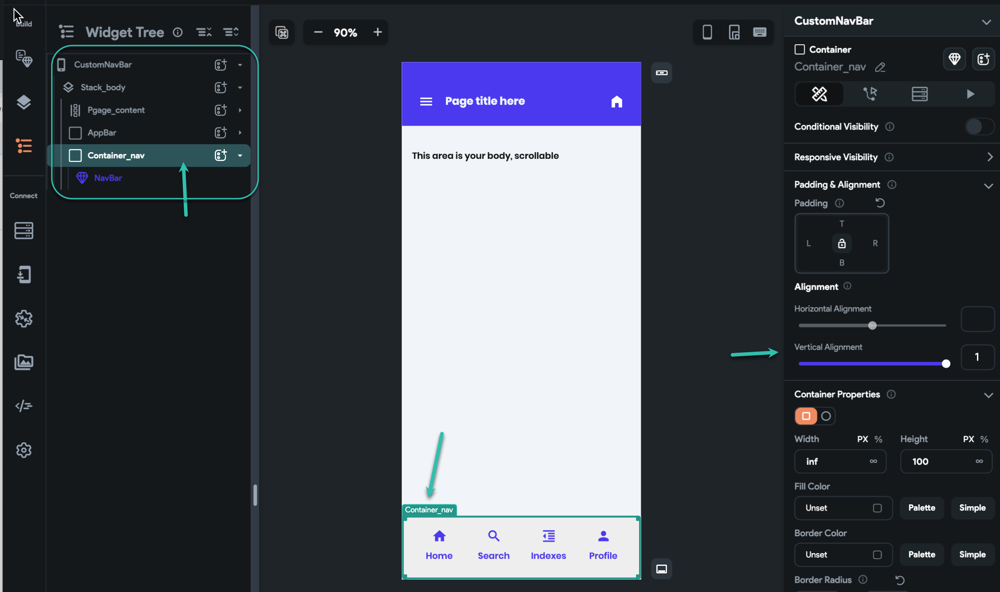
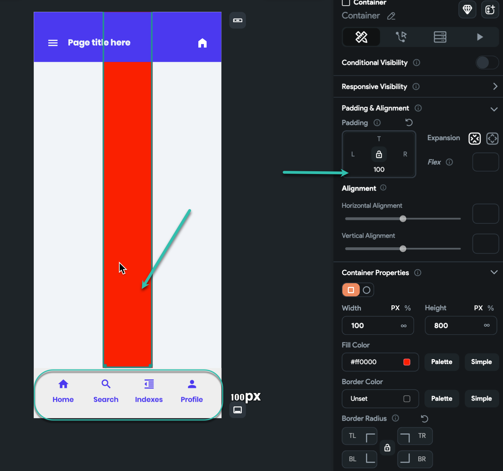
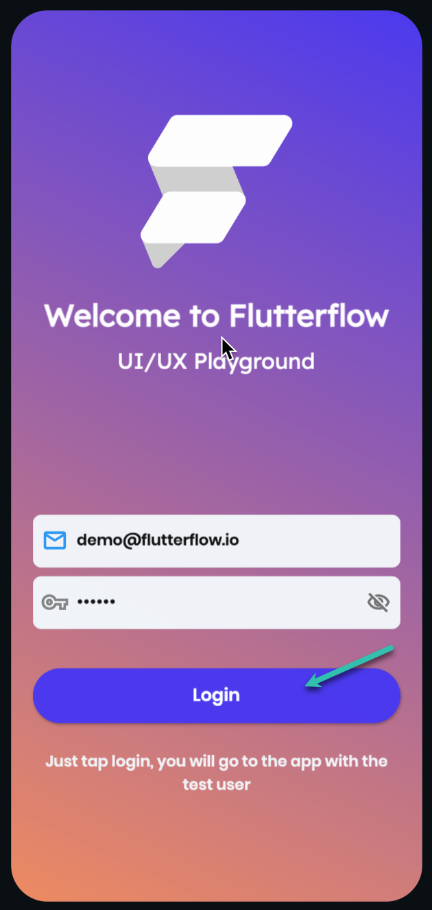
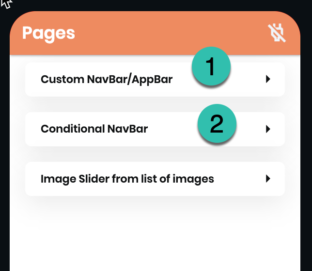
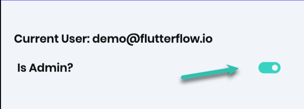

# How to make a custom NavBar

**Why do you need a custom NavBar?**

If you want to have control over the NavBar base on conditions: for example, you want to hide the navbar on the page if another widget is shown on the page.​

If you want conditional views and conditional items: for example, You want to show two different views and items when a user is an admin, so the admin will see a totally different view of the NavBar, or maybe you want to hide an item for the admin and show him something else.​

If you want to have more than icons and text for the item of a navBar: for example, You want to show a cart widget for an item, in case you have an e-commerce app.And maybe some more reasons.

**Things you need to know [ principles ] :**

A custom navBar should be floating on the page, it should be on a Stack, and on top of all other widgets. So the page should be like this:Page &gt; Stack [ inf, inf ] &gt; Container [ inf, 100px or height of navBar you need ] &gt; NavBar component.then in the alignment of the container, you need to put 1 for the vertical.​

If you have an item in the navBar [ a page ] that page should not have any back navigation, this means if a page is an item in a navBar it is the main page.you do not put navBar in a subpage. Pop actions [ back action ] can cause confusing navigation in the app routing.

You need to control the navBar dynamic field on each page, it can be set by static values, or it can be set from the localState or database.

You need to make sure your contents on the page have bottom padding, same as navBar height, 
**Here is the example of a custom navBar we made for you, so you can investigate and replicate it.**​
**Project Link**
**Run Mode LInk****How to use the sample project:**When you run the app, just tap on the login button, we made a test user ready so everyone can log in to the app freely.​
**On the home page:**

You can select Custom navBar/AppBar: in the page, you will see a custom App bar and a simple custom navBar​

You can select Conditional NavBar: on the page, you can see a conditional navBar, with admin and normal user view. there is a toggle you can use to turn is_admin in the user table ON/OFF

