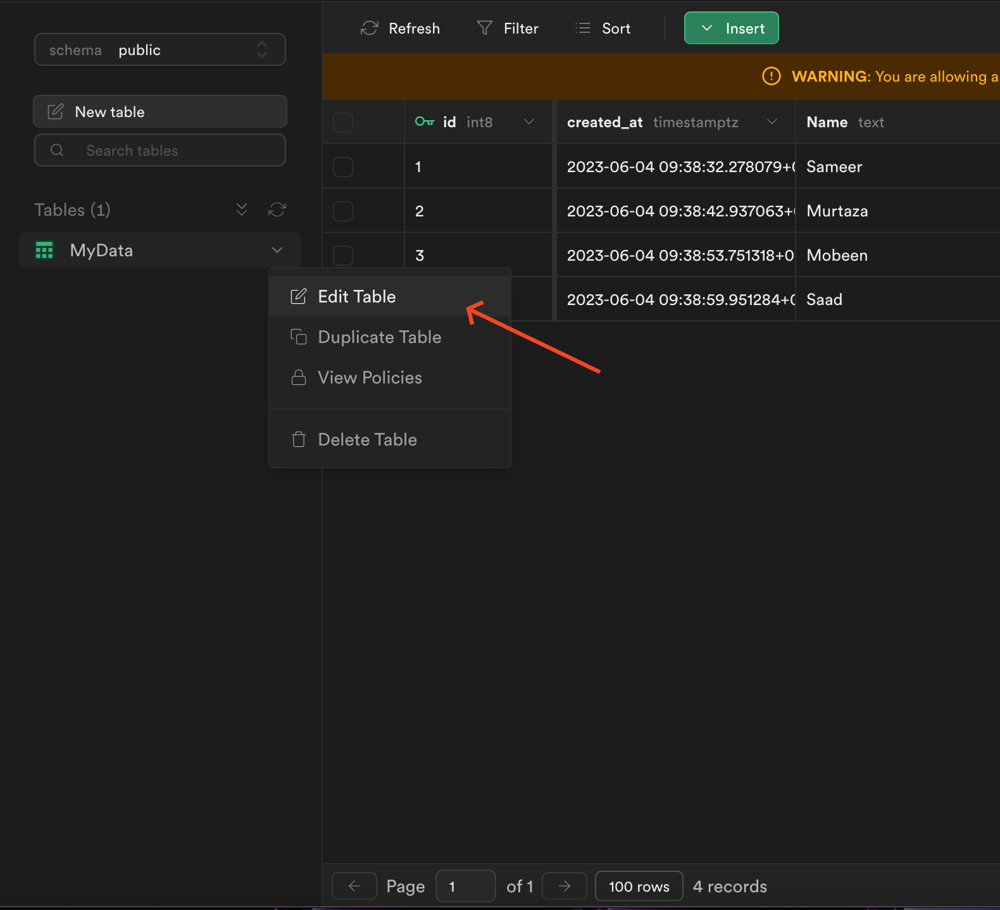
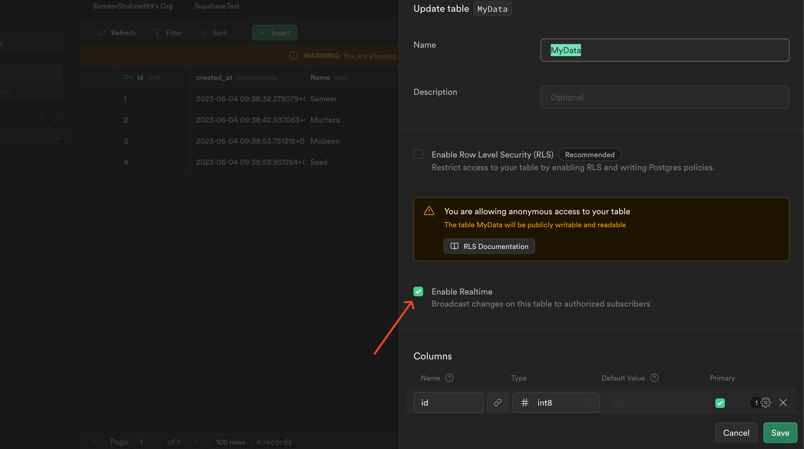
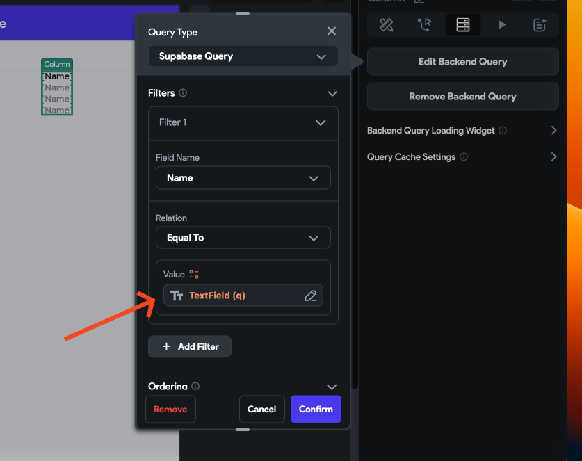
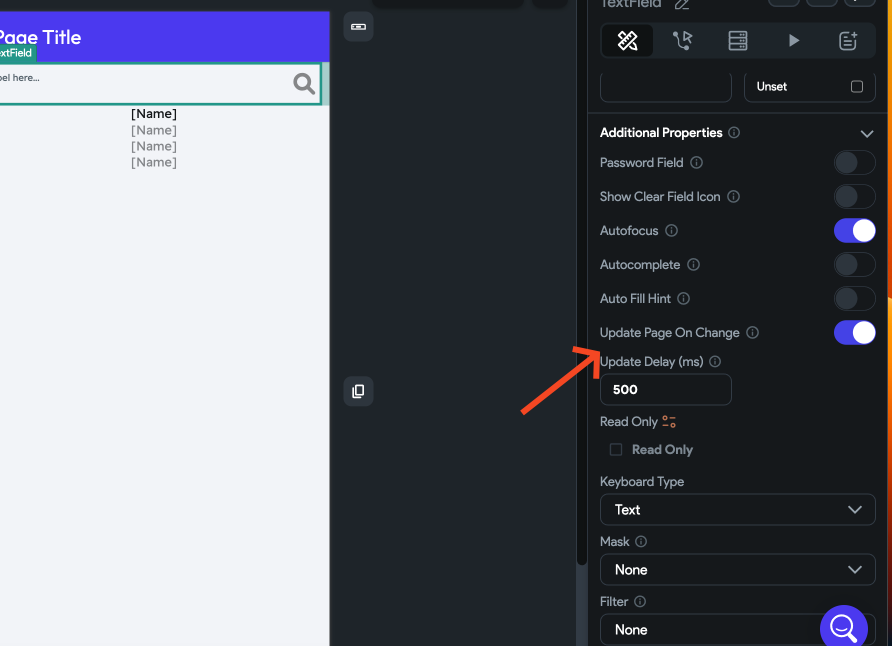
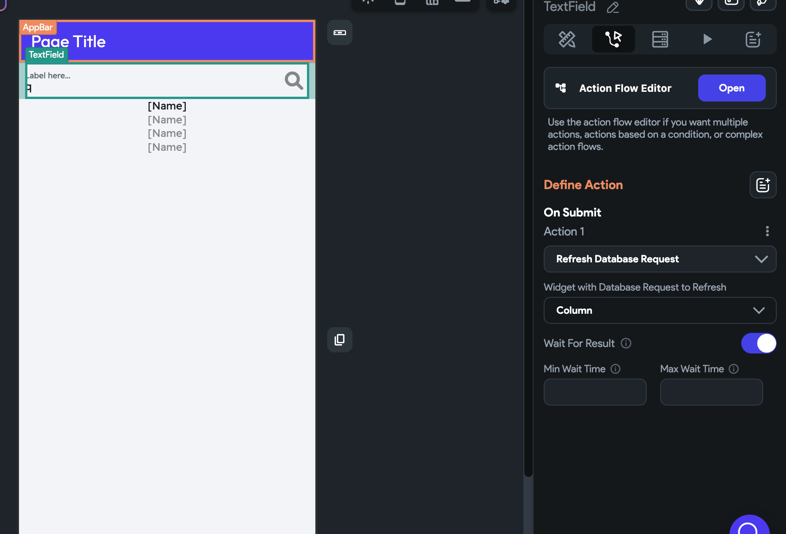

# Tutorial: Search Implementation for Supabase

**Background:**
FlutterFlow does not yet officially support Supabase search functionality, but we do have a workaround to implement a simple search function. Please note that this will not be a full-fledged search solution, but rather makes use of the equal filter by using the Supabase Realtime feature.​
**Steps for Implementation:**
1. First you need to enable Realtime from the Supabase table settings.

2. After enabling this you will then need to filter the query data with the input text field and set the filter to is equal.​
3. Now there are two options, first is to automatically search the data as soon as its typed. To do so, you need to enable the update page on change and set the frequency accordingly.

4. The second option is to refresh the database when the text is submitted.

Please note that real-time updates will be more costly compared to searching after submission.

**The issue was not resolved**
If the error persists after following the outlined steps, please report this issue to support via Chat or Email at support@flutterflow.io.