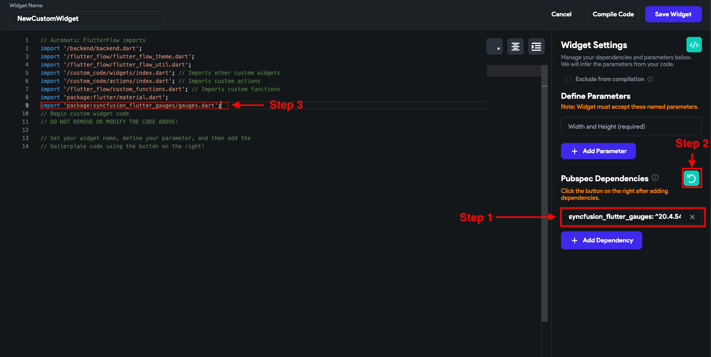

# Adding dependencies in pubspec.yaml file for entire Project

FlutterFlow does not support adding dependencies to the entire project yet, but here is the workaround, you can add dependencies in your Custom widgets or Custom Actions which will be added in the pubspec.yaml file.​
To add dependencies in your Custom widgets or Custom Actions you can follow the steps mentioned below:

Step 1: Add the dependencies

Step 2: Click on the Refresh icon to update the dependencies

Step 3: Import it inside the code

